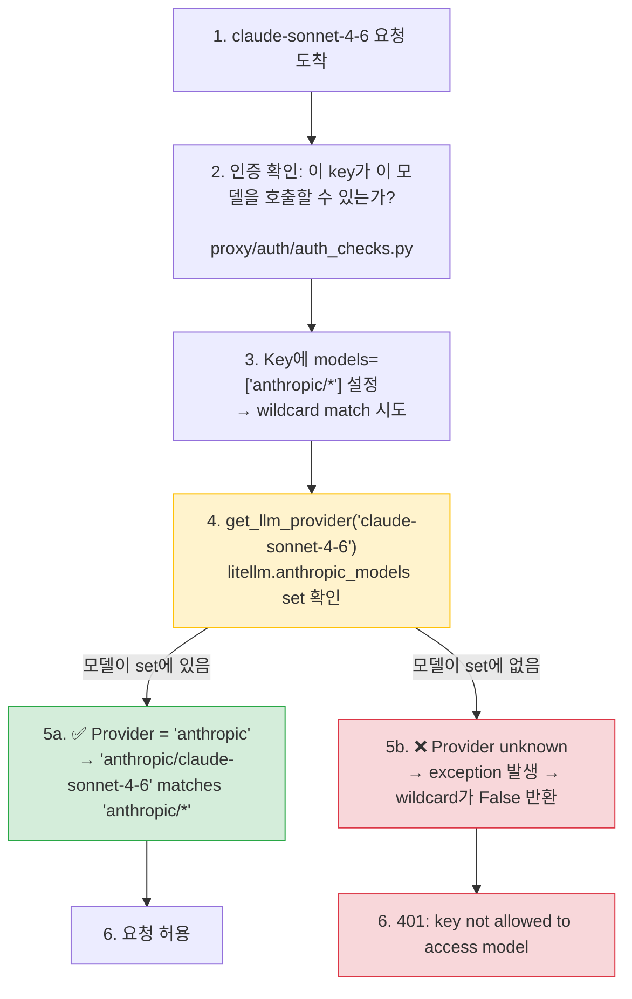

**날짜:** 2026년 2월 23일  
**지속 시간:** 약 3시간  
**심각도:** 높음(provider wildcard 접근 규칙을 사용하는 사용자 대상)  
**상태:** 해결됨

## 요약

새 Anthropic 모델(예: `claude-sonnet-4-6`)이 LiteLLM model cost map에 추가되고 cost map reload가 실행되면, 새 모델에 대한 요청이 다음 오류로 거부되었습니다.

```
key not allowed to access model. This key can only access models=['anthropic/*']. Tried to access claude-sonnet-4-6.
```

reload는 `litellm.model_cost`를 올바르게 업데이트했지만 `add_known_models()`를 다시 실행하지 않았습니다. 그래서 wildcard resolver가 사용하는 인메모리 set인 `litellm.anthropic_models`가 오래된 상태로 남았습니다. cost map에는 새 모델이 존재했지만, `anthropic/*` wildcard에서는 해당 모델을 볼 수 없었습니다.

- **LLM 호출:** 새로 추가된 Anthropic 모델에 대한 모든 요청이 401로 차단되었습니다.
- **기존 모델:** 영향 없음. 오래된 provider set에 없는 모델만 영향을 받았습니다.
- **다른 provider:** 동일한 bug class가 모든 provider wildcard에도 존재했습니다. 예: `openai/*`, `gemini/*`.

{/* truncate */}

---

## 배경

LiteLLM은 provider 수준 wildcard 접근 규칙을 지원합니다. 관리자가 key 또는 team에 `models=['anthropic/*']`를 설정하면, provider가 `anthropic`으로 resolve되는 모든 모델이 허용되어야 합니다. 이 resolve는 `_model_custom_llm_provider_matches_wildcard_pattern`에서 수행됩니다.



`litellm.anthropic_models`는 import 시점에 `add_known_models()`가 채우는 Python `set`입니다. `get_llm_provider()`는 `claude-sonnet-4-6` 같은 bare model name을 provider string `"anthropic"`으로 매핑할 때 이 set을 참고합니다.

---

## 근본 원인

`add_known_models()`는 module import 시점에 **한 번만** 호출되었습니다. `proxy_server.py`의 두 reload path는 fresh map으로 `litellm.model_cost`를 업데이트했지만 `add_known_models()`를 다시 호출하지 않았습니다.

```python
# Before the fix — both reload paths looked like this:
new_model_cost_map = get_model_cost_map(url=model_cost_map_url)
litellm.model_cost = new_model_cost_map          # ✅ cost map updated
_invalidate_model_cost_lowercase_map()           # ✅ cache cleared
# ❌ add_known_models() never called
#    → litellm.anthropic_models still has the old set
#    → new model not in the set
#    → get_llm_provider() raises for the new model
#    → wildcard match returns False
#    → 401 for every request to the new model
```

누락 지점은 두 곳이었습니다.
1. `_check_and_reload_model_cost_map` - 주기적 자동 reload(10초마다)
2. `/reload/model_cost_map` admin endpoint - 수동 reload

**타임라인:**

1. 새 모델(`claude-sonnet-4-6`)이 `model_prices_and_context_window.json`에 추가됨
2. 관리자가 UI에서 cost map reload 실행 → `litellm.model_cost` 업데이트
3. `anthropic/*` wildcard key를 가진 사용자가 `claude-sonnet-4-6` 요청 시도
4. `get_llm_provider('claude-sonnet-4-6')`가 예외 발생 → wildcard가 False 반환 → 401
5. 관리자가 cost map을 다시 reload해도 동일한 결과 발생(근본 원인 미해결)
6. 약 3시간 조사 → 근본 원인 식별 → fix 배포

---

## 수정 내용

각 reload 이후, 새로 가져온 map을 명시적으로 전달해 `add_known_models()`를 호출하도록 수정했습니다. module-level reference에 의존하지 않고 map을 직접 전달하면 어떤 dict를 iterate하는지에 대한 모호성이 사라집니다.

```python
# After the fix — both reload paths now do:
new_model_cost_map = get_model_cost_map(url=model_cost_map_url)
litellm.model_cost = new_model_cost_map
_invalidate_model_cost_lowercase_map()
litellm.add_known_models(model_cost_map=new_model_cost_map)  # ✅ sets repopulated
```

또한 `add_known_models()`가 선택적 explicit map을 받을 수 있도록 수정했습니다. 이로써 caller가 실수로 오래된 module-level reference를 iterate하는 일을 막을 수 있습니다.

```python
# Before
def add_known_models():
    for key, value in model_cost.items():   # reads module global — ambiguous after reload
        ...

# After
def add_known_models(model_cost_map: Optional[Dict] = None):
    _map = model_cost_map if model_cost_map is not None else model_cost
    for key, value in _map.items():         # always iterates the map you just fetched
        ...
```

수정 후에는 매 reload 직후 provider set(`anthropic_models`, `open_ai_chat_completion_models` 등)이 항상 `litellm.model_cost`와 일치합니다. 새 모델은 proxy restart 없이 wildcard rule로 접근 가능해집니다.

---

## 조치

| # | 조치 | 상태 | 코드 |
|---|---|---|---|
| 1 | 주기적 reload path에서 `add_known_models(model_cost_map=...)` 호출 | ✅ 완료 | [`proxy_server.py#L4393`](https://github.com/BerriAI/litellm/blob/main/litellm/proxy/proxy_server.py#L4393) |
| 2 | `/reload/model_cost_map` endpoint에서 `add_known_models(model_cost_map=...)` 호출 | ✅ 완료 | [`proxy_server.py#L11904`](https://github.com/BerriAI/litellm/blob/main/litellm/proxy/proxy_server.py#L11904) |
| 3 | `add_known_models()`가 explicit map parameter를 받을 수 있도록 업데이트 | ✅ 완료 | [`__init__.py#L617`](https://github.com/BerriAI/litellm/blob/main/litellm/__init__.py#L617) |
| 4 | 회귀 테스트: `add_known_models(model_cost_map=...)`가 provider set을 채우는지 검증 | ✅ 완료 | [`test_auth_checks.py`](https://github.com/BerriAI/litellm/blob/main/tests/proxy_unit_tests/test_auth_checks.py) |
| 5 | 회귀 테스트: reload 이후 `anthropic/*` wildcard가 접근을 올바르게 허용/거부하는지 검증 | ✅ 완료 | [`test_auth_checks.py`](https://github.com/BerriAI/litellm/blob/main/tests/proxy_unit_tests/test_auth_checks.py) |

---
