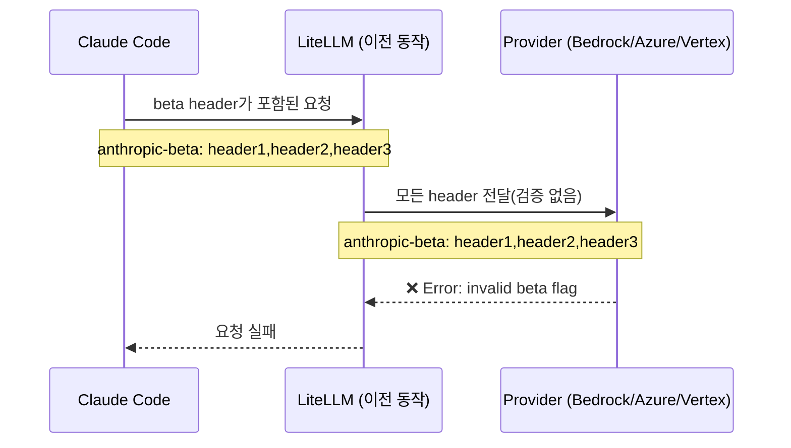
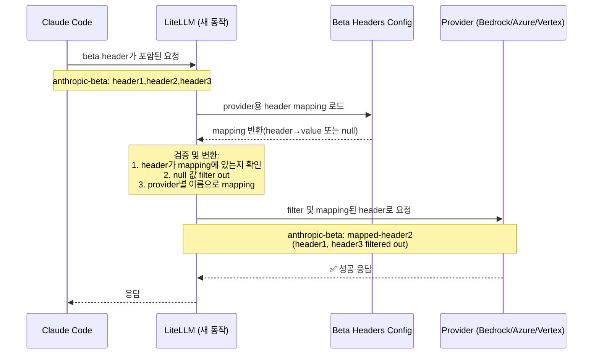

**날짜:** 2026년 2월 13일
**지속 시간:** 약 3시간
**심각도:** 높음
**상태:** 해결됨

> **참고:** 이 수정은 LiteLLM `v1.81.13-nightly` 이상에서 사용할 수 있습니다.

## 요약

Claude Code가 non-Anthropic provider(Bedrock, Azure AI, Vertex AI)에 지원되지 않는 Anthropic beta header를 보내기 시작하면서 `invalid beta flag` 오류가 발생했습니다. LiteLLM은 provider별 검증 없이 모든 beta header를 그대로 전달하고 있었습니다. 그 결과 Claude Code 요청을 LiteLLM을 통해 해당 provider로 라우팅하던 사용자가 요청 실패를 겪었습니다.

- **Anthropic으로 가는 LLM 호출:** 영향 없음.
- **Bedrock/Azure/Vertex로 가는 LLM 호출:** 지원되지 않는 header가 있을 때 `invalid beta flag` 오류로 실패.
- **비용 추적 및 라우팅:** 영향 없음.

{/* truncate */}

---

## 배경

Anthropic은 Claude의 실험 기능을 활성화하기 위해 beta header를 사용합니다. Claude Code가 API 요청을 보낼 때 `anthropic-beta: prompt-caching-scope-2026-01-05,advanced-tool-use-2025-11-20` 같은 header를 포함합니다. 하지만 모든 provider가 모든 Anthropic beta feature를 지원하는 것은 아닙니다.

이 incident 전에는 LiteLLM이 검증 없이 모든 beta header를 모든 provider에 전달했습니다.



Anthropic은 native support가 있어 요청이 성공했지만, 다른 provider는 Claude Code가 해당 provider에서 지원하지 않는 header를 보낼 때 실패했습니다.

---

## 근본 원인

LiteLLM에 provider별 beta header 검증이 없었습니다. Claude Code가 새로운 beta feature를 도입하거나 특정 provider가 지원하지 않는 header를 보냈을 때, LiteLLM이 이를 그대로 전달하면서 provider API 오류가 발생했습니다.

---

## 조치

| # | 조치 | 상태 | 코드 |
|---|---|---|---|
| 1 | provider별 mapping을 포함한 `anthropic_beta_headers_config.json` 생성 | ✅ 완료 | [`anthropic_beta_headers_config.json`](https://github.com/BerriAI/litellm/blob/main/litellm/anthropic_beta_headers_config.json) |
| 2 | 명시적으로 mapping된 header만 전달되도록 엄격한 검증 구현 | ✅ 완료 | [`litellm_logging.py`](https://github.com/BerriAI/litellm/blob/main/litellm/litellm_core_utils/litellm_logging.py) |
| 3 | 동적 config update를 위한 `/reload/anthropic_beta_headers` endpoint 추가 | ✅ 완료 | Proxy 관리 endpoint |
| 4 | 자동 주기 update를 위한 `/schedule/anthropic_beta_headers_reload` 추가 | ✅ 완료 | Proxy 관리 endpoint |
| 5 | custom config source를 위한 `LITELLM_ANTHROPIC_BETA_HEADERS_URL` 지원 | ✅ 완료 | 환경 설정 |
| 6 | air-gapped deployment를 위한 `LITELLM_LOCAL_ANTHROPIC_BETA_HEADERS` 지원 | ✅ 완료 | 환경 설정 |

이제 LiteLLM은 provider별로 header를 검증하고 변환합니다.



---

## 동적 설정 업데이트

핵심 개선점은 downtime 없는 설정 업데이트입니다. Anthropic이 새로운 beta feature를 release하면, 사용자는 재시작 없이 설정을 업데이트할 수 있습니다.

```bash
# Manually trigger reload (no restart needed)
curl -X POST "https://your-proxy-url/reload/anthropic_beta_headers" \
  -H "Authorization: Bearer YOUR_ADMIN_TOKEN"

# Or schedule automatic reloads every 24 hours
curl -X POST "https://your-proxy-url/schedule/anthropic_beta_headers_reload?hours=24" \
  -H "Authorization: Bearer YOUR_ADMIN_TOKEN"
```

이를 통해 Claude Code가 새 header를 도입했지만 LiteLLM 설정이 아직 갱신되지 않은 상황에서 같은 incident가 재발하는 것을 방지합니다.

---

## 설정 형식

`anthropic_beta_headers_config.json` 파일은 input header를 provider별 output header로 mapping합니다.

```json
{
  "description": "Mapping of Anthropic beta headers for each provider.",
  "anthropic": {
    "advanced-tool-use-2025-11-20": "advanced-tool-use-2025-11-20",
    "computer-use-2025-01-24": "computer-use-2025-01-24"
  },
  "bedrock_converse": {
    "advanced-tool-use-2025-11-20": null,
    "computer-use-2025-01-24": "computer-use-2025-01-24"
  },
  "azure_ai": {
    "advanced-tool-use-2025-11-20": "advanced-tool-use-2025-11-20",
    "computer-use-2025-01-24": "computer-use-2025-01-24"
  }
}
```

**검증 규칙:**
1. header는 target provider의 mapping에 존재해야 합니다.
2. `null` 값이 있는 header는 지원되지 않는 것으로 보고 filter out합니다.
3. header 이름은 provider별로 변환될 수 있습니다. 예를 들어 Bedrock은 일부 기능에 다른 이름을 사용합니다.

---

## 사용자 조치 방법

아직 문제가 발생하는 사용자는 LiteLLM version이 `v1.81.11-nightly`보다 낮다면 최신 버전으로 업데이트하세요.

```bash
pip install --upgrade litellm
```

또는 재시작 없이 설정을 수동으로 reload합니다.

```bash
curl -X POST "https://your-proxy-url/reload/anthropic_beta_headers" \
  -H "Authorization: Bearer YOUR_ADMIN_TOKEN"
```

---

## 관련 문서

- [Anthropic Beta Headers 관리](/litellm-docs-kr/docs/proxy/sync_anthropic_beta_headers) - 전체 설정 가이드
- [`anthropic_beta_headers_config.json`](https://github.com/BerriAI/litellm/blob/main/litellm/anthropic_beta_headers_config.json) - 현재 설정 파일
