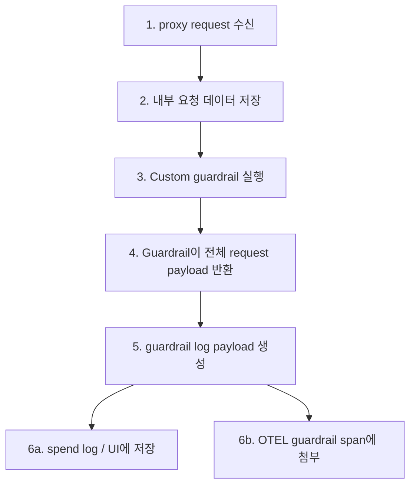

**날짜:** 2026년 3월 18일
**지속 시간:** 알 수 없음
**심각도:** 높음
**상태:** 해결됨

## 요약

custom guardrail이 전체 LiteLLM 요청/데이터 dictionary를 반환하면, LiteLLM이 기록하는 guardrail 응답에 `secret_fields.raw_headers`가 포함될 수 있었습니다. 여기에는 API key나 기타 자격 증명이 들어 있는 평문 `Authorization` header도 포함될 수 있었습니다.

이 정보는 guardrail metadata를 소비하는 로깅 및 관측성 표면으로 전파될 수 있었습니다. 예를 들면 다음과 같습니다.

- **LiteLLM UI의 spend log:** spend-log data 접근 권한이 있는 관리자에게 표시될 수 있음
- **OpenTelemetry trace:** 관련 telemetry backend 접근 권한이 있는 사람에게 표시될 수 있음

이 버그로 인해 LLM 호출, proxy routing, provider 실행이 차단되지는 않았습니다. 영향 범위는 관측성 및 로깅 경로에서 민감한 request header가 노출될 수 있다는 점이었습니다.

{/* truncate */}

---

## 배경

LiteLLM은 호출 중 사용하기 위해 내부 요청 데이터(request header 포함)를 보관합니다. 이 데이터는 로그나 telemetry에 기록되면 안 됩니다.

custom guardrail이 실행되면 그 결과가 기록되어 spend log, OpenTelemetry trace, 기타 관측성 backend에 표시될 수 있습니다. guardrail이 최소 결과 대신 전체 request payload를 반환하면, 내부 요청 데이터가 로깅 대상에 포함될 수 있었습니다. 수정 전에는 guardrail 로깅 경로가 해당 데이터를 제거하지 않은 채 시스템으로 전송했습니다.

---

## 근본 원인

근본 원인은 guardrail 로깅 경로의 sanitization이 불완전했다는 점입니다. spend log와 trace로 전송할 payload를 만들 때 LiteLLM은 guardrail response를 로깅용으로 준비했지만, header 같은 내부 요청 데이터를 제거하지 않았습니다. guardrail이 해당 데이터를 포함한 response를 반환하면, 그 값이 변경 없이 로깅 및 관측성 시스템으로 전달되었습니다.

---

## 영향

이 문제가 발생하려면 다음 조건이 모두 필요했습니다.

1. custom guardrail이 전체 LiteLLM 요청/데이터 dictionary 또는 `secret_fields`를 포함한 다른 response object를 반환함.
2. LiteLLM이 표준 guardrail 로깅 경로를 통해 해당 guardrail response를 기록함.
3. 운영자, 관리자 또는 telemetry consumer가 생성된 log나 trace에 접근할 수 있음.

이 조건이 충족되면 민감한 값이 다음 경로로 표시될 수 있었습니다.

- **Spend log / UI response:** 관리자 UI에 렌더링되는 spend-log payload에 guardrail metadata가 포함될 수 있음.
- **OpenTelemetry trace:** `guardrail_response`가 guardrail span의 span attribute로 기록될 수 있음.
- **기타 downstream 관측성 backend:** 동일한 guardrail metadata를 소비하는 integration이 유출된 값을 받을 수 있음.

이 문제는 로깅 및 telemetry 노출 버그였습니다. 호출자가 auth를 우회하거나, 다른 tenant에 직접 접근하거나, model behavior를 바꿀 수 있게 하지는 않았지만, 해당 관측성 시스템 접근 권한이 있는 사람에게 평문 자격 증명이 노출될 수 있었습니다.

---

## 사용자 조치

- LiteLLM 1.82.3 이상으로 업그레이드하세요.
- 전체 request/data dict를 반환하는 custom guardrail을 운영했다면, 영향 기간 동안 spend log 또는 telemetry trace가 보관되었는지 검토하세요.
- 해당 시스템의 `Authorization` 또는 기타 전달된 request header에 표시되었을 수 있는 자격 증명을 rotate하세요.
- 요청에서 파생된 metadata가 포함될 수 있는 spend-log view와 telemetry backend에 최소 권한 access control을 적용하세요.
