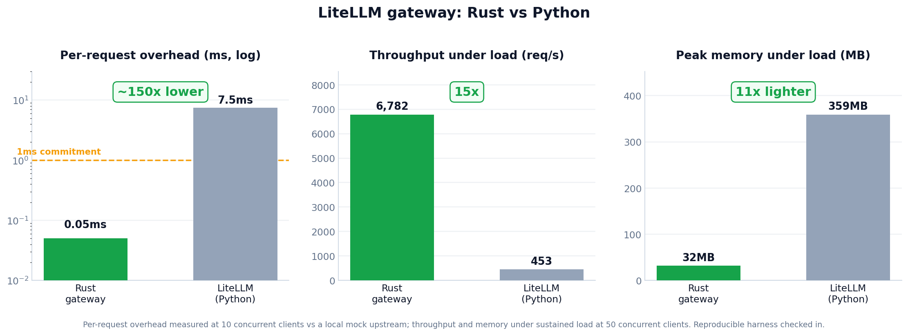

import { RustHeader, RustMigrationStages, RouteCadence, Stage1Architecture, RustServerSteps } from './diagrams';
import Head from '@docusaurus/Head';

<RustHeader />

*마지막 업데이트: 2026년 6월*

지난 1년 동안 사용자와 커뮤니티로부터 같은 이야기를 반복해서 들었습니다. 직접 운영할 수 있는 가장 빠르고 가장 가벼운 AI 게이트웨이가 필요하다는 것이었습니다. 우리는 이 요구를 들었고, LiteLLM을 Rust로 옮기면서 배포 가능한 바이너리의 메모리를 `100MB` 미만으로 낮추고 오버헤드를 `1ms` 미만으로 만들겠다고 약속합니다. 이 마이그레이션이 끝나면 인증과 rate limit을 포함한 모든 hot path 작업이 Rust에서 실행되고, AI 트래픽의 100%를 처리할 수 있는 순수 Rust 서버를 얻게 됩니다.

:::tip 함께 구축하고 싶으신가요?

초기 베타를 열고 있으며, 빠르고 가벼운 게이트웨이에 관심이 큰 팀과 직접 협업하고 싶습니다. 해당된다면 [여기에서 신청](https://docs.google.com/forms/d/e/1FAIpQLSecWdOjkzjEson2UiZpDftOoZPs8RQbtlAM40KSvDXZqEgYaA/viewform?usp=dialog)해 주세요. 여러분의 스택에서 Rust 게이트웨이를 테스트하고, 우리 팀과 직접 소통할 수 있도록 지원하겠습니다.

:::

이 일이 중요한 이유는 명확합니다. 실제 부하에서는 동시성이 올라갈수록 CPU와 메모리가 증가하고, 가장 나쁜 순간에 Pod가 OOM으로 종료됩니다. 현재 LiteLLM Python 프록시는 부하 상태에서 메모리가 약 `359MB`까지 올라가며, 이 비용은 운영하는 모든 Pod, 리전, 재시도마다 누적됩니다.

벤치마크에서는 이미 효과가 보이고 있습니다. Rust 게이트웨이는 약 `11배` 적은 메모리(`359MB`에서 `32MB`)로 약 `15배`의 처리량(`453` RPS에서 `6,782` RPS)을 제공하며, 요청당 오버헤드를 Python 경로의 약 `7.5ms`에서 우리가 약속한 `1ms`보다 훨씬 낮은 약 `0.05ms`까지 줄입니다.

## 얻을 수 있는 것

단일 Rust 바이너리를 배포합니다. 메모리는 약 `65MB`를 사용하고, 게이트웨이 오버헤드는 `1ms` 미만으로 유지되며, 설정은 아무것도 바뀌지 않습니다. 같은 `config.yaml`, 같은 데이터베이스, 같은 클라이언트 API, 같은 제공자를 그대로 사용합니다. LiteLLM이 오늘 지원하는 `/chat/completions`, `/messages`, `/responses`와 그 밖의 모든 LLM 엔드포인트를 포함해, OpenAI 호환 API 하나 뒤에서 100개 이상의 LLM 제공자를 지원하는 범위도 유지됩니다. 이제 이를 직접 호스팅할 수 있는 가장 빠르고 가벼운 LLM 게이트웨이로 제공합니다.

이것은 v2도 아니고 재작성도 아닙니다. 마이그레이션해야 할 새 메이저 버전도 없고, 사용자가 바꿔야 할 것도 없습니다. hot path 아래의 런타임만 더 빠르고 가벼워지며, 구성은 정확히 같은 위치에 그대로 남습니다.

우리는 이 작업을 신중하게 배포합니다. 각 route는 전체 parity 테스트와 end-to-end 테스트를 통과한 뒤에만 Rust로 이동하고, 다음 route를 시작하기 전에 프로덕션에서 실행됩니다. 안정성이 최우선이며, 모든 릴리스에서 회귀 0건을 목표로 합니다.

{/* truncate */}

## LiteLLM 게이트웨이는 얼마나 빠른가요? 처리량, 오버헤드, 메모리 벤치마크

**요청당 오버헤드.** 우리는 작은 harness를 만들었습니다. mock upstream, 얇은 Rust forwarding 게이트웨이(axum), 현재 LiteLLM에서 실행되는 동일한 forwarding 경로(`litellm.acompletion` over uvicorn), 그리고 각 요청 시간을 마이크로초 단위로 측정하는 load client로 구성됩니다. 같은 mock을 대상으로 `10`개의 동시 클라이언트를 실행했을 때 Rust 게이트웨이는 요청당 약 `0.05ms`의 오버헤드를 추가했고, LiteLLM Python 경로는 약 `7.5ms`를 추가했습니다. 이는 약 `150배` 낮은 수치이며, 우리가 약속한 `1ms`보다 훨씬 낮습니다.

**지속 부하.** 같은 `/v1/responses` 워크로드를 `50`개의 동시 클라이언트로 현재 LiteLLM Python 프록시에 적용했을 때, Rust 경로는 약 `11배` 적은 메모리로 약 `15배`의 처리량을 제공했습니다.

| | 요청당 오버헤드 | 부하 상태 처리량 | 부하 상태 최대 메모리 |
|---|---|---|---|
| **Rust gateway** | `~0.05ms` | `6,782` req/s | `31.7MB` |
| **LiteLLM (Python)** | `~7.5ms` | `453` req/s | `358.9MB` |

오버헤드 harness(mock, gateway, load client)는 이 글 옆의 [`benchmark/`](https://github.com/BerriAI/litellm-docs/tree/main/blog/litellm_rust_launch/benchmark)에 포함되어 있고, 요약된 수치는 [`rust_proxy_benchmark_results.csv`](./rust_proxy_benchmark_results.csv)에 있습니다. 따라서 `1ms` 미만 결과를 재현할 수 있습니다. 이 측정은 전체 프로덕션 워크로드가 아니라 게이트웨이 forwarding 경로(요청 변환, forwarding, 응답 처리)를 측정한 것입니다.

## 그대로 유지되는 것

여러분이 의존하는 것은 아무것도 바뀌지 않습니다. 마이그레이션은 외부에서 보이지 않습니다.

- Python SDK는 정확히 같은 인터페이스를 유지합니다. 같은 호출이 내부적으로 Rust 바인딩 위에서 실행됩니다.
- `config.yaml`은 그대로입니다.
- 데이터베이스와 스키마는 그대로입니다.
- 클라이언트 API와 요청/응답 형태는 그대로입니다.
- 제공자, 라우팅, 키는 그대로입니다.

더 낮은 메모리와 더 낮은 오버헤드를 얻지만, 이를 위해 사용자가 해야 할 일은 없습니다.

---

## 마이그레이션 방식

결과만 알고 싶다면 위 내용으로 충분합니다. 이 아래는 게이트웨이를 깨뜨리지 않고 Rust로 옮기는 방식을 보고 싶은 엔지니어를 위한 설명입니다.

핵심 아이디어는 깔끔한 분리입니다. 우리는 데이터만 변환하는 하나의 Rust core를 만듭니다. 이 core는 사용자 요청을 provider 요청으로 바꾸고, provider 응답을 다시 변환하고, stream chunk를 변환하고, token을 계산하고, 오류를 정규화합니다. socket을 열거나 secret을 읽거나 데이터베이스에 쓰지는 않습니다. 그 일은 host process가 모두 담당합니다. 이 분리 덕분에 서버를 재작성하지 않고도 Rust를 프로덕션에 넣을 수 있습니다. Python은 계속 I/O를 처리하고, Rust가 변환을 맡습니다.

<RustMigrationStages />

### 한 번에 하나의 route, 프로덕션에서 검증

우리는 전체 endpoint를 한 번에 전환하지 않습니다. 각 route마다 먼저 하나의 provider를 검증하고, 그 route의 모든 provider로 확장한 뒤에야 다음 route를 시작합니다. 가장 작고 위험이 낮은 route부터 시작합니다.

<RouteCadence />

Stage 1에서는 서버 구조가 바뀌지 않습니다. Python이 계속 트래픽을 받고 I/O를 처리하지만, provider별로 flag로 제어되는 binding을 통해 변환을 Rust core에 넘깁니다. provider를 켜기 전에는 parity check로 동일한 출력을 강제하고, flag가 꺼져 있으면 기존 Python 경로가 그대로 실행됩니다.

<Stage1Architecture />

route는 위험도 순서대로 이동합니다.

- **OCR 먼저.** 가장 작은 표면인 Mistral OCR부터 시작합니다. streaming이 없고, schema가 작고, parameter도 적습니다. 프로덕션에서 Python 출력과 byte 단위로 일치하면 모든 OCR provider로 확장한 뒤 route를 Rust core로 옮깁니다. 더 큰 endpoint를 옮기기 전에 여기서 integration 위험을 제거합니다.
- **다음은 `/v1/messages`.** 여기서는 streaming이 추가됩니다. SSE parsing, chunk emission, usage accounting, token cost를 다룹니다. 먼저 하나의 provider, 이후 전체 provider, 이후 route를 Rust로 옮깁니다.
- **그다음은 `/chat/completions`.** 가장 큰 표면이며, streaming이 검증된 뒤에만 진행합니다. tools, function calling, multimodal, 전체 optional parameter matrix를 포함합니다.
- **주요 provider.** 트래픽 규모 기준으로 Azure, Bedrock, Vertex 순서로 진행합니다. 인증과 결합된 provider는 host에서 signed header를 받습니다(boto3 / google-auth 먼저, 이후 native Rust). long-tail provider는 Python에서 계속 실행됩니다.

### Rust 서버로 이동

route가 Rust에서 실행되면 router도 이동합니다. routing, fallback, retry, cooldown을 Redis 상태와 함께 Rust로 옮깁니다. 그런 다음 서버 자체를 두 단계로 옮깁니다.

<RustServerSteps />

- **얇은 shell로서의 FastAPI.** FastAPI는 계속 HTTP를 종료하고 auth, rate-limit, callback을 실행하지만, 전체 forwarding 경로는 Rust로 들어가는 단일 호출이 됩니다.
- **순수 Rust 서버.** native server(axum / hyper)가 hot path에 Python 없이 forwarding 경로를 실행합니다. 사용자 정의 Python plugin(auth, guardrails, callbacks, SSO)은 선택적 sidecar에서 계속 동작하므로 깨지지 않습니다. shadow traffic과 percentage cutover로 배포합니다.

최종 상태는 순수 Rust data plane입니다. 고객의 Python plugin은 sidecar에서 계속 실행되므로 breaking change가 아닙니다. Python을 완전히 제거하려면 plugin을 Rust 또는 WASM 인터페이스로 이식해야 하며, 이는 breaking change이므로 뒤로 미룹니다.

### 이 순서로 진행하는 이유

- OCR route는 가장 작은 표면에서 integration 위험을 제거합니다.
- `/v1/messages`는 가장 큰 parameter set에 들어가기 전에 streaming 위험을 제거합니다.
- `/chat/completions`는 streaming이 검증된 뒤에만 진행합니다.
- 서버를 옮길 시점에는 core, provider, router가 이미 SDK를 통해 프로덕션에서 실행 중이므로 서버 작업은 대부분 연결 작업이 됩니다.

모든 단계는 parity check를 gate로 삼아, 다음 단계로 넘어가기 전에 실제 사용자에게 배포됩니다.

## 일정

우리는 한 번에 하나의 function을 가장 작은 것부터 옮기며, 각 단계가 테스트 suite를 통과한 뒤에만 진행합니다.

| 목표 | Rust로 이동하는 항목 |
|---|---|
| 2026년 8월 15일 | Mistral용 `litellm.ocr()`, 이후 전체 `litellm.ocr()`, 이후 `/ocr` route |
| 2026년 9월 1일 | `/messages`에 동일 패턴 적용, 이후 `/chat/completions` |
| 2026년 9월 15일 | router: load balancing, fallback, retry, cooldown |
| 2026년 12월 1일 | 전체 서버: 얇은 FastAPI shell, 이후 순수 Rust(axum) |

## 자주 묻는 질문

<Head>
  
</Head>

### LiteLLM은 가장 빠른 LLM 게이트웨이인가요?

이 작업의 목표가 바로 그것입니다. Rust hot path를 통해 LiteLLM은 `1ms` 미만의 게이트웨이 오버헤드와 `100MB` 미만 바이너리를 목표로 하며, 컴파일 언어 기반 게이트웨이 수준의 성능을 제공하면서도 OpenAI 호환 API 하나 뒤에서 100개 이상의 provider 지원 범위를 유지합니다. 벤치마크에서 Rust 게이트웨이는 요청당 약 `0.05ms`의 오버헤드를 추가했으며, 현재 LiteLLM Python 경로의 약 `7.5ms`와 비교됩니다. 또한 부하 상태에서 최대 메모리 `31.7MB`로 초당 `6,782`개 요청을 처리했습니다. 게이트웨이 오버헤드는 보통 전체 모델 지연 시간의 작은 비율이므로, 대규모 classification과 embedding처럼 높은 처리량과 낮은 지연 시간이 중요한 워크로드에서 가장 중요합니다.

### LiteLLM은 느린가요?

게이트웨이 지연 시간과 처리량은 프록시 배포 방식, worker 수, 동시성 설정, logging callback이 hot path에서 실행되는지에 따라 달라집니다. 적절히 튜닝된 Python 프록시는 이미 수백 개 provider의 프로덕션 트래픽을 처리합니다. hot path를 Rust로 옮기면 바닥값이 더 낮아집니다. 재현 가능한 벤치마크에서 Rust 게이트웨이는 요청당 약 `0.05ms`의 오버헤드를 추가했고, LiteLLM Python 경로는 약 `7.5ms`였으며, 최대 메모리 `31.7MB`에서 초당 `6,782`개 요청을 처리했습니다.

### LiteLLM은 Python GIL에 제한되나요?

GIL은 요청 경로의 CPU-bound 작업에만 의미가 있으며, 게이트웨이는 대부분 I/O입니다. LiteLLM은 현재 여러 worker를 실행해 확장합니다. Rust 마이그레이션은 hot path에서 이 질문 자체를 제거합니다. 요청 변환, streaming, routing이 Rust core와 router에서 GIL 밖으로 실행되고, 최종 상태에서는 forwarding 경로에 first-party Python이 없습니다.

### LiteLLM 게이트웨이는 메모리를 얼마나 사용하나요?

Python 프록시는 부하 테스트에서 `358.9MB`까지 올라갔습니다. Rust 최종 상태의 목표는 약 `65MB`입니다. 더 낮고 제한된 메모리 사용량은 이 작업의 핵심 이유입니다. 동시 부하에서 나타나는 높은 CPU 사용과 OOM 실패를 줄입니다.

### 이 벤치마크는 재현 가능한가요?

예. 오버헤드 harness(mock upstream, 얇은 Rust 게이트웨이, 요청 시간을 마이크로초 단위로 측정하는 load client)는 요약 CSV와 함께 [`benchmark/`](https://github.com/BerriAI/litellm-docs/tree/main/blog/litellm_rust_launch/benchmark)에 포함되어 있습니다. 두 런타임 모두 같은 upstream과 payload를 사용하며, 유일한 변수는 Python인지 Rust인지입니다.

### Rust 게이트웨이는 breaking change인가요?

아니요. config, database schema, client API contract는 그대로 유지됩니다. hot path 아래의 런타임만 parity 테스트와 end-to-end 테스트를 통과한 route부터 점진적으로 바뀝니다.

## Rust 엔지니어를 채용 중입니다

우리는 작은 팀으로 이 작업을 만들고 있으며, 100개 이상의 provider를 처리하는 AI 게이트웨이의 hot path에서 일하고 싶은 Rust 엔지니어를 찾고 있습니다. 관심이 있다면 [함께 만들어 주세요](https://jobs.ashbyhq.com/litellm/3f326076-7415-46a1-921e-8a1b1d6ee2b6).

## 참고 자료

- [Datadog이 정적 분석기를 Java에서 Rust로 마이그레이션한 방법](https://www.datadoghq.com/blog/engineering/how-we-migrated-our-static-analyzer-from-java-to-rust/)
- [GitGuardian이 플랫폼의 핵심을 Rust로 마이그레이션한 방법](https://blog.gitguardian.com/how-we-migrated-the-heart-of-our-platform-to-rust/)
- [LiteLLM AI Gateway, 전체 기능 개요](https://docs.litellm.ai/docs/simple_proxy)
- [100개 이상의 LLM provider에 대한 load balancing과 routing](https://docs.litellm.ai/docs/routing)
