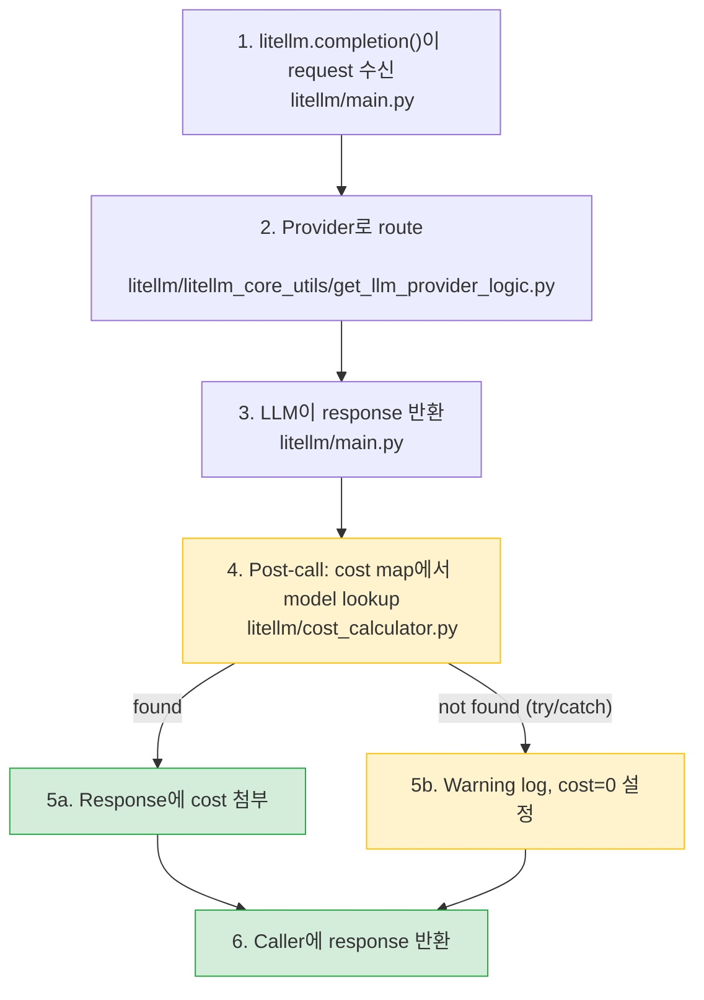

**날짜:** 2026년 1월 27일
**기간:** 약 20분
**심각도:** 낮음
**상태:** 해결됨

## 요약

`model_prices_and_context_window.json`의 잘못된 JSON entry가 `main`에 merge되었습니다([`562f0a0`](https://github.com/BerriAI/litellm/commit/562f0a028251750e3d75386bee0e630d9796d0df)). 이로 인해 LiteLLM이 오래된 model cost map local copy로 조용히 fallback했습니다. 오래된 package version을 사용하는 사용자는 newer model(예: `azure/gpt-5.2`)에 대해서만 cost tracking을 잃었습니다. LLM 호출은 차단되지 않았습니다.

- **LLM 호출 및 proxy routing:** 영향 없음.
- **Cost tracking:** Local backup에 없는 newer model에 영향이 있었습니다. 기존 model은 영향받지 않았습니다. Commit이 revert되기까지 약 20분 동안 지속되었습니다.

{/* truncate */}

---

## 배경

Model cost map은 request path에 없습니다. LLM response가 돌아온 뒤 spend를 계산하기 위해 try/catch 안에서 사용됩니다. Entry가 없어도 호출을 차단하지 않습니다.

두 경로 모두 caller에 response를 반환합니다. Cost map lookup이 실패하면 해당 요청에서 `cost=0`이 되는 것만 다릅니다.

---

## 근본 원인

LiteLLM은 import 시점에 GitHub `main`에서 model cost map을 가져옵니다. Fetch가 실패하면 package에 bundled된 local backup으로 fallback합니다. 이 사고 전에는 fallback이 완전히 조용히 이루어졌고 warning log도 남지 않았습니다.

Contributor PR에서 추가 `{` bracket이 들어가 invalid JSON이 만들어졌습니다. Remote fetch가 `JSONDecodeError`로 실패했고, silent fallback이 트리거되었습니다. 오래된 package version 사용자의 backup file에는 newer model이 누락되어 있었습니다.

**타임라인:**

1. 잘못된 JSON이 `main`에 merge됨
2. LiteLLM 설치본이 다음 import에서 local backup으로 fallback
3. 사용자가 newer model에 대해 `"This model isn't mapped yet"` 보고
4. 잘못된 commit 식별 및 revert(약 20분)

---

## 조치 내역

| # | 조치 | 상태 | 코드 |
|---|---|---|---|
| 1 | `model_prices_and_context_window.json`에 CI validation 추가 | ✅ 완료 | [`test-model-map.yaml`](https://github.com/BerriAI/litellm/blob/main/.github/workflows/test-model-map.yaml) |
| 2 | Local backup fallback 시 warning log 추가 | ✅ 완료 | [`get_model_cost_map.py#L57-L68`](https://github.com/BerriAI/litellm/blob/main/litellm/litellm_core_utils/get_model_cost_map.py#L57-L68) |
| 3 | Integrity validation helper가 포함된 `GetModelCostMap` class 추가 | ✅ 완료 | [`get_model_cost_map.py#L24-L149`](https://github.com/BerriAI/litellm/blob/main/litellm/litellm_core_utils/get_model_cost_map.py#L24-L149) |
| 4 | Resilience test suite 추가(bad hosted map, fallback, completion) | ✅ 완료 | [`test_model_cost_map_resilience.py#L150-L291`](https://github.com/BerriAI/litellm/blob/main/tests/llm_translation/test_model_cost_map_resilience.py#L150-L291) |
| 5 | Backup model cost map이 항상 존재하고 common model을 포함하는지 test | ✅ 완료 | [`test_model_cost_map_resilience.py#L213-L228`](https://github.com/BerriAI/litellm/blob/main/tests/llm_translation/test_model_cost_map_resilience.py#L213-L228) |

Import 시점에 외부 의존성이 전혀 없어야 하는 엔터프라이즈 환경에서는 `LITELLM_LOCAL_MODEL_COST_MAP=True`를 설정해 GitHub fetch를 완전히 건너뛸 수 있습니다.

---

## 외부 resource에 대한 다른 의존성

| 의존성 | 사용할 수 없을 때 영향 | Fallback |
|---|---|---|
| Model cost map (GitHub) | Newer model의 cost tracking | Local backup(이제 warning 포함) |
| JWT public keys (IDP/SSO) | Auth 실패 | 없음 |
| OIDC UserInfo (IDP/SSO) | Auth 실패 | 없음 |
| HuggingFace model API | HF provider 호출 실패 | 없음 |
| Ollama tags (localhost) | Ollama model list가 오래됨 | Static list |
