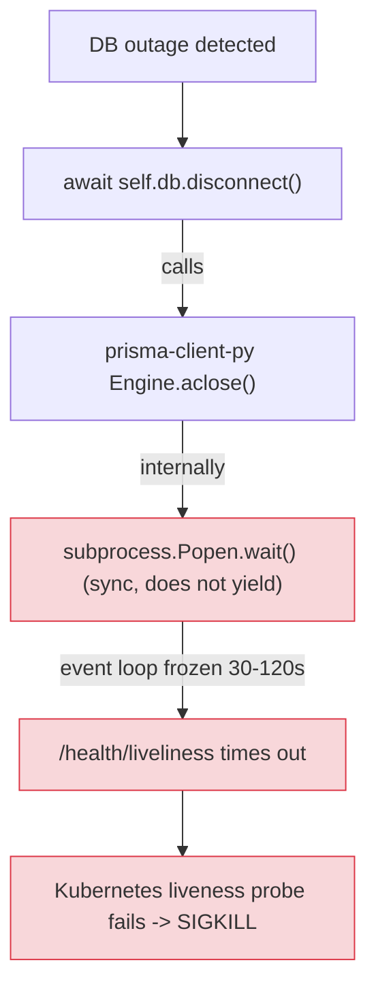

**날짜:** 2026년 4월
**기간:** 수정 반영 전 여러 고객 배포 환경에서 여러 차례 발생
**심각도:** 높음 — Kubernetes에서 전체 proxy 장애처럼 나타남
**상태:** 해결됨

> **참고:** 이 수정은 [PR #26225](https://github.com/BerriAI/litellm/pull/26225)가 포함된 릴리스부터 사용할 수 있습니다. 해당 PR은 2026년 4월 29일 merge되었습니다.

## 요약

Upstream Postgres database에 접근할 수 없게 되었을 때 LiteLLM proxy의 Prisma reconnect path가 `await self.db.disconnect()`를 호출했습니다. prisma-client-py에서 이 호출은 Rust query-engine subprocess에 대해 **동기식** `subprocess.Popen.wait()`를 실행합니다. `wait()`는 yield하지 않기 때문에, engine이 종료될 때까지 asyncio event loop가 멈췄습니다. 운영 환경에서는 응답하지 않는 database를 상대로 TCP close operation이 걸리면서 보통 30-120초 동안 멈췄습니다.

Loop가 멈춘 동안에는 `/health/liveliness`를 포함해 **어떤 coroutine도 실행되지 않았습니다**. Kubernetes liveness probe가 timeout되고 kubelet이 pod에 SIGKILL을 보냈습니다. 운영자 관점에서는 proxy가 죽은 것처럼 보였지만, 실제 underlying issue는 reconnect logic이 견뎌야 했던 *일시적인* DB 장애였습니다.

**영향:** Postgres가 잠깐 응답하지 않은 고객은 DB가 돌아왔을 때 proxy가 graceful하게 reconnect하는 대신, proxy pod가 kill되고 restart되는 현상을 겪었습니다. 이 문제는 FLock이 외부에서 보고했고 내부에서 재현했습니다.

{/* truncate */}

---

## 배경

LiteLLM proxy는 Postgres metadata store(key, team, spend log)에 접근하기 위해 하나의 long-lived Prisma client를 유지합니다. 이 연결이 끊기면 reconnect해야 하며, 그렇지 않으면 모든 authenticated request가 실패합니다. Reconnect path는 `litellm/proxy/db/prisma_client.py`의 `recreate_prisma_client()`에 있고, 지금은 제거된 `litellm/proxy/utils.py`의 "direct reconnect" branch에도 있었습니다.

의도한 흐름은 다음과 같았습니다.

1. Health watchdog이 DB query 실패를 감지합니다.
2. `await self.db.disconnect()`를 호출해 기존 engine process를 clean하게 release합니다.
3. 새 `Prisma()` client를 만듭니다.
4. `await new_client.connect()`를 호출합니다.
5. Proxy의 `prisma_client.db` reference를 새 client로 교체하고 serving을 재개합니다.

`/health/liveliness` route는 의도적으로 가볍게 만들어져 database를 건드리지 않습니다. 따라서 DB 장애 중에도 liveliness는 green 상태를 유지하고 Kubernetes가 pod를 그대로 두는 것이 기대 동작이었습니다.



---

## 근본 원인

`prisma-client-py`의 engine cleanup은 내부적으로 동기식입니다. Python 관점에서 library의 `Engine.aclose()`는 `async`처럼 보이지만, Rust query-engine subprocess를 실제로 종료하는 구현은 다음을 호출합니다.

```python
self.process.send_signal(signal.SIGTERM)
self.process.wait()   # <-- BLOCKING. Does not yield to the loop.
```

Database가 정상일 때는 engine이 millisecond 단위로 종료되어 blocking call이 눈에 띄지 않습니다. Database가 *비정상*일 때는 engine 자체의 outbound TCP `close()` call이 응답하지 않는 Postgres host의 FIN/ACK를 기다리며 hang되고, `wait()`가 그 시간 동안 전체 event loop를 막습니다.

Reconnect path는 "safety timeout"으로 `asyncio.wait_for()`에 감싸져 있었지만, **`wait_for`는 `await` 지점에서만 cancel할 수 있습니다**. `subprocess.wait()` 내부에는 `await`가 없으므로 timeout이 동작할 수 없었습니다. Loop는 `wait()`가 자체적으로 반환될 때까지 cancellation coroutine을 포함한 어떤 coroutine도 실행하지 못했습니다.

결과적으로 DB 장애 중 Prisma reconnect가 발생할 때마다 전체 proxy가 멈췄고, Kubernetes는 이 freeze를 liveness failure로 오인했습니다.

---

## 수정

[PR #26225](https://github.com/BerriAI/litellm/pull/26225)는 두 reconnect path 모두에서 `disconnect()`를 engine subprocess에 대한 direct non-blocking kill로 교체했습니다. 새 흐름은 다음과 같습니다.

1. `_get_engine_pid()`로 engine PID를 조회합니다. 이 함수는 unit-test mock이 caller를 crash시키지 않도록 실제 integer만 반환하게 강화되었습니다.
2. Subprocess에 직접 `SIGTERM`을 보냅니다.
3. `await asyncio.sleep(0.5)`를 호출합니다. 이것은 실제 `await`이므로 loop가 계속 돌고 `/health/liveliness`도 계속 응답합니다.
4. Process가 아직 살아 있으면 `SIGKILL`을 보냅니다.
5. 새 `Prisma()` client를 만들고 `await new_client.connect()`를 호출합니다.
6. Proxy의 reference를 새 client로 교체합니다.

두 reconnect call site인 `recreate_prisma_client`와 과거 별도였던 `litellm/proxy/utils.py`의 "direct reconnect" branch는 이제 모두 `recreate_prisma_client`를 거칩니다. Engine이 살아 있는 path와 이미 죽은 path가 같은 kill-then-recreate 흐름으로 합쳐져, "check 사이에 engine이 죽으면 어떻게 되는가" 같은 bug class를 제거했습니다.

관련 변경을 단순화하면 다음과 같습니다.

```diff
- # Old: blocks event loop for as long as the engine takes to shut down
- await self.db.disconnect()
+ # New: signal the engine subprocess directly, yield via real await,
+ # then SIGKILL if it has not exited.
+ pid = self._get_engine_pid()
+ if pid is not None:
+     try:
+         os.kill(pid, signal.SIGTERM)
+     except ProcessLookupError:
+         pass
+ await asyncio.sleep(0.5)
+ if pid is not None:
+     try:
+         os.kill(pid, signal.SIGKILL)
+     except ProcessLookupError:
+         pass
```

새 `Prisma()` client와 그 `connect()`는 기존과 동일하게 유지했습니다. 바뀐 것은 *기존* engine을 종료하는 방식뿐입니다.

### 검증

Local proxy + Postgres Docker 환경에서 end-to-end로 재현했고, Postgres container에 `docker pause`를 사용해 응답하지 않는 database를 시뮬레이션했습니다.

| 조건 | 최대 `/health/liveliness` latency | 2xx |
|---------------------------------------------------|----------------------------------|-----|
| 수정 전, 운영 환경과 유사한 느린 close(5s 주입) | **10006 ms** (probe timeout) | 99.7% |
| 수정 후, 같은 느린 close 주입 | **52.7 ms** | 100% |
| 수정 후, 자연 실행(주입 없음) | 78.8 ms | 100% |

시뮬레이션한 DB 장애가 끝난 뒤 `/health/readiness`는 `db: "connected"`를 반환했고 `/key/list`의 live row read도 성공했습니다. Reconnect가 end-to-end로 동작한다는 뜻입니다.

`tests/test_litellm/proxy/db/test_prisma_self_heal.py`와 `tests/litellm/proxy/test_prisma_engine_watchdog.py`의 unit test 40개를 새 code path에 맞춰 업데이트했습니다. 기존에 통과하던 `test_lightweight_reconnect_skips_kill_on_successful_disconnect`는 제거했습니다. 이 테스트는 "successful disconnect 시 engine을 보존한다"는 오래된 invariant를 encode하고 있었는데, 이 invariant 자체가 bug의 일부였습니다. prisma-client-py의 `aclose()`는 어쨌든 engine을 kill합니다.

---

## 배운 점

1. **Third-party library의 shutdown path에서 `async def`를 그대로 믿지 마세요.** Async signature는 library가 coroutine 모양의 API를 제공한다는 뜻일 뿐, 실제로 yield한다는 보장은 아닙니다. Yield하지 않는 비용이 "pod kill"이라면, 정상 DB나 hard-down DB만이 아니라 network partition, paused DB 같은 partial failure에서 동작을 검증해야 합니다.
2. **`asyncio.wait_for()`는 sync work에 대한 safety net이 아닙니다.** `await` 지점에서만 cancel할 수 있으므로 blocking call을 `wait_for`로 감싼다고 timeout이 생기지 않습니다. Kubernetes, load balancer, customer 같은 다른 무언가가 문제를 알아차릴 때까지 bug를 숨길 뿐입니다.
3. **Health check는 설명하는 work와 같은 event loop 위에 있어야 합니다.** `/health/liveliness`는 DB 장애에도 살아남도록 의도적으로 최소화했지만, 다른 모든 request와 같은 asyncio loop를 공유합니다. 따라서 loop 안의 동기식 blocking call 하나가 route 자체가 아무리 싸더라도 liveliness를 같이 끌어내립니다.
4. **복구 불가능한 subprocess에는 library-level cleanup보다 process-level signal을 선호하세요.** Engine이 socket close에서 wedged 상태가 되면 기다리지 않는 graceful path는 없습니다. `SIGTERM` + bounded `asyncio.sleep` + `SIGKILL`은 결정적이고 async-friendly한 shutdown을 제공합니다.

---

## 운영자 가이드

이 수정 전 LiteLLM version에서 다음 증상 중 하나를 봤다면, 위 bug가 가장 가능성 높은 원인입니다.

- 일시적인 Postgres incident(RDS failover, network partition, DB의 짧은 CPU starvation) 중 Kubernetes pod가 반복적으로 restart됨.
- `/health/liveliness`가 대부분 200을 반환하지만 DB issue 중 수십 초 동안 timeout됨.
- Proxy 내부 reconnect가 아니라 pod 자체가 re-roll, re-mount 등으로 복구되고, `litellm` log에는 "reconnect started"와 다음 pod startup 사이에 아무 내용도 없음.

해결 방법:

1. [PR #26225](https://github.com/BerriAI/litellm/pull/26225)가 포함된 LiteLLM 릴리스로 업그레이드합니다.
2. 수정이 활성화됐는지 확인합니다. `recreate_prisma_client`는 `self.db.disconnect()`를 호출하면 안 되며, engine subprocess에 직접 signal을 보내야 합니다.
3. 즉시 업그레이드할 수 없다면 liveness probe timeout을 최악의 `engine.wait()` duration보다 큰 값(예: 180s)으로 늘리면 pod kill은 줄일 수 있습니다. 하지만 underlying event-loop freeze는 그대로 남습니다. 이는 임시 완화책이지 수정이 아닙니다.

---

## 참고

- [LIT-2613 — FLock Prisma Connection Issue Fix](https://linear.app/litellm-ai/issue/LIT-2613/flock-prisma-connection-issue-fix)
- [LIT-2614 — Prisma Connection Issue RCA](https://linear.app/litellm-ai/issue/LIT-2614/prisma-connection-issue-rca) (this writeup)
- [PR #26225 — Proxy: reconnect Prisma DB without blocking the event loop](https://github.com/BerriAI/litellm/pull/26225)
- Code: `litellm/proxy/db/prisma_client.py` (`recreate_prisma_client`, `_kill_engine_process`)
