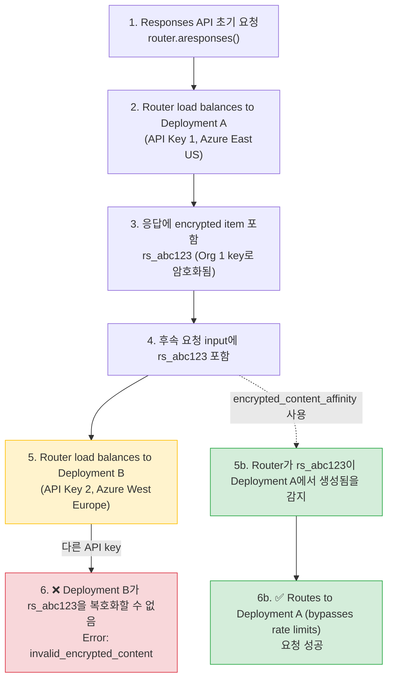

**날짜:** 2026년 2월 24일  
**기간:** 진행 중(수정 배포 전까지)  
**심각도:** 높음(서로 다른 API key로 Responses API를 load balancing하는 사용자 대상)  
**상태:** 해결됨

## 요약

OpenAI Responses API를 **서로 다른 API key**를 사용하는 deployment 간에 load balancing할 때(예: 서로 다른 Azure region 또는 OpenAI organization), encrypted content item(`rs_...` reasoning item 등)을 포함한 후속 요청이 다음 오류로 실패했습니다.

```json
{
  "error": {
    "message": "The encrypted content for item rs_0d09d6e56879e76500699d6feee41c8197bd268aae76141f87 could not be verified. Reason: Encrypted content organization_id did not match the target organization.",
    "type": "invalid_request_error",
    "code": "invalid_encrypted_content"
  }
}
```

Encrypted content item은 이를 생성한 API key의 organization에 암호학적으로 묶여 있습니다. Router가 후속 요청을 다른 API key를 가진 deployment로 load balancing하면 복호화가 실패했습니다.

- **Encrypted content가 있는 Responses API 호출:** 잘못된 deployment로 routing되면 완전히 실패
- **초기 요청:** 영향 없음 - encrypted item을 포함한 후속 요청만 실패
- **다른 API endpoint:** 영향 없음 - chat completions, embeddings 등은 정상 동작

{/* truncate */}

---

## 배경

OpenAI Responses API는 중간 reasoning step을 담은 encrypted "reasoning item"(`rs_...` 같은 ID)을 반환할 수 있습니다. 이 item은 organization key로 암호화되며, 같은 organization의 API key로만 복호화할 수 있습니다.

서로 다른 API key를 가진 deployment 간에 load balancing할 때 기존 affinity 메커니즘은 충분하지 않았습니다.

- **`responses_api_deployment_check`**: 일부 client(Codex 등)가 제공하지 않는 `previous_response_id`가 필요합니다.
- **`deployment_affinity`**: 범위가 너무 넓습니다. 한 사용자의 *모든* 요청을 하나의 deployment에 고정해 사용자 수만큼 유효 quota가 줄어듭니다.
- **`session_affinity`**: 명시적인 session ID가 필요하며 여전히 quota가 줄어듭니다.



---

## 근본 원인

LiteLLM router에는 특정 encrypted content item을 어느 deployment가 생성했는지 추적하고, 그에 맞춰 후속 요청을 routing하는 메커니즘이 없었습니다. Router는 모든 deployment를 상호 교체 가능한 대상으로 취급했고, encrypted content가 organization 경계를 넘을 때 복호화 실패가 발생했습니다.

**문제 흐름:**

1. 사용자가 model `gpt-5.1-codex`로 `router.aresponses()` 호출
2. Router가 배포 A(`Azure East US`, `API Key 1`)로 load balancing
3. 응답에 encrypted reasoning item `rs_abc123` 포함(Org 1의 key로 암호화됨)
4. 사용자가 input에 `rs_abc123`을 넣어 후속 요청 실행
5. Router가 Deployment B(Azure West Europe, API Key 2)로 load balancing
6. Deployment B가 Org 2의 key로 `rs_abc123` 복호화를 시도 → **실패**

**기존 해결책이 맞지 않았던 이유:**

- **`previous_response_id`**: 모든 client가 제공하지 않습니다(예: Codex).
- **`deployment_affinity`**: 사용자의 *모든* 요청을 하나의 deployment에 고정합니다. deployment 수가 N이면 quota가 1/N로 줄어듭니다.
- **`session_affinity`**: 명시적인 session 관리가 필요하며 여전히 quota가 줄어듭니다.

**타임라인:**

1. 사용자가 서로 다른 API key로 multi-region Responses API load balancing 구성
2. 초기 요청은 성공했지만 encrypted content가 있는 후속 요청은 간헐적으로 실패
3. 오류율은 deployment 수와 상관관계를 보임(deployment가 많을수록 잘못된 곳으로 routing될 확률 증가)
4. 조사 결과 encrypted content가 organization에 묶여 있음이 확인됨
5. 기존 affinity 메커니즘은 부적합하다고 판단됨(quota 감소, `previous_response_id` 누락)
6. 새 해결책 `encrypted_content_affinity` 설계 및 구현

---

## 수정 내용

Encrypted content를 지능적으로 추적하고 **필요한 경우에만** 후속 요청을 routing하는 새 `encrypted_content_affinity` pre-call check를 구현했습니다.

### 구현

**1. Output item에 `model_id` encoding** ([`responses/utils.py`](https://github.com/BerriAI/litellm/blob/main/litellm/litellm/responses/utils.py))

`previous_response_id` affinity에 사용한 것과 같은 접근 방식이며 cache가 필요 없습니다. 응답에 `encrypted_content`가 있는 output item이 포함되면 LiteLLM은 원본 deployment의 `model_id`를 중복성을 위해 **두 위치**에 encoding합니다.

1. **Item ID 내부**(있는 경우): `rs_abc123` → `encitem_{base64("litellm:model_id:{model_id};item_id:rs_abc123")}`
2. **`encrypted_content` 자체 내부**: content를 `litellm_enc:{base64("model_id:{model_id}")};{original_encrypted_content}`로 감쌉니다.

```python
# Encoding item IDs (when present)
def _build_encrypted_item_id(model_id: str, item_id: str) -> str:
    assembled = f"litellm:model_id:{model_id};item_id:{item_id}"
    encoded = base64.b64encode(assembled.encode("utf-8")).decode("utf-8")
    return f"encitem_{encoded}"

# Wrapping encrypted_content (always, for redundancy)
def _wrap_encrypted_content_with_model_id(encrypted_content: str, model_id: str) -> str:
    metadata = f"model_id:{model_id}"
    encoded_metadata = base64.b64encode(metadata.encode("utf-8")).decode("utf-8")
    return f"litellm_enc:{encoded_metadata};{encrypted_content}"
```

**왜 `encrypted_content`를 직접 감싸나요?** 일부 client(Codex 등)는 후속 요청에서 item ID를 일관되게 보내지 않지만, `encrypted_content` 자체는 항상 보냅니다. Content 안에 `model_id`를 넣으면 ID가 없어도 affinity가 동작합니다.

**Streaming response:** wrapping 로직은 두 경로 모두에 적용됩니다.
- 최종 response object(non-streaming)
- 개별 streaming event(`response.output_item.added`, `response.output_item.done`)

이를 통해 streaming response를 받는 client도 후속 요청에 다시 보낼 수 있는 wrapped content를 받습니다.

Upstream provider로 전달하기 전에 LiteLLM은 원래 item ID를 복원하고 encrypted_content를 unwrap하여 provider가 encoded form을 보지 않도록 합니다.

```python
# In responses/main.py — before calling the handler
input = ResponsesAPIRequestUtils._restore_encrypted_content_item_ids_in_input(input)
```

**2. `EncryptedContentAffinityCheck` - routing 전용** ([`encrypted_content_affinity_check.py`](https://github.com/BerriAI/litellm/blob/main/litellm/litellm/router_utils/pre_call_checks/encrypted_content_affinity_check.py))

`async_log_success_event`나 cache lookup이 없습니다. `model_id`는 item ID 또는 encrypted_content에서 직접 decoding됩니다.

```python
class EncryptedContentAffinityCheck(CustomLogger):
    async def async_filter_deployments(self, model, healthy_deployments, ...):
        """Extract model_id from input items (ID or encrypted_content) and pin to that deployment."""
        for item in request_kwargs.get("input", []):
            # Try to extract model_id from two sources:
            model_id = self._extract_model_id_from_input(item)
            
            if model_id:
                deployment = self._find_deployment_by_model_id(
                    healthy_deployments, model_id
                )
                if deployment:
                    request_kwargs["_encrypted_content_affinity_pinned"] = True
                    return [deployment]
        return healthy_deployments
    
    def _extract_model_id_from_input(self, item: dict) -> Optional[str]:
        """Extract model_id from either encoded ID or wrapped encrypted_content."""
        # 1. Try decoding from item ID (if present)
        item_id = item.get("id", "")
        if item_id:
            decoded = ResponsesAPIRequestUtils._decode_encrypted_item_id(item_id)
            if decoded:
                return decoded["model_id"]
        
        # 2. Try unwrapping from encrypted_content (fallback for clients that omit IDs)
        encrypted_content = item.get("encrypted_content", "")
        if encrypted_content and encrypted_content.startswith("litellm_enc:"):
            model_id, _ = ResponsesAPIRequestUtils._unwrap_encrypted_content_with_model_id(
                encrypted_content
            )
            return model_id
        
        return None
```

**3. Rate Limit 우회** ([`router.py`](https://github.com/BerriAI/litellm/blob/main/litellm/litellm/router.py))

Encrypted content가 특정 deployment를 요구하는 경우 RPM/TPM limit을 우회합니다. 어차피 다른 deployment에서는 해당 요청이 실패하기 때문입니다.

```python
# In async_get_available_deployment, after filtering healthy deployments:
if (
    request_kwargs.get("_encrypted_content_affinity_pinned")
    and len(healthy_deployments) == 1
):
    return healthy_deployments[0]  # Bypass routing strategy (RPM/TPM checks)
```

**3. 설정**

```yaml
router_settings:
  routing_strategy: usage-based-routing-v2
  enable_pre_call_checks: true
  optional_pre_call_checks:
    - encrypted_content_affinity
  deployment_affinity_ttl_seconds: 86400  # 24 hours
```

### 주요 이점

✅ **Quota 감소 없음**: encrypted item을 포함한 요청만 고정합니다.  
✅ **Rate limit 우회**: encrypted content가 특정 deployment를 요구할 때 RPM/TPM limit이 막지 않습니다.  
✅ **`previous_response_id` 불필요**: `model_id`를 item ID에 직접 encoding해 동작합니다.  
✅ **Cache 불필요**: `model_id`를 item ID에서 즉시 decoding합니다. Redis도 TTL도 필요 없습니다.  
✅ **전역적으로 안전**: 모든 model에 활성화할 수 있으며, Responses API가 아닌 호출에는 영향이 없습니다.  
✅ **정밀한 적용**: 일반 요청은 계속 자유롭게 load balance됩니다.

---

## 조치 내역

| # | 조치 | 상태 | 코드 |
|---|---|---|---|
| 1 | 응답에서 encrypted-content item ID에 `model_id` encoding | ✅ 완료 | [`responses/utils.py`](https://github.com/BerriAI/litellm/blob/main/litellm/litellm/responses/utils.py) |
| 2 | Upstream provider로 전달하기 전에 원래 item ID 복원 | ✅ 완료 | [`responses/main.py`](https://github.com/BerriAI/litellm/blob/main/litellm/litellm/responses/main.py) |
| 3 | `EncryptedContentAffinityCheck`: item ID를 decoding해 routing(cache 없음) | ✅ 완료 | [`encrypted_content_affinity_check.py`](https://github.com/BerriAI/litellm/blob/main/litellm/litellm/router_utils/pre_call_checks/encrypted_content_affinity_check.py) |
| 4 | `OptionalPreCallChecks` type에 `encrypted_content_affinity` 추가 | ✅ 완료 | [`types/router.py`](https://github.com/BerriAI/litellm/blob/main/litellm/litellm/types/router.py) |
| 5 | Affinity로 고정된 요청에 rate limit 우회 구현 | ✅ 완료 | [`router.py`](https://github.com/BerriAI/litellm/blob/main/litellm/litellm/router.py) |
| 6 | Unit test: encoding/decoding utility, routing, RPM 우회 | ✅ 완료 | [`test_encrypted_content_affinity_check.py`](https://github.com/BerriAI/litellm/blob/main/litellm/tests/test_litellm/router_utils/pre_call_checks/test_encrypted_content_affinity_check.py) |
| 7 | 문서: Responses API guide, load balancing guide, config reference | ✅ 완료 | [문서](https://docs.litellm.ai/docs/response_api#encrypted-content-affinity-multi-region-load-balancing) |
| 8 | **[3월 3일]** Streaming event가 encrypted_content를 wrap하도록 수정 | ✅ 완료 | [`responses/streaming_iterator.py`](https://github.com/BerriAI/litellm/blob/main/litellm/litellm/responses/streaming_iterator.py) |

---

## 후속 수정: Streaming Responses(2026년 3월 3일)

### 문제

초기 수정 배포 후, Codex 같은 client에서 streaming response를 사용할 때 `invalid_encrypted_content` 오류가 **여전히 발생한다는** 사용자 보고가 있었습니다. 조사 결과는 다음과 같았습니다.

- ✅ Non-streaming response: `encrypted_content`가 `litellm_enc:` prefix로 올바르게 wrap됨
- ❌ Streaming response: 개별 `response.output_item.added` 및 `response.output_item.done` event에 **raw, unwrapped** `encrypted_content`가 포함됨

Codex와 다른 client는 response를 stream으로 소비하므로, 이 event에서 unwrapped content를 받고 후속 요청에 다시 보냈습니다. 그 결과 affinity check가 실패했습니다.

### 근본 원인

`_update_encrypted_content_item_ids_in_response` 함수는 non-streaming response에 사용되는 **최종** response object만 수정했습니다. Streaming response에서는 개별 chunk가 `ResponsesAPIStreamingIterator._process_chunk`에서 처리되는데, 이 경로가 streaming event에 wrapping 로직을 적용하지 않았습니다.

### 수정

`litellm/litellm/responses/streaming_iterator.py`를 수정해 streaming event의 `encrypted_content`를 wrap하도록 했습니다.

```python
# In ResponsesAPIStreamingIterator._process_chunk
if (
    self.litellm_metadata
    and self.litellm_metadata.get("encrypted_content_affinity_enabled")
):
    event_type = getattr(openai_responses_api_chunk, "type", None)
    if event_type in (
        ResponsesAPIStreamEvents.OUTPUT_ITEM_ADDED,
        ResponsesAPIStreamEvents.OUTPUT_ITEM_DONE,
    ):
        item = getattr(openai_responses_api_chunk, "item", None)
        if item:
            encrypted_content = getattr(item, "encrypted_content", None)
            if encrypted_content and isinstance(encrypted_content, str):
                model_id = (
                    self.litellm_metadata.get("model_info", {}).get("id")
                    if self.litellm_metadata
                    else None
                )
                if model_id:
                    wrapped_content = ResponsesAPIRequestUtils._wrap_encrypted_content_with_model_id(
                        encrypted_content, model_id
                    )
                    setattr(item, "encrypted_content", wrapped_content)
```

이를 통해 client에 전송되는 **모든** `encrypted_content`가 streaming/non-streaming 여부와 관계없이 `model_id` metadata로 wrap되며, 일관된 affinity routing이 가능해졌습니다.

---

## 마이그레이션 가이드

### 이전 방식(`deployment_affinity` 사용)

```yaml
router_settings:
  optional_pre_call_checks:
    - deployment_affinity  # ❌ Reduces quota by number of users
```

**문제:** 한 사용자의 모든 요청이 하나의 deployment에 고정되어 유효 quota가 1/N로 줄어듭니다.

### 이후 방식(`encrypted_content_affinity` 사용)

```yaml
router_settings:
  optional_pre_call_checks:
    - encrypted_content_affinity  # ✅ Only pins requests with encrypted content
```

**이점:** 일반 요청은 자유롭게 load balance되고, encrypted content 요청만 필요할 때 고정됩니다.

---
