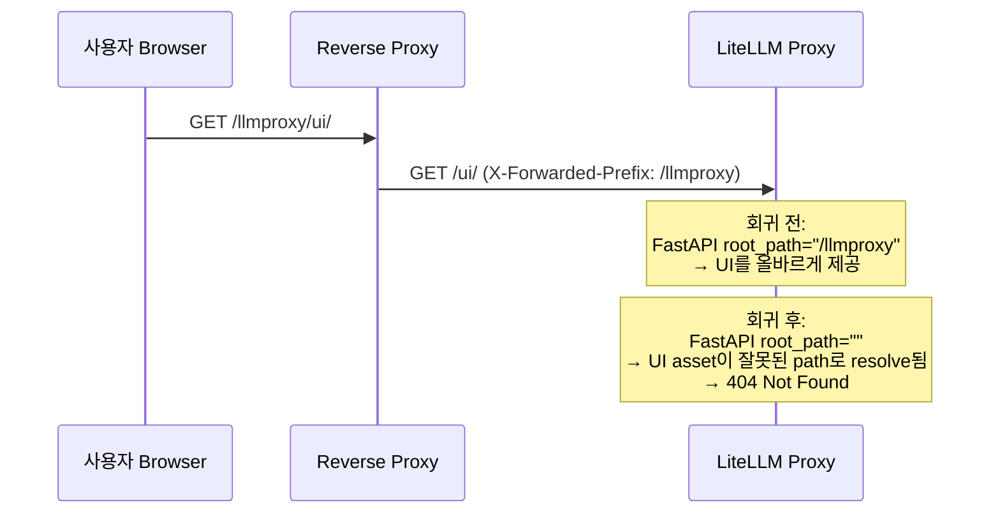
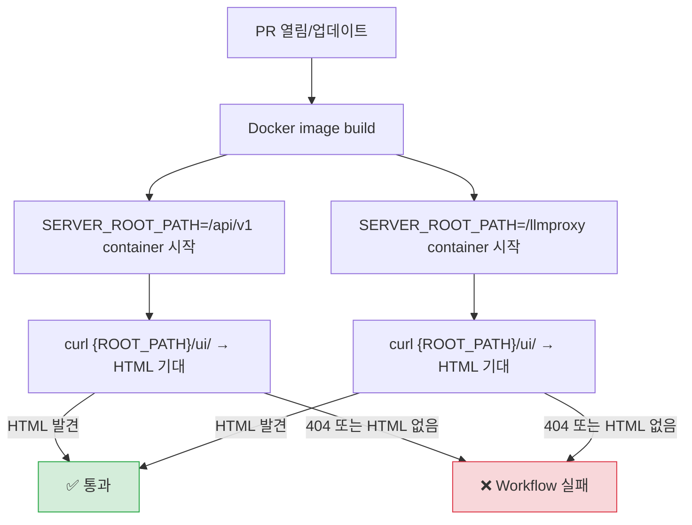

**날짜:** 2026년 1월 22일
**기간:** 약 4일(2026년 1월 26일 수정 merge 전까지)
**심각도:** 높음
**상태:** 해결됨

> **참고:** 이 수정은 LiteLLM `v1.81.3.rc.6` 이상에서 사용할 수 있습니다.

## 요약

PR ([`#19467`](https://github.com/BerriAI/litellm/pull/19467))에서 `proxy_server.py`의 FastAPI app 초기화에서 `root_path=server_root_path` parameter가 실수로 제거되었습니다. 그 결과 proxy가 UI를 제공할 때 `SERVER_ROOT_PATH` 환경 변수를 무시했습니다. Path prefix(예: `/api/v1`, `/llmproxy`)가 있는 reverse proxy 뒤에 LiteLLM을 배포한 사용자는 모든 UI page에서 404 Not Found를 받았습니다.

- **LLM API 호출:** 영향 없음. API routing은 영향받지 않았습니다.
- **UI page:** `SERVER_ROOT_PATH`를 사용하는 배포에서 모든 UI page가 404를 반환했습니다.
- **Swagger/OpenAPI 문서:** 설정된 root path를 통해 접근할 때 깨졌습니다.

{/* truncate */}

---

## 배경

많은 LiteLLM 배포는 path prefix 아래에서 LiteLLM으로 traffic을 routing하는 reverse proxy(예: Nginx, Traefik, AWS ALB) 뒤에서 실행됩니다. FastAPI의 `root_path` parameter는 application에 이 prefix를 알려주어 static file 제공, URL 생성, routing을 올바르게 처리하도록 합니다.



`root_path` parameter는 LiteLLM 초기 버전부터 `proxy_server.py`에 있었습니다. 다른 UI 404 문제를 고치려던 PR [#19467](https://github.com/BerriAI/litellm/pull/19467)의 부수 효과로 제거되었습니다.

---

## 근본 원인

PR [#19467](https://github.com/BerriAI/litellm/pull/19467)(`73d49f8`)가 `proxy_server.py`의 `FastAPI()` constructor에서 `root_path=server_root_path` line을 제거했습니다.

```diff
 app = FastAPI(
     docs_url=_get_docs_url(),
     redoc_url=_get_redoc_url(),
     title=_title,
     description=_description,
     version=version,
-    root_path=server_root_path,
     lifespan=proxy_startup_event,
 )
```

`root_path`가 없으면 FastAPI는 application이 `/`에 mount된 것처럼 모든 요청을 처리합니다. 이로 인해 `SERVER_ROOT_PATH`를 사용하는 배포에서 path mismatch가 발생했습니다.

이 회귀가 감지되지 않은 이유는 다음과 같습니다.

1. FastAPI app에 `root_path`가 설정되어 있는지 검증하는 **자동화 test가 없었습니다**.
2. `SERVER_ROOT_PATH` 기능에 대한 **수동 test 절차가 없었습니다**.
3. `SERVER_ROOT_PATH`가 없는 **기본 배포**는 영향받지 않아 대부분의 CI test가 통과했습니다.

---

## 조치 내역

| #   | 조치                                                                                            | 상태  | 코드                                                                                                                       |
| --- | ------------------------------------------------------------------------------------------------- | ------- | -------------------------------------------------------------------------------------------------------------------------- |
| 1   | FastAPI app 초기화에 `root_path=server_root_path` 복원                                | ✅ 완료 | [`#19790`](https://github.com/BerriAI/litellm/pull/19790) (`5426b3c`)                                                      |
| 2   | `get_server_root_path()` 및 FastAPI app 초기화 unit test 추가                        | ✅ 완료 | [`test_server_root_path.py`](https://github.com/BerriAI/litellm/blob/main/tests/proxy_unit_tests/test_server_root_path.py) |
| 3   | 모든 PR에서 Docker image를 build하고 `SERVER_ROOT_PATH` UI routing을 test하는 CI workflow 추가 | ✅ 완료 | [`test_server_root_path.yml`](https://github.com/BerriAI/litellm/blob/main/.github/workflows/test_server_root_path.yml)    |
| 4   | `SERVER_ROOT_PATH` 수동 test 절차 문서화                                             | ✅ 완료 | [Discussion #8495](https://github.com/BerriAI/litellm/discussions/8495)                                                    |

---

## CI workflow 세부 정보

새 [`test_server_root_path.yml`](https://github.com/BerriAI/litellm/blob/main/.github/workflows/test_server_root_path.yml) workflow는 `main` 대상 모든 PR에서 실행됩니다. 이 workflow는 다음을 수행합니다.

1. LiteLLM Docker 이미지 빌드
2. `SERVER_ROOT_PATH`가 설정된 container 시작(`/api/v1` 및 `/llmproxy` 모두 test)
3. `{ROOT_PATH}/ui/`에서 UI가 유효한 HTML을 반환하는지 검증
4. UI에 접근할 수 없으면 workflow 실패 처리



이를 통해 `proxy_server.py` 변경이 실수로 `SERVER_ROOT_PATH` 지원을 깨는 future regression을 방지합니다.

---

## 타임라인

| 시간(UTC)         | 이벤트                                                                                                                                                        |
| ------------------ | ------------------------------------------------------------------------------------------------------------------------------------------------------------ |
| 2026년 1월 22일 04:20 | PR [#19467](https://github.com/BerriAI/litellm/pull/19467) merge, `root_path=server_root_path` 제거                                                     |
| 1월 22-26일          | Nightly build 사용자가 `SERVER_ROOT_PATH` 사용 시 UI 404 오류 보고                                                                                   |
| 2026년 1월 26일 17:48 | 수정 PR [#19790](https://github.com/BerriAI/litellm/pull/19790) merge, `root_path=server_root_path` 복원                                                |
| 2026년 2월 18일       | 모든 PR에서 실행되는 CI workflow [`test_server_root_path.yml`](https://github.com/BerriAI/litellm/blob/main/.github/workflows/test_server_root_path.yml) 추가 |

---

## 사용자를 위한 해결 절차

아직 문제가 발생하는 사용자는 LiteLLM을 최신 버전으로 업데이트하세요.

```bash
pip install --upgrade litellm
```

`SERVER_ROOT_PATH`가 올바르게 설정되어 있는지 확인하세요.

```bash
# In your environment or docker-compose.yml
SERVER_ROOT_PATH="/your-prefix"
```

그 다음 `http://your-host:4000/your-prefix/ui/`에서 UI에 접근 가능한지 확인하세요.
