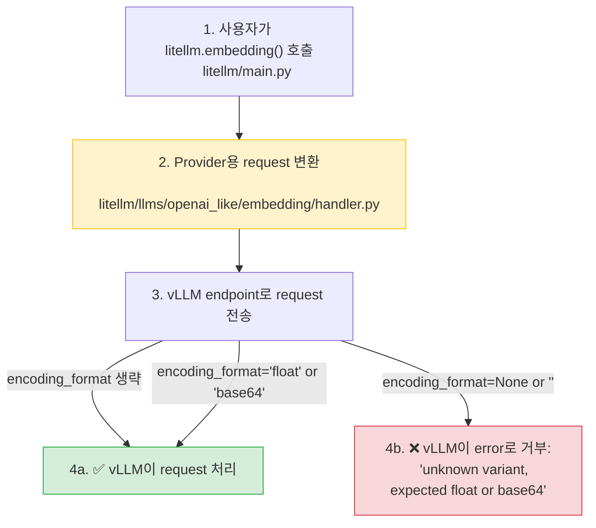

**날짜:** 2026년 2월 16일
**기간:** 약 3시간
**심각도:** 높음(vLLM embedding 사용자 대상)
**상태:** 해결됨

## 요약

OpenAI SDK 동작을 수정하려던 commit ([`dbcae4a`](https://github.com/BerriAI/litellm/commit/dbcae4aca5836770d0e9cd43abab0333c3d61ab2))이 API 요청에 `encoding_format=None`을 명시적으로 전달하면서 vLLM embeddings가 중단되었습니다. vLLM은 이를 `"unknown variant \`\`, expected float or base64"` 오류로 거부합니다.

- **vLLM embedding 호출:** 완전 실패 - 모든 요청이 거부됨
- **다른 provider:** 영향 없음 - OpenAI 및 다른 provider는 정상 동작
- **다른 vLLM 기능:** 영향 없음 - embeddings만 영향받음

{/* truncate */}

---

## 배경

Embeddings의 `encoding_format` parameter는 vector를 `float` array로 반환할지, `base64` encoded string으로 반환할지를 지정합니다. Provider마다 기대값이 다릅니다.

- **OpenAI SDK:** `encoding_format`이 생략되면 SDK가 default value `"float"`를 추가합니다.
- **vLLM:** `encoding_format`을 엄격하게 검증합니다. `"float"`, `"base64"`, 또는 완전한 생략만 허용합니다. `None`이나 빈 문자열 값은 거부합니다.



---

## 근본 원인

OpenAI SDK 동작을 고치려던 수정이 의도치 않게 vLLM embeddings를 깨뜨렸습니다.

**문제를 일으킨 변경 ([`dbcae4a`](https://github.com/BerriAI/litellm/commit/dbcae4aca5836770d0e9cd43abab0333c3d61ab2)):**

`litellm/main.py`에서 `encoding_format`을 생략하는 대신 `encoding_format=None`을 명시적으로 설정하도록 코드가 변경되었습니다.

```python
# Added in dbcae4a
if encoding_format is not None:
    optional_params["encoding_format"] = encoding_format
else:
    # Omitting causes openai sdk to add default value of "float"
    optional_params["encoding_format"] = None
```

이 수정은 OpenAI에는 올바르게 동작했습니다. `None`을 명시적으로 전달하면 SDK가 default value를 추가하지 않았기 때문입니다. 하지만 vLLM의 엄격한 parameter validation은 `None` 값을 거부했고, 그 결과 모든 embedding 요청이 실패했습니다.

---

## 수정 내용

수정이 배포되었습니다([`55348dd`](https://github.com/BerriAI/litellm/commit/55348dd9c51b5b028f676d25ad023b8f052fc071)). 해결책은 vLLM을 포함한 OpenAI-like provider로 요청을 보내기 전에 `optional_params`에서 `None`과 빈 문자열 값을 filter out하는 것입니다.

**`litellm/llms/openai_like/embedding/handler.py`에서:**

```python
# Before (broken)
data = {"model": model, "input": input, **optional_params}

# After (fixed)
filtered_optional_params = {k: v for k, v in optional_params.items() if v not in (None, '')}
data = {"model": model, "input": input, **filtered_optional_params}
```

이를 통해 다음을 보장합니다.
- 유효한 값(`"float"`, `"base64"`)은 보존되어 전송됩니다.
- `None`과 빈 문자열 값은 filter out됩니다(parameter가 완전히 생략됨).
- liteLLM이 upstream에서 parameter를 처리하므로 OpenAI SDK가 더 이상 default를 추가하지 않습니다.

---

## 조치 내역

| # | 조치 | 상태 | 코드 |
|---|---|---|---|
| 1 | OpenAI-like embedding handler에서 `None` 및 빈 문자열 값 filter | ✅ 완료 | [`handler.py#L108`](https://github.com/BerriAI/litellm/blob/main/litellm/llms/openai_like/embedding/handler.py#L108) |
| 2 | Parameter filtering unit test 추가(None, 빈 문자열, 유효한 값) | ✅ 완료 | [`test_openai_like_embedding.py`](https://github.com/BerriAI/litellm/blob/main/tests/test_litellm/llms/openai_like/embedding/test_openai_like_embedding.py) |
| 3 | hosted_vllm embedding config transformation test 추가 | ✅ 완료 | [`test_hosted_vllm_embedding_transformation.py`](https://github.com/BerriAI/litellm/blob/main/tests/test_litellm/llms/hosted_vllm/embedding/test_hosted_vllm_embedding_transformation.py) |
| 4 | 실제 vLLM endpoint를 사용하는 E2E test 추가 | ✅ 완료 | [`test_hosted_vllm_embedding_e2e.py`](https://github.com/BerriAI/litellm/blob/main/tests/test_litellm/llms/hosted_vllm/embedding/test_hosted_vllm_embedding_e2e.py) |
| 5 | JSON payload 구조가 vLLM 기대값과 일치하는지 검증 | ✅ 완료 | Test가 endpoint로 전송되는 정확한 JSON을 검증 |

---
