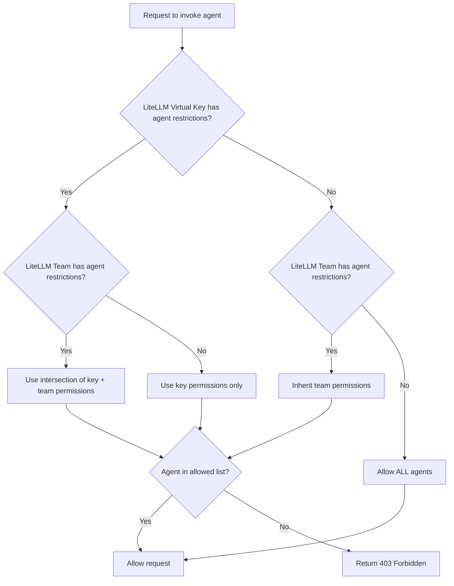

import Tabs from '@theme/Tabs';
import TabItem from '@theme/TabItem';
import Image from '@theme/IdealImage';

# Agent 권한 관리

LiteLLM에서 특정 key 또는 team이 접근할 수 있는 A2A agent를 제어합니다.

## 개요

Agent 권한 관리를 사용하면 LiteLLM Virtual Key 또는 Team이 접근할 수 있는 agent를 제한할 수 있습니다. 다음 상황에 유용합니다.

- **Multi-tenant environments**: team별로 서로 다른 agent 접근 권한 부여
- **Security**: 접근 권한이 없는 agent를 key가 호출하지 못하도록 방지
- **Compliance**: 민감한 agent workflow에 접근 정책 적용

권한이 설정되면 다음처럼 동작합니다.
- `GET /v1/agents`는 key/team이 접근할 수 있는 agent만 반환합니다.
- `POST /a2a/{agent_id}`(agent 호출)는 접근이 거부되면 `403 Forbidden`을 반환합니다.

## Key에 권한 설정

이 예제는 agent 권한이 포함된 key를 만들고 접근을 테스트하는 방법을 보여줍니다.

### 1. Agent ID 확인

<Tabs>
<TabItem value="ui" label="UI">

1. sidebar에서 **Agents**로 이동합니다.
2. 원하는 agent를 클릭합니다.
3. **Agent ID**를 복사합니다.

<Image 
  img={require('../img/agent_id.png')}
  style={{width: '80%', display: 'block', margin: '0', borderRadius: '8px'}}
/>

</TabItem>
<TabItem value="api" label="API">

```bash title="List all agents" showLineNumbers
curl "http://localhost:4000/v1/agents" \
  -H "Authorization: Bearer sk-master-key"
```

Response:
```json title="Response" showLineNumbers
{
  "agents": [
    {"agent_id": "agent-123", "name": "Support Agent"},
    {"agent_id": "agent-456", "name": "Sales Agent"}
  ]
}
```

</TabItem>
</Tabs>

### 2. Agent 권한이 있는 Key 생성

<Tabs>
<TabItem value="ui" label="UI">

1. **Keys** -> **Create Key**로 이동합니다.
2. **Agent Settings**를 펼칩니다.
3. 허용할 agent를 선택합니다.

<Image 
  img={require('../img/agent_key.png')}
  style={{width: '80%', display: 'block', margin: '0', borderRadius: '8px'}}
/>

</TabItem>
<TabItem value="api" label="API">

```bash title="Create key with agent permissions" showLineNumbers
curl -X POST "http://localhost:4000/key/generate" \
  -H "Authorization: Bearer sk-master-key" \
  -H "Content-Type: application/json" \
  -d '{
    "object_permission": {
      "agents": ["agent-123"]
    }
  }'
```

</TabItem>
</Tabs>

### 3. 접근 테스트

**허용된 agent(성공):**
```bash title="Invoke allowed agent" showLineNumbers
curl -X POST "http://localhost:4000/a2a/agent-123" \
  -H "Authorization: Bearer sk-your-new-key" \
  -H "Content-Type: application/json" \
  -d '{"message": {"role": "user", "parts": [{"type": "text", "text": "Hello"}]}}'
```

**차단된 agent(403으로 실패):**
```bash title="Invoke blocked agent" showLineNumbers
curl -X POST "http://localhost:4000/a2a/agent-456" \
  -H "Authorization: Bearer sk-your-new-key" \
  -H "Content-Type: application/json" \
  -d '{"message": {"role": "user", "parts": [{"type": "text", "text": "Hello"}]}}'
```

Response:
```json title="403 Forbidden Response" showLineNumbers
{
  "error": {
    "message": "Access denied to agent: agent-456",
    "code": 403
  }
}
```

## Team에 권한 설정

team에 속한 모든 key가 특정 agent에만 접근하도록 제한합니다.

### 1. Agent 권한이 있는 Team 생성

<Tabs>
<TabItem value="ui" label="UI">

1. **Teams** -> **Create Team**으로 이동합니다.
2. **Agent Settings**를 펼칩니다.
3. 이 team에 허용할 agent를 선택합니다.

<Image 
  img={require('../img/agent_key.png')}
  style={{width: '80%', display: 'block', margin: '0', borderRadius: '8px'}}
/>

</TabItem>
<TabItem value="api" label="API">

```bash title="Create team with agent permissions" showLineNumbers
curl -X POST "http://localhost:4000/team/new" \
  -H "Authorization: Bearer sk-master-key" \
  -H "Content-Type: application/json" \
  -d '{
    "team_alias": "support-team",
    "object_permission": {
      "agents": ["agent-123"]
    }
  }'
```

Response:
```json title="Response" showLineNumbers
{
  "team_id": "team-abc-123",
  "team_alias": "support-team"
}
```

</TabItem>
</Tabs>

### 2. Team용 Key 생성

<Tabs>
<TabItem value="ui" label="UI">

1. **Keys** -> **Create Key**로 이동합니다.
2. dropdown에서 **Team**을 선택합니다.

<Image 
  img={require('../img/agent_team.png')}
  style={{width: '80%', display: 'block', margin: '0', borderRadius: '8px'}}
/>

</TabItem>
<TabItem value="api" label="API">

```bash title="Create key for team" showLineNumbers
curl -X POST "http://localhost:4000/key/generate" \
  -H "Authorization: Bearer sk-master-key" \
  -H "Content-Type: application/json" \
  -d '{
    "team_id": "team-abc-123"
  }'
```

</TabItem>
</Tabs>

### 3. 접근 테스트

key는 team의 agent 권한을 상속합니다.

**허용된 agent(성공):**
```bash title="Invoke allowed agent" showLineNumbers
curl -X POST "http://localhost:4000/a2a/agent-123" \
  -H "Authorization: Bearer sk-team-key" \
  -H "Content-Type: application/json" \
  -d '{"message": {"role": "user", "parts": [{"type": "text", "text": "Hello"}]}}'
```

**차단된 agent(403으로 실패):**
```bash title="Invoke blocked agent" showLineNumbers
curl -X POST "http://localhost:4000/a2a/agent-456" \
  -H "Authorization: Bearer sk-team-key" \
  -H "Content-Type: application/json" \
  -d '{"message": {"role": "user", "parts": [{"type": "text", "text": "Hello"}]}}'
```

## 동작 방식



| Key 권한 | Team 권한 | 결과 | 참고 |
|-----------------|------------------|--------|-------|
| None | None | Key가 **모든** agent에 접근 가능 | 제한이 없으면 기본적으로 open access |
| `["agent-1", "agent-2"]` | None | Key가 `agent-1`, `agent-2`에 접근 가능 | Key 자체 권한 사용 |
| None | `["agent-1", "agent-3"]` | Key가 `agent-1`, `agent-3`에 접근 가능 | Key가 team 권한 상속 |
| `["agent-1", "agent-2"]` | `["agent-1", "agent-3"]` | Key가 `agent-1`에만 접근 가능 | 두 목록의 교집합 사용(가장 제한적인 설정 우선) |

## 권한 보기

<Tabs>
<TabItem value="ui" label="UI">

1. **Keys** 또는 **Teams**로 이동합니다.
2. 확인할 key/team을 클릭합니다.
3. info view에 agent 권한이 표시됩니다.

</TabItem>
<TabItem value="api" label="API">

```bash title="Get key info" showLineNumbers
curl "http://localhost:4000/key/info?key=sk-your-key" \
  -H "Authorization: Bearer sk-master-key"
```

</TabItem>
</Tabs>
