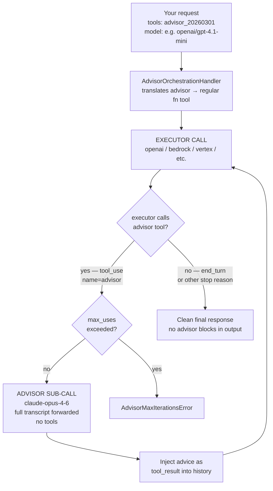

# Advisor Tool

더 빠른 실행 모델을 생성 중간에 전략적 지침을 제공하는 고지능 advisor 모델과 함께 사용합니다.

advisor 도구를 사용하면 빠르고 비용이 낮은 실행 모델(Sonnet 또는 Haiku)이 생성 중간에 고지능 advisor 모델(Opus 4.6)에 자문을 구할 수 있습니다. advisor는 전체 대화를 읽고 보통 400~700개 텍스트 토큰 분량의 계획이나 방향 수정을 생성하며, 실행 모델은 이어서 작업을 계속합니다.

이 패턴은 대부분의 턴은 기계적으로 처리되지만 뛰어난 계획이 중요한 장기 에이전트형 워크로드(코딩 에이전트, computer use, 다단계 리서치)에 적합합니다. 토큰 생성의 대부분은 실행 모델 요금으로 처리하면서 advisor 단독 사용에 가까운 품질을 얻을 수 있습니다.

:::info 베타

advisor 도구는 베타입니다. 요청에 `anthropic-beta: advisor-tool-2026-03-01`을 포함하세요. LiteLLM은 `tools` 배열에서 advisor 도구를 감지하면 이를 자동으로 추가합니다.

:::

## 지원 프로바이더 {#supported-providers}

| 프로바이더 | Chat Completions API | Messages API | 참고 |
|----------|---------------------|--------------|-------|
| **Anthropic API** | ✅ | ✅ | 네이티브 - 서버 측에서 실행 |
| **OpenAI / Azure OpenAI** | ✅ | ✅ | LiteLLM 오케스트레이션 루프 |
| **Amazon Bedrock** | ✅ | ✅ | LiteLLM 오케스트레이션 루프 |
| **Google Vertex AI** | ✅ | ✅ | LiteLLM 오케스트레이션 루프 |
| **Groq / Mistral / 기타** | ✅ | ✅ | LiteLLM 오케스트레이션 루프 |

## 동작 방식 (LiteLLM 네이티브 오케스트레이션) {#how-it-works-litellm-native-orchestration}

Anthropic이 아닌 프로바이더의 경우 LiteLLM이 advisor 루프를 직접 구현합니다. 호출하는 API는 동일하며, LiteLLM이 모든 과정을 투명하게 처리합니다.

`advisor_20260301` 도구와 Anthropic이 아닌 프로바이더가 포함된 요청이 도착하면 `AdvisorOrchestrationHandler`가 이를 가로챕니다. advisor 도구를 프로바이더가 이해하는 일반 function tool로 변환한 다음 orchestration loop를 실행합니다.



**LiteLLM이 대신 처리하는 작업:**

- 나가는 요청에서 `advisor_20260301`을 제거합니다. 프로바이더는 `advisor`라는 표준 function tool만 보게 됩니다.
- 실행 모델이 이를 호출하면 결과가 사용자에게 도달하기 전에 가로채 advisor 하위 호출을 실행하고 조언을 삽입합니다.
- 재전송 시 메시지 기록에서 `advisor_tool_result` / `server_tool_use` 블록을 제거하여 Anthropic이 아닌 프로바이더가 Anthropic 전용 타입을 보지 않도록 합니다.
- `stream=True`를 요청한 경우 최종 응답을 SSE 스트림으로 감쌉니다.
- `max_uses`를 강한 상한으로 적용합니다. 초과하면 `AdvisorMaxIterationsError`가 발생하며, `max_uses=0`은 advisor를 완전히 비활성화합니다.

## 모델 호환성 {#model-compatibility}

실행 모델과 advisor 모델은 유효한 조합이어야 합니다. 현재 지원되는 유일한 advisor 모델은 `claude-opus-4-6`입니다.

| 실행 모델 | advisor 모델 |
|----------|---------|
| `claude-haiku-4-5-20251001` | `claude-opus-4-6` |
| `claude-sonnet-4-6` | `claude-opus-4-6` |
| `claude-opus-4-6` | `claude-opus-4-6` |

---

## `Chat Completions API`

### SDK 사용법 {#sdk-usage}

#### 기본 예제 {#basic-example}

```python showLineNumbers title="Advisor Tool — litellm.completion()"
import litellm

response = litellm.completion(
    model="anthropic/claude-sonnet-4-6",
    messages=[
        {"role": "user", "content": "Build a concurrent worker pool in Go with graceful shutdown."}
    ],
    tools=[
        {
            "type": "advisor_20260301",
            "name": "advisor",
            "model": "claude-opus-4-6",
        }
    ],
    max_tokens=4096,
)

print(response.choices[0].message.content)
```

#### 선택적 파라미터 사용 {#using-optional-parameters}

```python showLineNumbers title="Advisor Tool with max_uses and caching"
import litellm

response = litellm.completion(
    model="anthropic/claude-sonnet-4-6",
    messages=[
        {"role": "user", "content": "Build a REST API with authentication in Python."}
    ],
    tools=[
        {
            "type": "advisor_20260301",
            "name": "advisor",
            "model": "claude-opus-4-6",
            "max_uses": 3,                             # cap advisor calls per request
            "caching": {"type": "ephemeral", "ttl": "5m"},  # enable for 3+ calls per conversation
        }
    ],
    max_tokens=4096,
)
```

#### 스트리밍 {#streaming}

```python showLineNumbers title="Streaming with Advisor Tool"
import litellm

response = litellm.completion(
    model="anthropic/claude-sonnet-4-6",
    messages=[
        {"role": "user", "content": "Implement a distributed rate limiter."}
    ],
    tools=[
        {
            "type": "advisor_20260301",
            "name": "advisor",
            "model": "claude-opus-4-6",
        }
    ],
    max_tokens=4096,
    stream=True,
)

for chunk in response:
    if chunk.choices[0].delta.content:
        print(chunk.choices[0].delta.content, end="")
```

:::note 스트리밍 동작

advisor 하위 추론은 스트리밍되지 않습니다. advisor가 실행되는 동안 실행 모델의 스트림은 일시 중지되고, 전체 advisor 결과가 단일 이벤트로 도착합니다. 이후 실행 모델 출력 스트리밍이 재개됩니다.

:::

#### 멀티턴 대화 {#multi-turn-conversations}

```python showLineNumbers title="Multi-Turn with Advisor Tool"
import litellm

tools = [
    {
        "type": "advisor_20260301",
        "name": "advisor",
        "model": "claude-opus-4-6",
    }
]

messages = [
    {"role": "user", "content": "Build a concurrent worker pool in Go with graceful shutdown."}
]

response = litellm.completion(
    model="anthropic/claude-sonnet-4-6",
    messages=messages,
    tools=tools,
    max_tokens=4096,
)

# Append the full response (includes server_tool_use + advisor_tool_result blocks)
messages.append({"role": "assistant", "content": response.choices[0].message.content})

# Continue the conversation — keep the same tools array
messages.append({"role": "user", "content": "Now add a max-in-flight limit of 10."})

response2 = litellm.completion(
    model="anthropic/claude-sonnet-4-6",
    messages=messages,
    tools=tools,
    max_tokens=4096,
)
```

:::tip 후속 턴 자동 제거

현재 요청에 advisor 도구가 없으면 LiteLLM은 메시지 기록에서 `advisor_tool_result` 블록을 자동으로 제거합니다. 이 동작은 그렇지 않으면 발생할 수 있는 Anthropic 400 오류를 방지합니다.

:::

### AI Gateway 사용법 {#ai-gateway-usage}

#### Proxy 설정 {#proxy-config}

```yaml showLineNumbers title="config.yaml"
model_list:
  - model_name: claude-sonnet
    litellm_params:
      model: anthropic/claude-sonnet-4-6
      api_key: os.environ/ANTHROPIC_API_KEY
```

#### Proxy를 통한 클라이언트 요청 {#client-request-through-proxy}

```python showLineNumbers title="Advisor Tool via AI Gateway"
from openai import OpenAI

client = OpenAI(
    api_key="your-litellm-proxy-key",
    base_url="http://0.0.0.0:4000/v1"
)

response = client.chat.completions.create(
    model="claude-sonnet",
    messages=[
        {"role": "user", "content": "Implement a distributed rate limiter in Python."}
    ],
    tools=[
        {
            "type": "advisor_20260301",
            "name": "advisor",
            "model": "claude-opus-4-6",
        }
    ],
    max_tokens=4096,
)
```

---

## Messages API

### SDK 사용법 {#sdk-usage-1}

#### 기본 예제 {#basic-example-1}

```python showLineNumbers title="Advisor Tool — litellm.anthropic.messages"
import asyncio
import litellm

async def main():
    response = await litellm.anthropic.messages.acreate(
        model="anthropic/claude-sonnet-4-6",
        messages=[
            {"role": "user", "content": "Build a concurrent worker pool in Go with graceful shutdown."}
        ],
        tools=[
            {
                "type": "advisor_20260301",
                "name": "advisor",
                "model": "claude-opus-4-6",
            }
        ],
        max_tokens=4096,
    )
    print(response)

asyncio.run(main())
```

#### 스트리밍 {#streaming-1}

```python showLineNumbers title="Messages API Streaming with Advisor Tool"
import asyncio
import json
import litellm

async def main():
    response = await litellm.anthropic.messages.acreate(
        model="anthropic/claude-sonnet-4-6",
        messages=[
            {"role": "user", "content": "Implement a distributed rate limiter."}
        ],
        tools=[
            {
                "type": "advisor_20260301",
                "name": "advisor",
                "model": "claude-opus-4-6",
            }
        ],
        max_tokens=4096,
        stream=True,
    )

    async for chunk in response:
        if isinstance(chunk, bytes):
            for line in chunk.decode("utf-8").split("\n"):
                if line.startswith("data: "):
                    try:
                        print(json.loads(line[6:]))
                    except json.JSONDecodeError:
                        pass

asyncio.run(main())
```

### AI Gateway 사용법 {#ai-gateway-usage-1}

#### Proxy 설정 {#proxy-config-1}

```yaml showLineNumbers title="config.yaml"
model_list:
  - model_name: claude-sonnet
    litellm_params:
      model: anthropic/claude-sonnet-4-6
      api_key: os.environ/ANTHROPIC_API_KEY
```

#### Proxy를 통한 클라이언트 요청 (Anthropic SDK) {#client-request-through-proxy-anthropic-sdk}

```python showLineNumbers title="Advisor Tool via AI Gateway (Anthropic SDK)"
import anthropic

client = anthropic.Anthropic(
    api_key="your-litellm-proxy-key",
    base_url="http://0.0.0.0:4000"
)

response = client.beta.messages.create(
    model="claude-sonnet",
    max_tokens=4096,
    betas=["advisor-tool-2026-03-01"],
    messages=[
        {"role": "user", "content": "Build a concurrent worker pool in Go with graceful shutdown."}
    ],
    tools=[
        {
            "type": "advisor_20260301",
            "name": "advisor",
            "model": "claude-opus-4-6",
        }
    ],
)
print(response)
```

#### Anthropic이 아닌 프로바이더 (LiteLLM 오케스트레이션 루프) {#non-anthropic-providers-litellm-orchestration-loop}

```python showLineNumbers title="Advisor Tool with OpenAI executor"
import asyncio
import litellm

async def main():
    # executor: openai/gpt-4.1-mini  |  advisor: claude-opus-4-6
    # LiteLLM runs the orchestration loop automatically
    response = await litellm.anthropic.messages.acreate(
        model="openai/gpt-4.1-mini",
        messages=[
            {"role": "user", "content": "Implement a Python LRU cache with O(1) get and put."}
        ],
        tools=[
            {
                "type": "advisor_20260301",
                "name": "advisor",
                "model": "claude-opus-4-6",
                "max_uses": 3,
            }
        ],
        max_tokens=1024,
        custom_llm_provider="openai",
    )
    # Final response is clean — no advisor tool_use blocks
    print(response["content"][0]["text"])

asyncio.run(main())
```

---

## 응답 구조 {#response-structure}

성공한 advisor 호출은 assistant content 안에 `server_tool_use` 및 `advisor_tool_result` 블록을 반환합니다.

```json title="Response with advisor blocks"
{
  "role": "assistant",
  "content": [
    {
      "type": "text",
      "text": "Let me consult the advisor on this."
    },
    {
      "type": "server_tool_use",
      "id": "srvtoolu_abc123",
      "name": "advisor",
      "input": {}
    },
    {
      "type": "advisor_tool_result",
      "tool_use_id": "srvtoolu_abc123",
      "content": {
        "type": "advisor_result",
        "text": "Use a channel-based coordination pattern. The tricky part is draining in-flight work during shutdown: close the input channel first, then wait on a WaitGroup..."
      }
    },
    {
      "type": "text",
      "text": "Here's the implementation using a channel-based coordination pattern..."
    }
  ]
}
```

후속 턴에서는 advisor 블록을 포함한 전체 assistant content를 다시 전달하세요. LiteLLM은 `provider_specific_fields`를 통해 이를 자동으로 처리합니다.

---

## 비용 제어 {#cost-control}

advisor 호출은 별도의 하위 추론으로 실행되며 advisor 모델 요금으로 과금됩니다. 사용량은 `usage.iterations[]`에 보고됩니다.

```json title="Usage with advisor sub-inference"
{
  "usage": {
    "input_tokens": 412,
    "output_tokens": 531,
    "iterations": [
      {
        "type": "message",
        "input_tokens": 412,
        "output_tokens": 89
      },
      {
        "type": "advisor_message",
        "model": "claude-opus-4-6",
        "input_tokens": 823,
        "output_tokens": 1612
      },
      {
        "type": "message",
        "input_tokens": 1348,
        "output_tokens": 442
      }
    ]
  }
}
```

최상위 `usage`에는 실행 모델 토큰만 반영됩니다. advisor 토큰은 `type: "advisor_message"`인 `iterations` 항목에 표시되며 Opus 요금으로 과금됩니다.

**팁:**
- 대화당 advisor 호출이 3회 이상 예상될 때만 도구 정의에서 `caching`을 활성화하세요. 그보다 적으면 절감되는 비용보다 추가 비용이 더 큽니다.
- 요청당 advisor 호출 수를 제한하려면 `max_uses`를 사용하세요. 한도에 도달하면 실행 모델은 추가 조언 없이 계속 진행합니다.
- 대화 수준의 한도를 적용하려면 클라이언트 측에서 advisor 호출 수를 계산하세요. 한도에 도달하면 `tools`에서 advisor 도구를 제거합니다.

---

## 권장 시스템 프롬프트 {#recommended-system-prompt}

코딩 및 에이전트 작업에서 일관된 advisor 호출 타이밍과 최적의 비용/품질을 위해 Anthropic은 시스템 프롬프트 앞에 다음 블록을 추가할 것을 권장합니다.

```text title="Timing guidance (prepend to system prompt)"
You have access to an `advisor` tool backed by a stronger reviewer model. It takes NO parameters — when you call advisor(), your entire conversation history is automatically forwarded. They see the task, every tool call you've made, every result you've seen.

Call advisor BEFORE substantive work — before writing, before committing to an interpretation, before building on an assumption. If the task requires orientation first (finding files, fetching a source, seeing what's there), do that, then call advisor. Orientation is not substantive work. Writing, editing, and declaring an answer are.

Also call advisor:
- When you believe the task is complete. BEFORE this call, make your deliverable durable: write the file, save the result, commit the change.
- When stuck — errors recurring, approach not converging, results that don't fit.
- When considering a change of approach.

On tasks longer than a few steps, call advisor at least once before committing to an approach and once before declaring done. On short reactive tasks where the next action is dictated by tool output you just read, you don't need to keep calling.
```

```text title="Advice weight guidance (add after timing block)"
Give the advice serious weight. If you follow a step and it fails empirically, or you have primary-source evidence that contradicts a specific claim, adapt. A passing self-test is not evidence the advice is wrong.

If you've already retrieved data pointing one way and the advisor points another: don't silently switch. Surface the conflict in one more advisor call — "I found X, you suggest Y, which constraint breaks the tie?"
```

품질 손실 없이 advisor 출력 길이를 35~45% 줄이려면 다음을 추가하세요.

```text title="Cost reduction (optional, add before timing block)"
The advisor should respond in under 100 words and use enumerated steps, not explanations.
```

---

## 추가 리소스 {#additional-resources}

- [Anthropic Advisor Tool 문서](https://platform.claude.com/docs/en/agents-and-tools/tool-use/advisor-tool)
- [LiteLLM 도구 호출 가이드](https://docs.litellm.ai/docs/completion/function_call)
