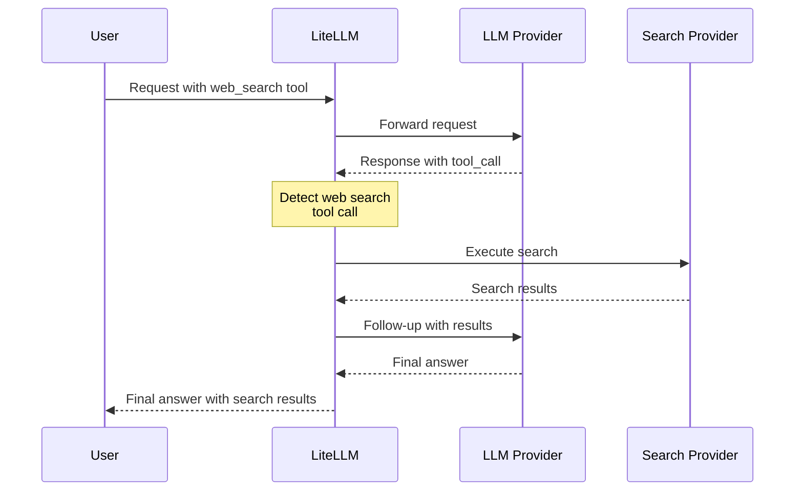

# 웹 검색 통합

모든 LLM 프로바이더에서 서버 측 웹 검색을 투명하게 실행합니다. LiteLLM은 웹 검색 도구 호출을 자동으로 가로채고, 설정된 검색 프로바이더(Perplexity, Tavily 등)를 사용해 실행합니다.

## 빠른 시작

### 1. Web Search Interception 설정

`config.yaml`에 다음을 추가합니다.

```yaml
model_list:
  - model_name: gpt-4o
    litellm_params:
      model: openai/gpt-4o
      api_key: os.environ/OPENAI_API_KEY

litellm_settings:
  callbacks:
    - websearch_interception:
        enabled_providers:
          - openai
          - minimax
          - anthropic
        search_tool_name: perplexity-search  # Optional

search_tools:
  - search_tool_name: perplexity-search
    litellm_params:
      search_provider: perplexity
      api_key: os.environ/PERPLEXITY_API_KEY
```

### 2. 모든 프로바이더에서 사용

```python
import litellm

response = await litellm.acompletion(
    model="gpt-4o",
    messages=[
        {"role": "user", "content": "What's the weather in San Francisco today?"}
    ],
    tools=[
        {
            "type": "function",
            "function": {
                "name": "litellm_web_search",
                "description": "Search the web for information",
                "parameters": {
                    "type": "object",
                    "properties": {
                        "query": {"type": "string", "description": "Search query"}
                    },
                    "required": ["query"]
                }
            }
        }
    ]
)

# Response includes search results automatically!
print(response.choices[0].message.content)
```

## 동작 방식

모델이 웹 검색 도구 호출을 만들면 LiteLLM은 다음 순서로 처리합니다.

1. 응답에서 `litellm_web_search` 도구 호출을 **감지**합니다.
2. 설정된 검색 프로바이더로 검색을 **실행**합니다.
3. 검색 결과를 포함해 **후속 요청**을 보냅니다.
4. 최종 답변을 사용자에게 **반환**합니다.



**결과**: 사용자는 한 번의 API 호출만 보내고, 검색 결과가 반영된 완성 답변을 받습니다.

## 지원 프로바이더

웹 검색 통합은 다음 핸들러를 사용하는 **모든 프로바이더**에서 동작합니다.
- ✅ **Base HTTP Handler** (`BaseLLMHTTPHandler`)
- ✅ **`OpenAI Completion Handler`** (`OpenAIChatCompletion`)

### Base HTTP Handler를 사용하는 프로바이더

| 프로바이더 | 상태 | 참고 |
|----------|--------|-------|
| **OpenAI** | ✅ 지원 | GPT-4, GPT-3.5 등 |
| **Anthropic** | ✅ 지원 | HTTP 핸들러를 통한 Claude 모델 |
| **MiniMax** | ✅ 지원 | 모든 MiniMax 모델 |
| **Mistral** | ✅ 지원 | Mistral AI 모델 |
| **Cohere** | ✅ 지원 | Command 모델 |
| **Fireworks AI** | ✅ 지원 | 모든 Fireworks 모델 |
| **Together AI** | ✅ 지원 | 모든 Together AI 모델 |
| **Groq** | ✅ 지원 | 모든 Groq 모델 |
| **Perplexity** | ✅ 지원 | Perplexity 모델 |
| **DeepSeek** | ✅ 지원 | DeepSeek 모델 |
| **xAI** | ✅ 지원 | Grok 모델 |
| **Hugging Face** | ✅ 지원 | Inference API 모델 |
| **OCI** | ✅ 지원 | Oracle Cloud 모델 |
| **Vertex AI** | ✅ 지원 | Google Vertex AI 모델 |
| **Bedrock** | ✅ 지원 | AWS Bedrock 모델(`converse_like` 경로) |
| **Azure OpenAI** | ✅ 지원 | Azure 호스팅 OpenAI 모델 |
| **Sagemaker** | ✅ 지원 | AWS Sagemaker 모델 |
| **Databricks** | ✅ 지원 | Databricks 모델 |
| **DataRobot** | ✅ 지원 | DataRobot 모델 |
| **Hosted VLLM** | ✅ 지원 | 자체 호스팅 VLLM |
| **Heroku** | ✅ 지원 | Heroku 호스팅 모델 |
| **RAGFlow** | ✅ 지원 | RAGFlow 모델 |
| **Compactif** | ✅ 지원 | Compactif 모델 |
| **Cometapi** | ✅ 지원 | Comet API 모델 |
| **A2A** | ✅ 지원 | Agent-to-Agent 모델 |
| **Bytez** | ✅ 지원 | Bytez 모델 |

### OpenAI Handler를 사용하는 프로바이더

| 프로바이더 | 상태 | 참고 |
|----------|--------|-------|
| **OpenAI** | ✅ 지원 | 네이티브 OpenAI API |
| **Azure OpenAI** | ✅ 지원 | Azure 호스팅 OpenAI |
| **OpenAI-Compatible** | ✅ 지원 | 모든 OpenAI 호환 API |

## 설정

### WebSearch Interception 파라미터

| 파라미터 | 타입 | 필수 | 설명 | 예제 |
|-----------|------|----------|-------------|---------|
| `enabled_providers` | List[String] | 예 | 웹 검색을 활성화할 프로바이더 목록 | `[openai, minimax, anthropic]` |
| `search_tool_name` | String | 아니요 | `search_tools` 설정에 있는 특정 검색 도구입니다. 설정하지 않으면 첫 번째 사용 가능 도구를 사용합니다. | `perplexity-search` |

### 프로바이더 값

`enabled_providers`에는 다음 값을 사용합니다.

| 프로바이더 | 값 | 프로바이더 | 값 |
|----------|-------|----------|-------|
| OpenAI | `openai` | Anthropic | `anthropic` |
| MiniMax | `minimax` | Mistral | `mistral` |
| Cohere | `cohere` | Fireworks AI | `fireworks_ai` |
| Together AI | `together_ai` | Groq | `groq` |
| Perplexity | `perplexity` | DeepSeek | `deepseek` |
| xAI | `xai` | Hugging Face | `huggingface` |
| OCI | `oci` | Vertex AI | `vertex_ai` |
| Bedrock | `bedrock` | Azure | `azure` |
| Sagemaker | `sagemaker_chat` | Databricks | `databricks` |
| DataRobot | `datarobot` | VLLM | `hosted_vllm` |
| Heroku | `heroku` | RAGFlow | `ragflow` |
| Compactif | `compactif` | Cometapi | `cometapi` |
| A2A | `a2a` | Bytez | `bytez` |

## 검색 프로바이더

사용할 검색 프로바이더를 설정합니다. LiteLLM은 여러 검색 프로바이더를 지원합니다.

| 프로바이더 | `search_provider` 값 | 환경 변수 |
|----------|------------------------|----------------------|
| **Perplexity AI** | `perplexity` | `PERPLEXITYAI_API_KEY` |
| **Tavily** | `tavily` | `TAVILY_API_KEY` |
| **Exa AI** | `exa_ai` | `EXA_API_KEY` |
| **Parallel AI** | `parallel_ai` | `PARALLEL_AI_API_KEY` |
| **Google PSE** | `google_pse` | `GOOGLE_PSE_API_KEY`, `GOOGLE_PSE_ENGINE_ID` |
| **DataForSEO** | `dataforseo` | `DATAFORSEO_LOGIN`, `DATAFORSEO_PASSWORD` |
| **Firecrawl** | `firecrawl` | `FIRECRAWL_API_KEY` |
| **SearXNG** | `searxng` | `SEARXNG_API_BASE` (required) |
| **Linkup** | `linkup` | `LINKUP_API_KEY` |

자세한 설정 방법은 [검색 프로바이더 문서](../search/index.md)를 참고하세요.

## Complete 설정 예제

```yaml
model_list:
  # OpenAI
  - model_name: gpt-4o
    litellm_params:
      model: openai/gpt-4o
      api_key: os.environ/OPENAI_API_KEY

  # MiniMax
  - model_name: minimax
    litellm_params:
      model: minimax/MiniMax-M2.1
      api_key: os.environ/MINIMAX_API_KEY

  # Anthropic
  - model_name: claude
    litellm_params:
      model: anthropic/claude-sonnet-4-5
      api_key: os.environ/ANTHROPIC_API_KEY

  # Azure OpenAI
  - model_name: azure-gpt4
    litellm_params:
      model: azure/gpt-4
      api_base: https://my-azure.openai.azure.com
      api_key: os.environ/AZURE_API_KEY

litellm_settings:
  callbacks:
    - websearch_interception:
        enabled_providers:
          - openai
          - minimax
          - anthropic
          - azure
        search_tool_name: perplexity-search

search_tools:
  - search_tool_name: perplexity-search
    litellm_params:
      search_provider: perplexity
      api_key: os.environ/PERPLEXITY_API_KEY

  - search_tool_name: tavily-search
    litellm_params:
      search_provider: tavily
      api_key: os.environ/TAVILY_API_KEY
```

## 사용법 예제

### Python SDK

```python
import litellm

# 콜백 설정
litellm.callbacks = ["websearch_interception"]

# 웹 검색 도구를 포함해 completion 실행
response = await litellm.acompletion(
    model="gpt-4o",
    messages=[
        {"role": "user", "content": "What are the latest AI news?"}
    ],
    tools=[
        {
            "type": "function",
            "function": {
                "name": "litellm_web_search",
                "description": "Search the web for current information",
                "parameters": {
                    "type": "object",
                    "properties": {
                        "query": {
                            "type": "string",
                            "description": "Search query"
                        }
                    },
                    "required": ["query"]
                }
            }
        }
    ]
)

print(response.choices[0].message.content)
```

### Proxy 서버

```bash
# 설정 파일로 proxy 시작
litellm --config config.yaml

# 요청 실행
curl http://localhost:4000/v1/chat/completions \
  -H "Content-Type: application/json" \
  -H "Authorization: Bearer sk-1234" \
  -d '{
    "model": "gpt-4o",
    "messages": [
      {"role": "user", "content": "What is the weather in San Francisco?"}
    ],
    "tools": [
      {
        "type": "function",
        "function": {
          "name": "litellm_web_search",
          "description": "Search the web",
          "parameters": {
            "type": "object",
            "properties": {
              "query": {"type": "string"}
            },
            "required": ["query"]
          }
        }
      }
    ]
  }'
```

## 검색 도구 선택 방식

1. **`search_tool_name`이 지정된 경우** → 해당 검색 도구를 사용합니다.
2. **`search_tool_name`이 지정되지 않은 경우** → `search_tools` 목록의 첫 번째 검색 도구를 사용합니다.

```yaml
search_tools:
  - search_tool_name: perplexity-search  # ← search_tool_name이 없으면 이 도구가 사용됩니다
    litellm_params:
      search_provider: perplexity
      api_key: os.environ/PERPLEXITY_API_KEY

  - search_tool_name: tavily-search
    litellm_params:
      search_provider: tavily
      api_key: os.environ/TAVILY_API_KEY
```

## 문제 해결

### 웹 검색이 동작하지 않음

1. **프로바이더가 활성화되어 있는지 확인**:
   ```yaml
   enabled_providers:
     - openai  # 사용하는 프로바이더가 이 목록에 있어야 합니다
   ```

2. **검색 도구 설정 확인**:
   ```yaml
   search_tools:
     - search_tool_name: perplexity-search
       litellm_params:
         search_provider: perplexity
         api_key: os.environ/PERPLEXITY_API_KEY
   ```

3. **API 키 설정 확인**:
   ```bash
   export PERPLEXITY_API_KEY=your-key
   ```

4. **디버그 로깅 활성화**:
   ```python
   litellm.set_verbose = True
   ```

### 자주 발생하는 문제

**문제**: 모델이 최종 답변 대신 `tool_calls`를 반환함
- **원인**: 프로바이더가 `enabled_providers` 목록에 없음
- **해결**: 해당 프로바이더를 `enabled_providers`에 추가합니다.

**문제**: `"No search tool configured"` 오류
- **원인**: `search_tools` 설정에 검색 도구가 없음
- **해결**: 검색 도구 설정을 하나 이상 추가합니다.

**문제**: `"Invalid function arguments json string"` 오류(MiniMax)
- **원인**: 이전 버전에서 인자가 JSON으로 올바르게 직렬화되지 않던 문제입니다. 최신 버전에서 수정되었습니다.
- **해결**: LiteLLM 최신 버전으로 업데이트합니다.

## 관련 문서

- [검색 프로바이더](../search/index.md) - 자세한 검색 프로바이더 설정
- [Claude Code WebSearch](../tutorials/claude_code_websearch.md) - Claude Code와 함께 사용
- [도구 호출](../completion/function_call.md) - 일반 도구 호출 문서
- [Callbacks](../observability/custom_callback.md) - 사용자 지정 콜백 문서

## 기술 세부 정보

### 아키텍처

웹 검색 통합은 다음을 수행하는 사용자 지정 콜백(`WebSearchInterceptionLogger`)으로 구현되어 있습니다.

1. **Pre-request Hook**: 네이티브 웹 검색 도구를 LiteLLM 표준 형식으로 변환합니다.
2. **Post-response Hook**: 응답에서 웹 검색 도구 호출을 감지합니다.
3. **Agentic Loop**: 검색을 실행하고 후속 요청을 자동으로 보냅니다.

### 지원 API

- ✅ **`Chat Completions API`** (OpenAI format)
- ✅ **`Anthropic Messages API`** (Anthropic format)
- ✅ **Streaming** (자동 변환)
- ✅ **Non-streaming**

### 응답 형식 감지

핸들러는 응답 형식을 자동으로 감지합니다.
- **OpenAI 형식**: assistant 메시지의 `tool_calls`
- **Anthropic 형식**: content 안의 `tool_use` 블록

### 성능

- **Latency**: LLM 호출이 하나 추가됩니다(검색 결과를 포함한 후속 요청).
- **캐싱**: 검색 결과를 캐시할 수 있습니다(검색 프로바이더에 따라 다름).
- **Parallel Searches**: 여러 검색 쿼리를 병렬로 실행합니다.

## 기여하기

버그를 발견했거나 새 프로바이더 지원을 추가하고 싶다면 [기여하기 가이드](https://github.com/BerriAI/litellm/blob/main/CONTRIBUTING.md)를 참고하세요.
