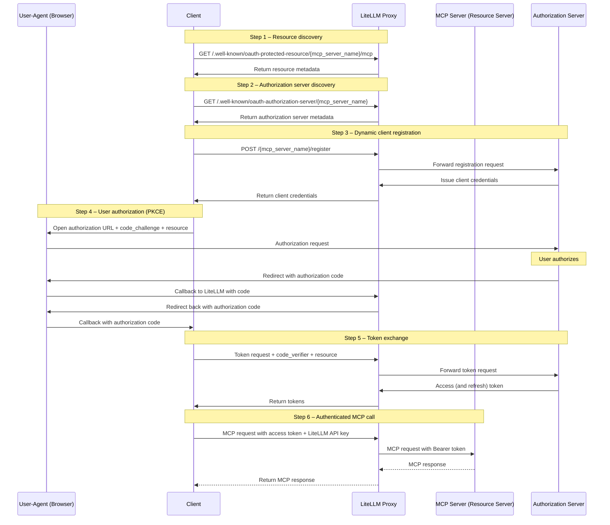
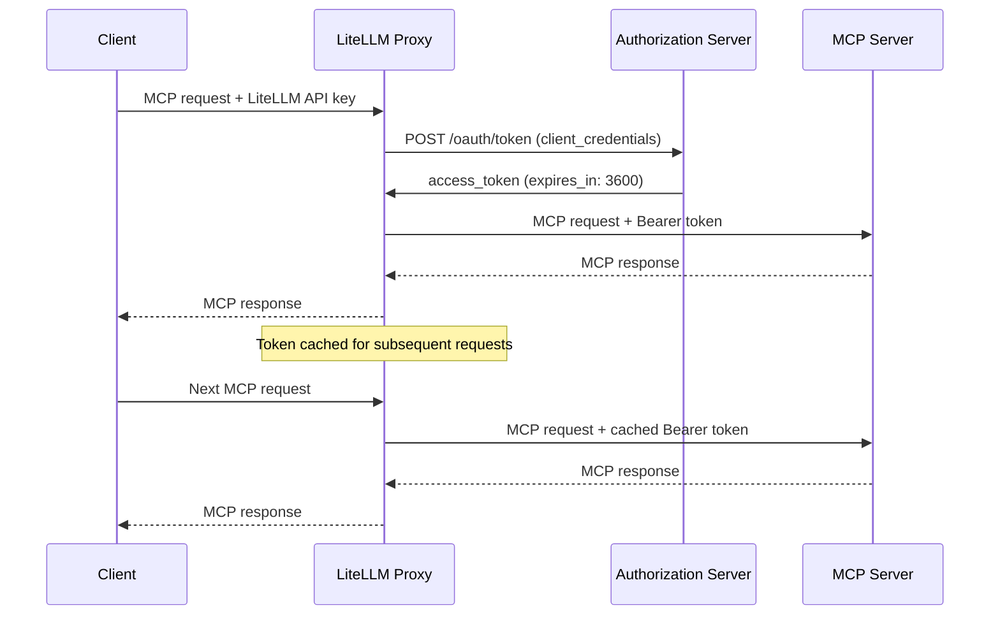

# MCP OAuth

LiteLLM은 MCP 서버에 대해 세 가지 OAuth 2.0 흐름을 지원합니다.

| 흐름 | 사용 사례 | 동작 방식 |
|------|----------|--------------|
| **대화형(PKCE)** | 사용자 대상 앱(Claude Code, Cursor) | 브라우저 기반 동의, 사용자별 토큰 |
| **머신 투 머신(M2M)** | 백엔드 서비스, CI/CD, 자동화 에이전트 | `client_credentials` grant, Proxy가 관리하는 토큰 |
| **On-Behalf-Of(OBO)** | 보호된 MCP 서버에 대한 사용자 컨텍스트 도구 호출 | LiteLLM이 호출자 토큰을 범위가 제한된 MCP 토큰으로 교환합니다. [MCP OBO Auth](./mcp_obo_auth.md)를 참고하세요. |

## 대화형 OAuth (PKCE)

사용자 대상 MCP 클라이언트(Claude Code, Cursor)의 경우 LiteLLM은 PKCE를 사용하는 전체 OAuth 2.0 authorization code 흐름을 지원합니다.

### 설정

```yaml title="config.yaml" showLineNumbers
mcp_servers:
  github_mcp:
    url: "https://api.githubcopilot.com/mcp"
    auth_type: oauth2
    client_id: os.environ/GITHUB_OAUTH_CLIENT_ID
    client_secret: os.environ/GITHUB_OAUTH_CLIENT_SECRET
```

[**Claude Code 튜토리얼 보기**](./tutorials/claude_responses_api#connecting-mcp-servers)

### 동작 방식



**참여자**

- **Client** -- 사용자를 대신해 OAuth 검색, 권한 부여, 도구 호출을 시작하는 MCP 지원 AI 에이전트입니다. 예: Claude Code, Cursor, 기타 IDE/에이전트.
- **LiteLLM Proxy** -- 저장된 자격 증명을 보호하면서 모든 OAuth 검색, 등록, 토큰 교환, MCP 트래픽을 중개합니다.
- **Authorization Server** -- dynamic client registration, PKCE authorization, token endpoint를 통해 OAuth 2.0 토큰을 발급합니다.
- **MCP Server (Resource Server)** -- LiteLLM의 인증된 JSON-RPC 요청을 받는 보호된 MCP endpoint입니다.
- **User-Agent (Browser)** -- authorization 단계에서 최종 사용자가 동의할 수 있도록 일시적으로 관여합니다.

**흐름 단계**

1. **리소스 검색**: 클라이언트는 LiteLLM의 `.well-known/oauth-protected-resource` endpoint에서 MCP resource metadata를 가져와 scope와 capability를 파악합니다.
2. **Authorization Server 검색**: 클라이언트는 LiteLLM의 `.well-known/oauth-authorization-server` endpoint를 통해 OAuth server metadata(token endpoint, authorization endpoint, 지원되는 PKCE method)를 가져옵니다.
3. **Dynamic Client Registration**: 클라이언트는 LiteLLM을 통해 등록하고, LiteLLM은 요청을 authorization server(RFC 7591)로 전달합니다. provider가 dynamic registration을 지원하지 않으면 `client_id`/`client_secret`을 LiteLLM에 미리 저장할 수 있으며(예: GitHub MCP), 이후 흐름은 동일하게 진행됩니다.
4. **사용자 권한 부여**: 클라이언트는 브라우저 세션을 시작합니다(code challenge와 resource hint 포함). 사용자가 접근을 승인하면 authorization server가 LiteLLM을 거쳐 클라이언트로 code를 보냅니다.
5. **토큰 교환**: 클라이언트는 authorization code, code verifier, resource를 포함해 LiteLLM을 호출합니다. LiteLLM은 이를 authorization server와 교환하고 발급된 access/refresh token을 반환합니다.
6. **MCP 호출**: 유효한 토큰이 있으면 클라이언트는 MCP JSON-RPC 요청과 LiteLLM API key를 LiteLLM으로 보냅니다. LiteLLM은 이를 MCP server로 전달하고 도구 응답을 다시 중계합니다.

추가 참고 자료는 공식 [MCP Authorization Flow](https://modelcontextprotocol.io/specification/2025-06-18/basic/authorization#authorization-flow-steps)를 확인하세요.

## 머신 투 머신(M2M) 인증 {#machine-to-machine-m2m-authentication}

LiteLLM은 `client_credentials` grant를 사용해 OAuth2 토큰을 자동으로 가져오고, 캐시하고, 갱신합니다. 수동 토큰 관리는 필요하지 않습니다.

### 설정

M2M OAuth는 LiteLLM UI 또는 `config.yaml`로 설정할 수 있습니다.

### UI 설정

**MCP Servers** 페이지로 이동한 뒤 **+ Add New MCP Server**를 클릭합니다.


서버 이름을 입력하고 전송 유형으로 **HTTP**를 선택합니다.


MCP server URL을 붙여 넣습니다.


**인증** 아래에서 **OAuth**를 선택합니다.


OAuth 흐름 유형으로 **머신 투 머신(M2M)**을 선택합니다. 이는 `client_credentials` grant를 사용하는 서버 간 인증용이며, 브라우저 상호작용이 필요하지 않습니다.


OAuth provider가 제공한 **Client ID**와 **Client Secret**을 입력합니다.


**Token URL**을 입력합니다. LiteLLM이 `client_credentials`를 사용해 access token을 가져오기 위해 호출하는 endpoint입니다.


아래로 스크롤해 server URL과 모든 필드를 검토한 뒤 **Create MCP Server**를 클릭합니다.


생성 후 서버를 열고 **MCP Tools** 탭으로 이동해 LiteLLM이 연결하고 사용 가능한 도구 목록을 가져올 수 있는지 확인합니다.


테스트할 도구(예: **echo**)를 선택합니다. 필요한 파라미터를 입력하고 **Call Tool**을 클릭합니다.


LiteLLM은 내부적으로 OAuth 토큰을 자동으로 가져온 뒤 도구를 호출합니다. 결과가 표시되면 M2M OAuth 흐름이 처음부터 끝까지 동작하는 것입니다.


### Config.yaml 설정

```yaml title="config.yaml" showLineNumbers
mcp_servers:
  my_mcp_server:
    url: "https://my-mcp-server.com/mcp"
    auth_type: oauth2
    client_id: os.environ/MCP_CLIENT_ID
    client_secret: os.environ/MCP_CLIENT_SECRET
    token_url: "https://auth.example.com/oauth/token"
    scopes: ["mcp:read", "mcp:write"]  # optional
```

### 동작 방식

1. 첫 MCP 요청에서 LiteLLM은 `grant_type=client_credentials`를 사용해 `token_url`로 POST합니다.
2. access token은 TTL = `expires_in - 60s`로 메모리에 캐시됩니다.
3. 이후 요청은 캐시된 토큰을 재사용합니다.
4. 토큰이 만료되면 LiteLLM이 새 토큰을 자동으로 가져옵니다.



### Mock Server로 테스트

[BerriAI/mock-oauth2-mcp-server](https://github.com/BerriAI/mock-oauth2-mcp-server)를 사용해 로컬에서 테스트할 수 있습니다.

```bash title="Terminal 1 - Start mock server" showLineNumbers
uv add fastapi uvicorn
python mock_oauth2_mcp_server.py  # starts on :8765
```

```yaml title="config.yaml" showLineNumbers
mcp_servers:
  test_oauth2:
    url: "http://localhost:8765/mcp"
    auth_type: oauth2
    client_id: "test-client"
    client_secret: "test-secret"
    token_url: "http://localhost:8765/oauth/token"
```

```bash title="Terminal 2 - Start proxy and test" showLineNumbers
litellm --config config.yaml --port 4000

# List tools
curl http://localhost:4000/mcp-rest/tools/list \
  -H "Authorization: Bearer sk-1234"

# Call a tool
curl http://localhost:4000/mcp-rest/tools/call \
  -H "Content-Type: application/json" \
  -H "Authorization: Bearer sk-1234" \
  -d '{"name": "echo", "arguments": {"message": "hello"}}'
```

### Config 참조

| 필드 | 필수 | 설명 |
|-------|----------|-------------|
| `auth_type` | 예 | 반드시 `oauth2`여야 합니다. |
| `client_id` | 예 | OAuth2 client ID입니다. `os.environ/VAR_NAME`을 지원합니다. |
| `client_secret` | 예 | OAuth2 client secret입니다. `os.environ/VAR_NAME`을 지원합니다. |
| `token_url` | 예 | Token endpoint URL입니다. |
| `scopes` | 아니요 | 요청할 scope 목록입니다. |

## OAuth 디버깅

LiteLLM proxy가 원격에 호스팅되어 서버 로그에 접근할 수 없는 경우 **debug headers**를 활성화하면 HTTP response에서 마스킹된 인증 진단 정보를 받을 수 있습니다.

### 디버그 모드 활성화 {#debug-mode}

MCP client 요청에 `x-litellm-mcp-debug: true` header를 추가합니다.

**Claude Code:**

```bash
claude mcp add --transport http litellm_proxy http://proxy.example.com/atlassian_mcp/mcp \
  --header "x-litellm-api-key: Bearer sk-..." \
  --header "x-litellm-mcp-debug: true"
```

**curl:**

```bash
curl -X POST http://localhost:4000/atlassian_mcp/mcp \
  -H "Content-Type: application/json" \
  -H "x-litellm-api-key: Bearer sk-..." \
  -H "x-litellm-mcp-debug: true" \
  -d '{"jsonrpc":"2.0","id":1,"method":"tools/list","params":{}}'
```

### 디버그 응답 헤더 읽기 {#debug-response-headers}

응답에는 다음 header가 포함됩니다. 모든 민감한 값은 마스킹됩니다.

| Header | 설명 |
|--------|-------------|
| `x-mcp-debug-inbound-auth` | 어떤 inbound auth header가 있었는지 표시합니다. |
| `x-mcp-debug-oauth2-token` | OAuth2 token입니다(마스킹됨). LiteLLM key가 누출되는 경우 `SAME_AS_LITELLM_KEY`가 표시됩니다. |
| `x-mcp-debug-auth-resolution` | 사용된 auth method를 표시합니다: `oauth2-passthrough`, `m2m-client-credentials`, `per-request-header`, `static-token`, `no-auth`. |
| `x-mcp-debug-outbound-url` | upstream MCP server URL입니다. |
| `x-mcp-debug-server-auth-type` | 서버에 설정된 `auth_type`입니다. |

**예제 — 정상 OAuth2 passthrough:**

```
x-mcp-debug-inbound-auth: x-litellm-api-key=Bearer****1234; authorization=Bearer****ef01
x-mcp-debug-oauth2-token: Bearer****ef01
x-mcp-debug-auth-resolution: oauth2-passthrough
x-mcp-debug-outbound-url: https://mcp.atlassian.com/v1/mcp
x-mcp-debug-server-auth-type: oauth2
```

**예제 — LiteLLM key 누출(잘못된 설정):**

```
x-mcp-debug-inbound-auth: authorization=Bearer****1234
x-mcp-debug-oauth2-token: Bearer****1234 (SAME_AS_LITELLM_KEY - likely misconfigured)
x-mcp-debug-auth-resolution: oauth2-passthrough
x-mcp-debug-outbound-url: https://mcp.atlassian.com/v1/mcp
x-mcp-debug-server-auth-type: oauth2
```

### 자주 발생하는 문제

#### LiteLLM API key가 MCP server로 누출됨

**증상:** `x-mcp-debug-oauth2-token`에 `SAME_AS_LITELLM_KEY`가 표시됩니다.

`Authorization` header가 OAuth2 token 대신 LiteLLM API key를 담고 있습니다. 클라이언트에 이미 `Authorization` header가 설정되어 있어 OAuth2 흐름이 실행되지 않은 상태입니다.

**해결:** LiteLLM key를 `x-litellm-api-key`로 옮깁니다.

```bash
# WRONG — blocks OAuth2 discovery
claude mcp add --transport http my_server http://proxy/mcp/server \
    --header "Authorization: Bearer sk-..."

# CORRECT — LiteLLM key in dedicated header, Authorization free for OAuth2
claude mcp add --transport http my_server http://proxy/mcp/server \
    --header "x-litellm-api-key: Bearer sk-..."
```

#### OAuth2 token이 없음

**증상:** `x-mcp-debug-oauth2-token`에 `(none)`이 표시되고 `x-mcp-debug-auth-resolution`에는 `no-auth`가 표시됩니다.

다음을 확인하세요.
1. client config에 `Authorization` header가 static header로 설정되어 있지 않아야 합니다.
2. LiteLLM config의 MCP server에 `auth_type: oauth2`가 있어야 합니다.
3. `.well-known/oauth-protected-resource` endpoint가 유효한 metadata를 반환해야 합니다.

#### user token 대신 M2M token이 사용됨

**증상:** `x-mcp-debug-auth-resolution`에 `m2m-client-credentials`가 표시됩니다.

서버에 `client_id`/`client_secret`/`token_url`이 설정되어 있어 LiteLLM이 사용자별 OAuth2 token 대신 머신 투 머신 토큰을 가져오고 있습니다. 사용자별 토큰을 사용하려면 server config에서 client credentials를 제거하세요.
