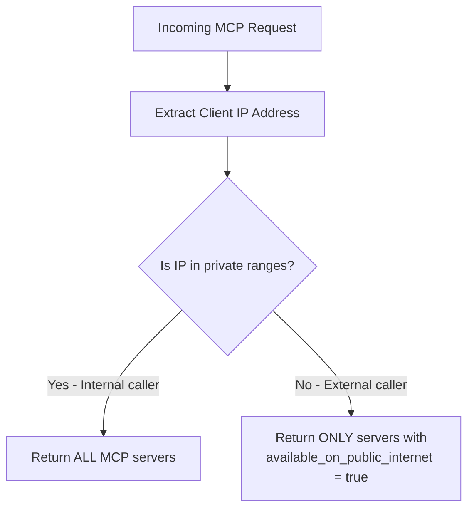

import Tabs from '@theme/Tabs';
import TabItem from '@theme/TabItem';

# Public Internet에 MCP 노출

외부 호출자(예: ChatGPT, Claude Desktop)에게 보이는 MCP server와 내부 전용 호출자에게만 보이는 MCP server를 제어합니다. 민감한 server는 사설 네트워크로 제한하면서 일부 MCP server만 공개적으로 사용할 수 있게 할 때 유용합니다.

## 개요

| 속성 | 세부 정보 |
|-------|-------|
| 설명 | MCP server에 대한 IP 기반 접근 제어 - 외부 호출자는 public으로 표시된 server만 볼 수 있습니다. |
| 설정 | 각 MCP server의 `available_on_public_internet` |
| 네트워크 구성 | `general_settings`의 `mcp_internal_ip_ranges` |
| 지원 클라이언트 | ChatGPT, Claude Desktop, Cursor, OpenAI API 또는 모든 MCP client |

## 동작 방식

LiteLLM의 MCP endpoint에 요청이 도착하면 LiteLLM은 호출자의 IP 주소를 확인해 **내부** 호출자인지 **외부** 호출자인지 판단합니다.

1. 들어오는 요청에서 **client IP를 추출**합니다(reverse proxy 뒤에 구성된 경우 `X-Forwarded-For` 지원).
2. 구성된 사설 IP 범위와 비교해 IP를 내부 또는 외부로 **분류**합니다(기본값은 RFC 1918: `10.0.0.0/8`, `172.16.0.0/12`, `192.168.0.0/16`, `127.0.0.0/8`).
3. **Server 목록을 필터링**합니다.
   - **내부 호출자**는 모든 MCP server(public 및 private)를 봅니다.
   - **외부 호출자**는 `available_on_public_internet: true`인 server만 봅니다.

이 필터링은 MCP registry, tool listing, tool calling, dynamic server route, OAuth discovery endpoint 등 모든 MCP 접근 지점에 적용됩니다.



## 연습 안내

이 안내는 두 가지 흐름을 다룹니다.
1. **Public MCP server 추가**(DeepWiki) 후 ChatGPT에서 연결
2. **기존 server를 private으로 전환**(Exa)하고 ChatGPT에서 더 이상 보이지 않는지 확인

### 흐름 1: Public MCP Server 추가(DeepWiki)

DeepWiki는 무료 MCP server이므로 AI gateway 사용자가 ChatGPT에서 접근할 수 있도록 공개 노출하기 좋은 후보입니다.

#### 단계 1: MCP Server 생성

MCP Servers 페이지로 이동해 **"+ Add New MCP Server"**를 클릭합니다.


생성 dialog가 열리면 server 이름으로 **"DeepWiki"**를 입력합니다.


DeepWiki는 Streamable HTTP transport를 사용하므로 transport type dropdown에서 **HTTP**를 선택합니다.


이제 MCP Server URL 필드까지 아래로 스크롤합니다.


DeepWiki MCP URL `https://mcp.deepwiki.com/mcp`를 입력합니다.


이름, transport, URL을 입력하면 기본 server 구성이 완료됩니다.


#### 단계 2: `"Available on Public Internet"` 활성화

생성하기 전에 아래로 스크롤해 **Permission Management / Access Control** 섹션을 펼칩니다. 여기서 이 server를 누가 볼 수 있는지 제어합니다.


**`"Available on Public Internet"`** 토글을 켭니다. 이 핵심 설정은 public internet에서 연결하는 ChatGPT 같은 외부 호출자가 이 server를 발견하고 사용할 수 있어야 한다고 LiteLLM에 알려줍니다.


토글이 활성화되면 **"Create"**를 클릭해 server를 저장합니다.


#### 단계 3: ChatGPT에서 연결

이제 동작을 확인합니다. ChatGPT를 열고 MCP server 아이콘에서 새 연결을 추가합니다. 사용할 endpoint는 `<your-litellm-url>/mcp`입니다.


Dropdown에서 **"Add an MCP server"**를 선택해 새 연결을 구성합니다.


ChatGPT가 server label을 요청하면 "LiteLLM"처럼 알아보기 쉬운 이름을 지정합니다.


다음으로 Server URL을 입력합니다. 이 값은 LiteLLM proxy의 MCP endpoint인 `<your-litellm-url>/mcp`여야 합니다.


LiteLLM URL을 붙여넣고 올바른지 확인합니다.


ChatGPT에는 인증도 필요합니다. Proxy에 연결할 수 있도록 authentication 필드에 LiteLLM API key를 입력합니다.


연결을 설정하려면 **"Connect"**를 클릭합니다.


ChatGPT가 연결되고 사용 가능한 tool을 표시합니다. 현재 DeepWiki와 Exa가 모두 public으로 표시되어 있으므로 ChatGPT는 두 server의 tool을 모두 볼 수 있습니다.


---

### 흐름 2: 기존 Server를 Private으로 전환(Exa)

이제 반대 흐름을 수행합니다. 현재 public인 기존 MCP server(Exa)를 내부 접근 전용으로 제한합니다. 변경 후 ChatGPT는 더 이상 Exa의 tool을 볼 수 없어야 합니다.

#### 단계 1: Server 편집

MCP Servers 표로 이동해 Exa server를 클릭하고 상세 화면을 엽니다.


편집 form에 접근하려면 **"Settings"** 탭으로 전환합니다.


Exa의 현재 구성이 포함된 편집 form이 로드됩니다.


#### 단계 2: `"Available on Public Internet"` 끄기

아래로 스크롤해 **Permission Management / Access Control** 섹션을 펼치고 public internet 토글을 찾습니다.


**`"Available on Public Internet"`** 토글을 끕니다. 그러면 사설 네트워크 외부의 모든 호출자에게 Exa가 숨겨집니다.


적용하려면 **"Save Changes"**를 클릭합니다. 변경은 즉시 적용되며 proxy 재시작은 필요하지 않습니다.


#### 단계 3: ChatGPT에서 확인

ChatGPT로 돌아가 Exa가 더 이상 보이지 않는지 확인합니다. ChatGPT가 tool 목록을 다시 가져오도록 다시 연결해야 합니다.


MCP server 설정을 열고 server 추가 또는 재연결을 선택합니다.


이전과 동일한 LiteLLM MCP URL을 입력합니다.


Server label을 설정합니다.


인증을 위해 API key를 입력합니다.


연결을 다시 설정하려면 **"Connect"**를 클릭합니다.


이번에는 DeepWiki의 tool만 표시되고 Exa는 사라집니다. LiteLLM은 ChatGPT가 public IP에서 호출한다고 판단하고, Exa가 더 이상 public으로 표시되어 있지 않으므로 필터링합니다. 사설 네트워크의 내부 사용자는 여전히 두 server를 모두 볼 수 있습니다.


## 설정 참조

### Server별 설정

<Tabs>
<TabItem value="ui" label="UI">

MCP server를 생성하거나 편집할 때 Permission Management 섹션에서 **`"Available on Public Internet"`**을 토글합니다.

</TabItem>
<TabItem value="config" label="config.yaml">

```yaml title="config.yaml" showLineNumbers
mcp_servers:
  deepwiki:
    url: https://mcp.deepwiki.com/mcp
    available_on_public_internet: true   # visible to external callers

  exa:
    url: https://exa.ai/mcp
    auth_type: api_key
    auth_value: os.environ/EXA_API_KEY
    available_on_public_internet: false  # internal only (default)
```

</TabItem>
<TabItem value="api" label="API">

```bash title="Create a public MCP server" showLineNumbers
curl -X POST <your-litellm-url>/v1/mcp/server \
  -H "Authorization: Bearer sk-..." \
  -H "Content-Type: application/json" \
  -d '{
    "server_name": "DeepWiki",
    "url": "https://mcp.deepwiki.com/mcp",
    "transport": "http",
    "available_on_public_internet": true
  }'
```

```bash title="Update an existing server" showLineNumbers
curl -X PUT <your-litellm-url>/v1/mcp/server \
  -H "Authorization: Bearer sk-..." \
  -H "Content-Type: application/json" \
  -d '{
    "server_id": "<server-id>",
    "available_on_public_internet": false
  }'
```

</TabItem>
</Tabs>

### 사용자 지정 Private IP 범위

기본적으로 LiteLLM은 RFC 1918 private 범위를 내부로 취급합니다. MCP Servers 아래의 **Network Settings** 탭 또는 config에서 이를 사용자 지정할 수 있습니다.

```yaml title="config.yaml" showLineNumbers
general_settings:
  mcp_internal_ip_ranges:
    - "10.0.0.0/8"
    - "172.16.0.0/12"
    - "192.168.0.0/16"
    - "100.64.0.0/10"    # Add your VPN/Tailscale range
```

비어 있으면 표준 private 범위(`10.0.0.0/8`, `172.16.0.0/12`, `192.168.0.0/16`, `127.0.0.0/8`)가 사용됩니다.
