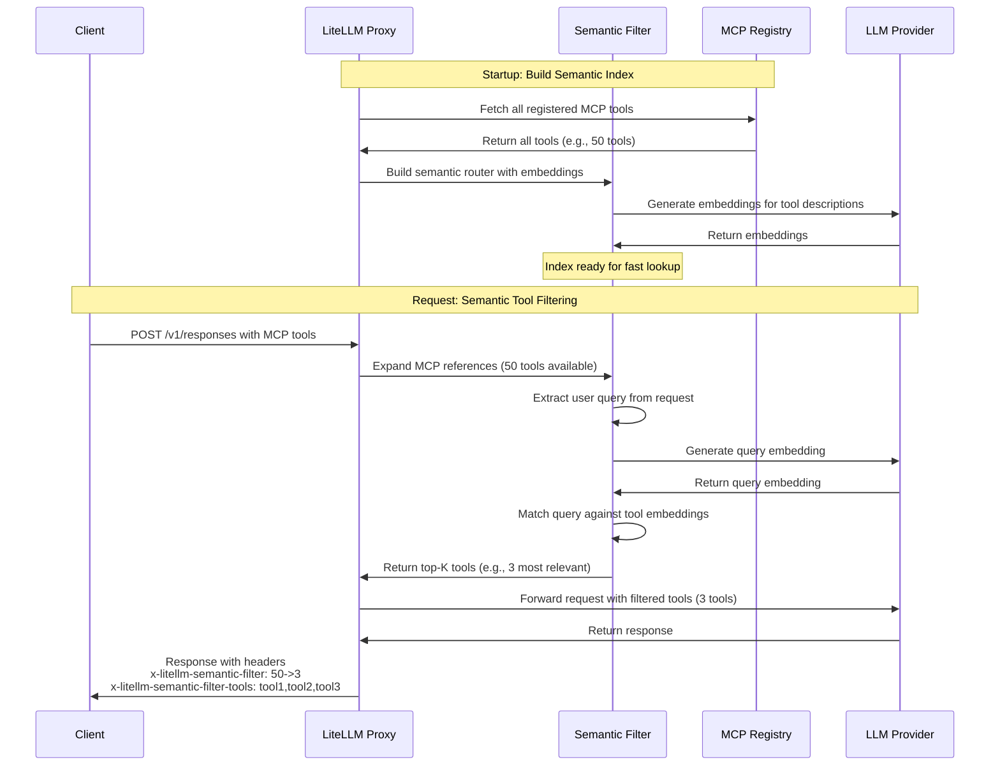

import Tabs from '@theme/Tabs';
import TabItem from '@theme/TabItem';

# MCP 의미 기반 도구 필터 {#mcp-semantic-tool-filter}

MCP 도구를 의미적 관련성 기준으로 자동 필터링합니다. 등록된 MCP 도구가 많을 때 LiteLLM은 사용자 쿼리를 도구 설명과 의미적으로 매칭하고, 가장 관련성이 높은 도구만 LLM으로 보냅니다.

## 작동 방식

도구 검색은 도구 선택을 프롬프트 엔지니어링 문제가 아니라 검색 문제로 바꿉니다. 모든 프롬프트에 큰 정적 도구 목록을 주입하는 대신, 의미 필터는 다음과 같이 동작합니다.

1. 시작 시 사용 가능한 모든 MCP 도구의 의미 인덱스를 구축합니다
2. 각 요청에서 사용자 쿼리를 도구 설명과 의미적으로 매칭합니다
3. 가장 관련성이 높은 상위 K개 도구만 LLM에 반환합니다

이 방식은 컨텍스트 효율을 높이고, 도구 혼동을 줄여 신뢰성을 개선하며, 수백 또는 수천 개의 MCP 도구가 있는 생태계까지 확장할 수 있게 합니다.



## 설정

LiteLLM 설정에서 의미 필터링을 활성화합니다.

```yaml title="config.yaml" showLineNumbers
litellm_settings:
  mcp_semantic_tool_filter:
    enabled: true
    embedding_model: "text-embedding-3-small"  # Model for semantic matching
    top_k: 5                                    # Max tools to return
    similarity_threshold: 0.3                   # Min similarity score
```

**설정 옵션:**
- `enabled` - 의미 필터링을 활성화하거나 비활성화합니다(기본값: `false`).
- `embedding_model` - 임베딩 생성에 사용할 모델입니다(기본값: `"text-embedding-3-small"`).
- `top_k` - 반환할 최대 도구 수입니다(기본값: `10`).
- `similarity_threshold` - 매칭에 필요한 최소 유사도 점수입니다(기본값: `0.3`).

## 사용법

Responses API 또는 Chat Completions에서 MCP 도구를 평소처럼 사용하면 됩니다. 의미 필터는 자동으로 실행됩니다.

<Tabs>
<TabItem value="responses" label="Responses API">

```bash title="Responses API with Semantic Filtering" showLineNumbers
curl --location 'http://localhost:4000/v1/responses' \
--header 'Content-Type: application/json' \
--header "Authorization: Bearer sk-1234" \
--data '{
    "model": "gpt-4o",
    "input": [
    {
      "role": "user",
      "content": "give me TLDR of what BerriAI/litellm repo is about",
      "type": "message"
    }
  ],
    "tools": [
        {
            "type": "mcp",
            "server_url": "litellm_proxy",
            "require_approval": "never"
        }
    ],
    "tool_choice": "required"
}'
```

</TabItem>
<TabItem value="chat" label="Chat Completions">

```bash title="Chat Completions with Semantic Filtering" showLineNumbers
curl --location 'http://localhost:4000/v1/chat/completions' \
--header 'Content-Type: application/json' \
--header "Authorization: Bearer sk-1234" \
--data '{
  "model": "gpt-4o",
  "messages": [
    {"role": "user", "content": "Search Wikipedia for LiteLLM"}
  ],
  "tools": [
    {
      "type": "mcp",
      "server_url": "litellm_proxy"
    }
  ]
}'
```

</TabItem>
</Tabs>

## 응답 헤더

의미 필터는 모든 응답에 진단용 헤더를 추가합니다.

```
x-litellm-semantic-filter: 10->3
x-litellm-semantic-filter-tools: wikipedia-fetch,github-search,slack-post
```

- **`x-litellm-semantic-filter`** - 필터링 전후의 도구 수를 보여줍니다(예: `10->3`은 10개 도구가 3개로 줄었다는 뜻입니다).
- **`x-litellm-semantic-filter-tools`** - 필터링된 도구 이름의 CSV 목록입니다(최대 150자, 더 길면 `...`로 잘립니다).

이 헤더를 통해 각 요청에서 어떤 도구가 선택되었는지 확인하고 필터가 올바르게 동작하는지 검증할 수 있습니다.

## 예제

MCP 도구 50개가 등록된 상태에서 Wikipedia 관련 요청을 보내면, 의미 필터는 다음과 같이 동작합니다.

1. 쿼리 `"Search Wikipedia for LiteLLM"`를 50개 전체 도구 설명과 의미적으로 매칭합니다
2. 가장 관련성이 높은 상위 5개 도구를 선택합니다(예: `wikipedia-fetch`, `wikipedia-search` 등)
3. 해당 5개 도구만 LLM에 전달합니다
4. `x-litellm-semantic-filter: 50->5`를 보여주는 헤더를 추가합니다

이렇게 하면 LLM이 작업에 맞는 도구에 접근할 수 있게 유지하면서 프롬프트 크기를 크게 줄일 수 있습니다.

## 성능

의미 필터는 프로덕션 환경에 맞게 최적화되어 있습니다.
- 라우터는 시작 시 한 번만 구축됩니다(요청별 오버헤드 없음).
- 의미 매칭은 일반적으로 50ms 미만이 걸립니다.
- 필터링 실패 시 전체 도구를 반환하며 우아하게 실패합니다.
- MCP 도구가 없는 요청의 지연 시간에는 영향이 없습니다.

## 관련 문서

- [MCP 개요](./mcp.md) - LiteLLM의 MCP 알아보기
- [MCP 권한 관리](./mcp_control.md) - 키/팀별 도구 접근 제어
- [MCP 사용](./mcp_usage.md) - 전체 MCP 사용 가이드
