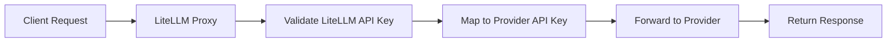

# Pass-Through 엔드포인트가 필요한 이유

이 엔드포인트는 두 가지 상황에서 유용합니다:

1. **기존 프로젝트를 LiteLLM Proxy로 마이그레이션**할 때. 예를 들어 이미 production에서 Anthropic SDK를 사용하는 사용자가 있다면, base URL만 바꿔 cost tracking, logging, budgets 등을 사용할 수 있습니다.

2. **Provider별 엔드포인트를 사용**할 때. 예를 들어 [Vertex AI의 token counting 엔드포인트](https://docs.litellm.ai/docs/pass_through/vertex_ai#count-tokens-api)를 사용하려는 경우입니다.

## 요청은 어떻게 처리되나요?

요청은 provider 엔드포인트로 그대로 전달됩니다. 이후 응답이 클라이언트로 다시 전달됩니다. **변환은 수행되지 않습니다.**

### 요청 전달 프로세스

1. **요청 수신**: LiteLLM이 `/provider/endpoint`에서 요청을 받습니다.
2. **인증**: LiteLLM API key를 검증하고 provider API key에 매핑합니다.
3. **요청 변환**: 대상 provider API에 맞게 요청 형식을 조정합니다.
4. **전달**: 실제 provider 엔드포인트로 요청을 보냅니다.
5. **응답 처리**: provider 응답을 사용자에게 직접 반환합니다.

### 인증 흐름

**핵심 사항:**
- 요청에는 provider key가 아니라 **LiteLLM API key**를 사용합니다.
- LiteLLM이 내부에서 provider 인증을 처리합니다.
- 모든 passthrough 엔드포인트에서 동일한 인증 방식이 동작합니다.

### 오류 처리

**Provider 오류**: 원래 오류 코드와 메시지를 포함해 사용자에게 직접 전달됩니다.

**LiteLLM 오류**:
- `401`: 유효하지 않은 LiteLLM API key
- `404`: 지원되지 않는 provider 또는 엔드포인트
- `500`: 내부 routing/forwarding 오류

### 장점

- **통합 인증**: 모든 provider에 하나의 API key를 사용합니다.
- **중앙화된 Logging**: 모든 요청이 LiteLLM을 통해 기록됩니다.
- **Cost Tracking**: 모든 엔드포인트의 사용량을 추적합니다.
- **Access Control**: passthrough 엔드포인트에도 동일한 권한이 적용됩니다.
