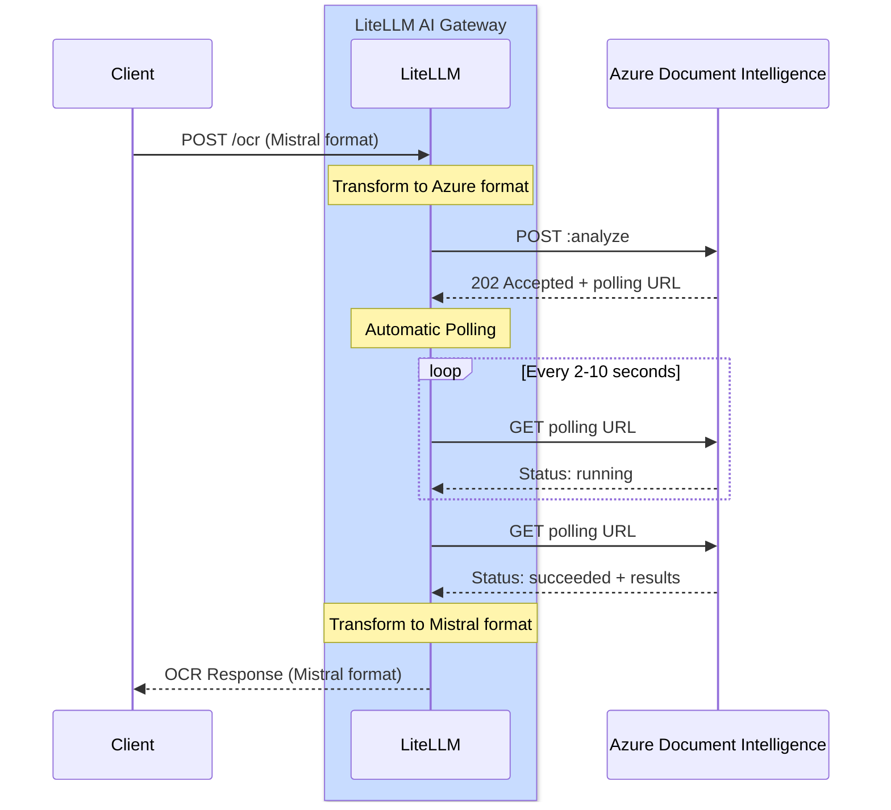

# Azure Document Intelligence OCR 사용하기

## 개요

| 속성 | 세부 정보 |
|-------|-------|
| 설명 | Azure Document Intelligence(이전 Form Recognizer)는 텍스트 추출, 레이아웃 분석, 구조 인식을 포함한 고급 문서 분석 기능을 제공합니다 |
| LiteLLM 공급자 라우트 | `azure_ai/doc-intelligence/` |
| 지원 작업 | `/ocr` |
| 공급자 문서 링크 | [Azure Document Intelligence ↗](https://learn.microsoft.com/en-us/azure/ai-services/document-intelligence/)

Azure Document Intelligence의 강력한 사전 빌드 모델을 사용해 텍스트를 추출하고 문서 구조를 분석합니다.

## 빠른 시작

### **LiteLLM SDK**

```python showLineNumbers title="SDK Usage"
import litellm
import os

# Set environment variables
os.environ["AZURE_DOCUMENT_INTELLIGENCE_API_KEY"] = "your-api-key"
os.environ["AZURE_DOCUMENT_INTELLIGENCE_ENDPOINT"] = "https://your-resource.cognitiveservices.azure.com"

# OCR with PDF URL
response = litellm.ocr(
    model="azure_ai/doc-intelligence/prebuilt-layout",
    document={
        "type": "document_url",
        "document_url": "https://example.com/document.pdf"
    }
)

# Access extracted text
for page in response.pages:
    print(f"Page {page.index}:")
    print(page.markdown)
```

### **LiteLLM PROXY**

```yaml showLineNumbers title="proxy_config.yaml"
model_list:
  - model_name: azure-doc-intel
    litellm_params:
      model: azure_ai/doc-intelligence/prebuilt-layout
      api_key: os.environ/AZURE_DOCUMENT_INTELLIGENCE_API_KEY
      api_base: os.environ/AZURE_DOCUMENT_INTELLIGENCE_ENDPOINT
    model_info:
      mode: ocr
```

**프록시 시작**
```bash
litellm --config proxy_config.yaml
```

**프록시로 OCR 호출**
```bash showLineNumbers title="cURL Request"
curl -X POST http://localhost:4000/ocr \
  -H "Content-Type: application/json" \
  -H "Authorization: Bearer your-api-key" \
  -d '{
    "model": "azure-doc-intel",
    "document": {
      "type": "document_url",
      "document_url": "https://arxiv.org/pdf/2201.04234"
    }
  }'
```

## 작동 방식

Azure Document Intelligence는 비동기 API 패턴을 사용합니다. LiteLLM AI Gateway가 요청/응답 변환과 폴링을 자동으로 처리합니다.

### 전체 흐름도



### LiteLLM이 대신 처리하는 작업

SDK로 `litellm.ocr()`를 호출하거나 프록시로 `/ocr`를 호출하면:

1. **요청 변환**: Mistral OCR 형식을 Azure Document Intelligence 형식으로 변환합니다
2. **문서 제출**: 변환된 요청을 Azure DI API로 보냅니다
3. **202 응답 처리**: 응답 헤더에서 `Operation-Location` URL을 캡처합니다
4. **자동 폴링**:
   - `retry-after` 헤더에 지정된 간격으로 작업 URL을 폴링합니다(기본값: 2초)
   - 상태가 `succeeded` 또는 `failed`가 될 때까지 계속합니다
   - `retry-after` 헤더를 사용해 Azure의 속도 제한을 준수합니다
5. **응답 변환**: Azure DI 형식을 Mistral OCR 형식으로 변환합니다
6. **결과 반환**: 통합된 Mistral 형식 응답을 클라이언트에 보냅니다

**Polling 설정:**
- 기본 제한 시간: 120초
- `AZURE_OPERATION_POLLING_TIMEOUT` 환경 변수로 설정할 수 있습니다
- 호출 유형에 따라 동기(`time.sleep()`) 또는 비동기(`await asyncio.sleep()`) 방식을 사용합니다

:::info
**일반적인 처리 시간**: 문서 크기와 복잡도에 따라 2~10초
:::

## 지원 모델

Azure Document Intelligence는 다양한 사용 사례에 최적화된 여러 사전 빌드 모델을 제공합니다.

### prebuilt-layout (권장)

구조를 보존해야 하는 일반 문서 OCR에 가장 적합합니다.

import Tabs from '@theme/Tabs';
import TabItem from '@theme/TabItem';

<Tabs>
<TabItem value="sdk" label="SDK">

```python showLineNumbers title="Layout Model - SDK"
import litellm
import os

os.environ["AZURE_DOCUMENT_INTELLIGENCE_API_KEY"] = "your-api-key"
os.environ["AZURE_DOCUMENT_INTELLIGENCE_ENDPOINT"] = "https://your-resource.cognitiveservices.azure.com"

response = litellm.ocr(
    model="azure_ai/doc-intelligence/prebuilt-layout",
    document={
        "type": "document_url",
        "document_url": "https://example.com/document.pdf"
    }
)
```

</TabItem>
<TabItem value="proxy" label="Proxy Config">

```yaml showLineNumbers title="proxy_config.yaml"
model_list:
  - model_name: azure-layout
    litellm_params:
      model: azure_ai/doc-intelligence/prebuilt-layout
      api_key: os.environ/AZURE_DOCUMENT_INTELLIGENCE_API_KEY
      api_base: os.environ/AZURE_DOCUMENT_INTELLIGENCE_ENDPOINT
    model_info:
      mode: ocr
```

**사용법:**
```bash
curl -X POST http://localhost:4000/ocr \
  -H "Authorization: Bearer your-api-key" \
  -d '{"model": "azure-layout", "document": {"type": "document_url", "document_url": "https://example.com/doc.pdf"}}'
```

</TabItem>
</Tabs>

**기능:**
- 마크다운 형식을 적용한 텍스트 추출
- 표 감지 및 추출
- 문서 구조 분석
- 문단 및 섹션 인식

**가격:** 1,000페이지당 $10

### prebuilt-read

문서에서 텍스트를 읽는 데 최적화되어 있으며 가장 빠르고 비용 효율적입니다.

<Tabs>
<TabItem value="sdk" label="SDK">

```python showLineNumbers title="Read Model - SDK"
import litellm
import os

os.environ["AZURE_DOCUMENT_INTELLIGENCE_API_KEY"] = "your-api-key"
os.environ["AZURE_DOCUMENT_INTELLIGENCE_ENDPOINT"] = "https://your-resource.cognitiveservices.azure.com"

response = litellm.ocr(
    model="azure_ai/doc-intelligence/prebuilt-read",
    document={
        "type": "document_url",
        "document_url": "https://example.com/document.pdf"
    }
)
```

</TabItem>
<TabItem value="proxy" label="Proxy Config">

```yaml showLineNumbers title="proxy_config.yaml"
model_list:
  - model_name: azure-read
    litellm_params:
      model: azure_ai/doc-intelligence/prebuilt-read
      api_key: os.environ/AZURE_DOCUMENT_INTELLIGENCE_API_KEY
      api_base: os.environ/AZURE_DOCUMENT_INTELLIGENCE_ENDPOINT
    model_info:
      mode: ocr
```

**사용법:**
```bash
curl -X POST http://localhost:4000/ocr \
  -H "Authorization: Bearer your-api-key" \
  -d '{"model": "azure-read", "document": {"type": "document_url", "document_url": "https://example.com/doc.pdf"}}'
```

</TabItem>
</Tabs>

**기능:**
- 빠른 텍스트 추출
- 텍스트 읽기 중심 문서에 최적화
- 기본 구조 인식

**가격:** 1,000페이지당 $1.50

### prebuilt-document

키-값 쌍을 포함하는 범용 문서 분석용 모델입니다.

<Tabs>
<TabItem value="sdk" label="SDK">

```python showLineNumbers title="Document Model - SDK"
import litellm
import os

os.environ["AZURE_DOCUMENT_INTELLIGENCE_API_KEY"] = "your-api-key"
os.environ["AZURE_DOCUMENT_INTELLIGENCE_ENDPOINT"] = "https://your-resource.cognitiveservices.azure.com"

response = litellm.ocr(
    model="azure_ai/doc-intelligence/prebuilt-document",
    document={
        "type": "document_url",
        "document_url": "https://example.com/document.pdf"
    }
)
```

</TabItem>
<TabItem value="proxy" label="Proxy Config">

```yaml showLineNumbers title="proxy_config.yaml"
model_list:
  - model_name: azure-document
    litellm_params:
      model: azure_ai/doc-intelligence/prebuilt-document
      api_key: os.environ/AZURE_DOCUMENT_INTELLIGENCE_API_KEY
      api_base: os.environ/AZURE_DOCUMENT_INTELLIGENCE_ENDPOINT
    model_info:
      mode: ocr
```

**사용법:**
```bash
curl -X POST http://localhost:4000/ocr \
  -H "Authorization: Bearer your-api-key" \
  -d '{"model": "azure-document", "document": {"type": "document_url", "document_url": "https://example.com/doc.pdf"}}'
```

</TabItem>
</Tabs>

**가격:** 1,000페이지당 $10

## 문서 유형

Azure Document Intelligence는 다양한 문서 형식을 지원합니다.

### PDF 문서

```python showLineNumbers title="PDF OCR"
response = litellm.ocr(
    model="azure_ai/doc-intelligence/prebuilt-layout",
    document={
        "type": "document_url",
        "document_url": "https://example.com/document.pdf"
    }
)
```

### 이미지 문서

```python showLineNumbers title="Image OCR"
response = litellm.ocr(
    model="azure_ai/doc-intelligence/prebuilt-layout",
    document={
        "type": "image_url",
        "image_url": "https://example.com/image.png"
    }
)
```

**지원되는 이미지 형식:** JPEG, PNG, BMP, TIFF

### Base64 인코딩 문서

```python showLineNumbers title="Base64 PDF"
import base64

# Read and encode PDF
with open("document.pdf", "rb") as f:
    pdf_base64 = base64.b64encode(f.read()).decode()

response = litellm.ocr(
    model="azure_ai/doc-intelligence/prebuilt-layout",
    document={
        "type": "document_url",
        "document_url": f"data:application/pdf;base64,{pdf_base64}"
    }
)
```

## 응답 형식

```python showLineNumbers title="Response Structure"
# Response has the following structure
response.pages          # List of pages with extracted text
response.model          # Model used
response.object         # "ocr"
response.usage_info     # Token usage information

# Access page content
for page in response.pages:
    print(f"Page {page.index}:")
    print(page.markdown)
    
    # Page dimensions (in pixels)
    if page.dimensions:
        print(f"Width: {page.dimensions.width}px")
        print(f"Height: {page.dimensions.height}px")
```

## 비동기 지원

```python showLineNumbers title="Async Usage"
import litellm
import asyncio

async def process_document():
    response = await litellm.aocr(
        model="azure_ai/doc-intelligence/prebuilt-layout",
        document={
            "type": "document_url",
            "document_url": "https://example.com/document.pdf"
        }
    )
    return response

# Run async function
response = asyncio.run(process_document())
```

## 비용 추적

LiteLLM은 Azure Document Intelligence OCR 비용을 자동으로 추적합니다.

| 모델 | 1,000페이지당 비용 |
|-------|---------------------|
| prebuilt-read | $1.50 |
| prebuilt-layout | $10.00 |
| prebuilt-document | $10.00 |

```python showLineNumbers title="View Cost"
response = litellm.ocr(
    model="azure_ai/doc-intelligence/prebuilt-layout",
    document={"type": "document_url", "document_url": "https://..."}
)

# Access cost information
print(f"Cost: ${response._hidden_params.get('response_cost', 0)}")
```

## 추가 자료

- [Azure Document Intelligence 문서](https://learn.microsoft.com/en-us/azure/ai-services/document-intelligence/)
- [가격 세부 정보](https://azure.microsoft.com/en-us/pricing/details/ai-document-intelligence/)
- [지원되는 파일 형식](https://learn.microsoft.com/en-us/azure/ai-services/document-intelligence/concept-model-overview)
- [LiteLLM OCR 문서](https://docs.litellm.ai/docs/ocr)
