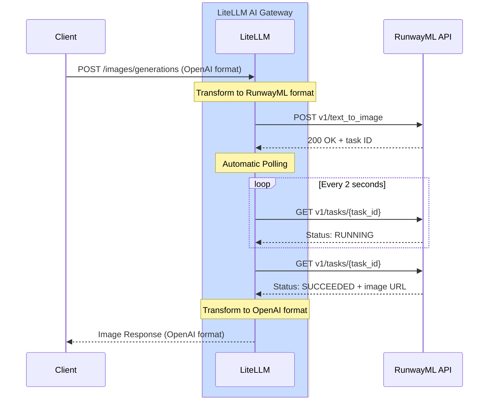

# RunwayML - 이미지 생성 {#runwayml-image-generation}

## 개요

| 속성 | 세부 정보 |
|-------|-------|
| 설명 | RunwayML은 고품질 결과를 제공하는 고급 AI 기반 이미지 생성을 지원합니다 |
| LiteLLM 제공업체 경로 | `runwayml/` |
| 지원 작업 | [`/images/generations`](#quick-start) |
| 제공업체 문서 링크 | [RunwayML API ↗](https://docs.dev.runwayml.com/) |

LiteLLM은 RunwayML의 Gen-4 이미지 생성 API를 지원하므로, 텍스트 프롬프트에서 고품질 이미지를 생성할 수 있습니다.

## 빠른 시작 {#quick-start}

```python showLineNumbers title="Basic Image Generation"
from litellm import image_generation
import os

os.environ["RUNWAYML_API_KEY"] = "your-api-key"

response = image_generation(
    model="runwayml/gen4_image",
    prompt="A serene mountain landscape at sunset",
    size="1920x1080"
)

print(response.data[0].url)
```

## 인증

RunwayML API 키를 설정하세요:

```python showLineNumbers title="Set API Key"
import os

os.environ["RUNWAYML_API_KEY"] = "your-api-key"
```

## 지원 파라미터

| 파라미터 | 타입 | 필수 여부 | 설명 |
|-----------|------|----------|-------------|
| `model` | string | 예 | 사용할 모델(예: `runwayml/gen4_image`) |
| `prompt` | string | 예 | 이미지에 대한 텍스트 설명 |
| `size` | string | 아니요 | 이미지 크기(기본값: `1920x1080`) |

### 지원 크기 {#supported-sizes}

- `1024x1024`
- `1792x1024`
- `1024x1792`
- `1920x1080` (기본값)
- `1080x1920`

## 비동기 사용법 {#async-usage}

```python showLineNumbers title="Async Image Generation"
from litellm import aimage_generation
import os
import asyncio

os.environ["RUNWAYML_API_KEY"] = "your-api-key"

async def generate_image():
    response = await aimage_generation(
        model="runwayml/gen4_image",
        prompt="A futuristic city skyline at night",
        size="1920x1080"
    )
    
    print(response.data[0].url)

asyncio.run(generate_image())
```

## LiteLLM Proxy 사용법

프록시 설정에 RunwayML을 추가하세요:

```yaml showLineNumbers title="config.yaml"
model_list:
  - model_name: gen4-image
    litellm_params:
      model: runwayml/gen4_image
      api_key: os.environ/RUNWAYML_API_KEY
```

프록시 시작:

```bash
litellm --config /path/to/config.yaml
```

프록시를 통해 이미지를 생성하세요:

```bash showLineNumbers title="Proxy Request"
curl --location 'http://localhost:4000/v1/images/generations' \
--header 'Content-Type: application/json' \
--header 'x-litellm-api-key: sk-1234' \
--data '{
    "model": "runwayml/gen4_image",
    "prompt": "A serene mountain landscape at sunset",
    "size": "1920x1080"
}'
```

## 지원 모델 {#supported-models}

| 모델 | 설명 | 기본 크기 |
|-------|-------------|--------------|
| `runwayml/gen4_image` | 고품질 이미지 생성 | 1920x1080 |

## 비용 추적 {#cost-tracking}

LiteLLM은 RunwayML 이미지 생성 비용을 자동으로 추적합니다:

```python showLineNumbers title="Cost Tracking"
from litellm import image_generation, completion_cost

response = image_generation(
    model="runwayml/gen4_image",
    prompt="A serene mountain landscape at sunset",
    size="1920x1080"
)

cost = completion_cost(completion_response=response)
print(f"Image generation cost: ${cost}")
```

## 지원 기능 {#supported-features}

| 기능 | 지원 여부 |
|---------|-----------|
| 이미지 생성 | ✅ |
| 비용 추적 | ✅ |
| 로깅 | ✅ |
| 폴백 | ✅ |
| 로드 밸런싱 | ✅ |


## 작동 방식 {#how-it-works}

RunwayML은 비동기 작업 기반 API 패턴을 사용합니다. LiteLLM은 폴링과 응답 변환을 자동으로 처리합니다.

### 전체 흐름 다이어그램 {#complete-flow-diagram}



### LiteLLM이 대신 처리하는 작업 {#what-litellm-does-for-you}

`litellm.image_generation()` 또는 `/v1/images/generations`를 호출하면:

1. **요청 변환**: OpenAI 이미지 생성 형식을 RunwayML 형식으로 변환합니다
2. **작업 제출**: 변환된 요청을 RunwayML API로 전송합니다
3. **작업 ID 수신**: 초기 응답에서 작업 ID를 가져옵니다
4. **자동 폴링**: 
   - 2초마다 작업 상태 엔드포인트를 폴링합니다
   - 상태가 `SUCCEEDED` 또는 `FAILED`가 될 때까지 계속합니다
   - 기본 제한 시간: 10분(`RUNWAYML_POLLING_TIMEOUT`으로 설정 가능)
5. **응답 변환**: RunwayML 형식을 OpenAI 형식으로 변환합니다
6. **결과 반환**: 통합된 OpenAI 형식 응답을 클라이언트로 전송합니다

**폴링 설정:**
- 기본 제한 시간: 600초(10분)
- `RUNWAYML_POLLING_TIMEOUT` 환경 변수로 설정 가능
- 호출 유형에 따라 동기(`time.sleep()`) 또는 비동기(`await asyncio.sleep()`) 방식을 사용합니다

:::info
**일반적인 처리 시간**: 이미지 크기와 복잡도에 따라 10~30초
:::
