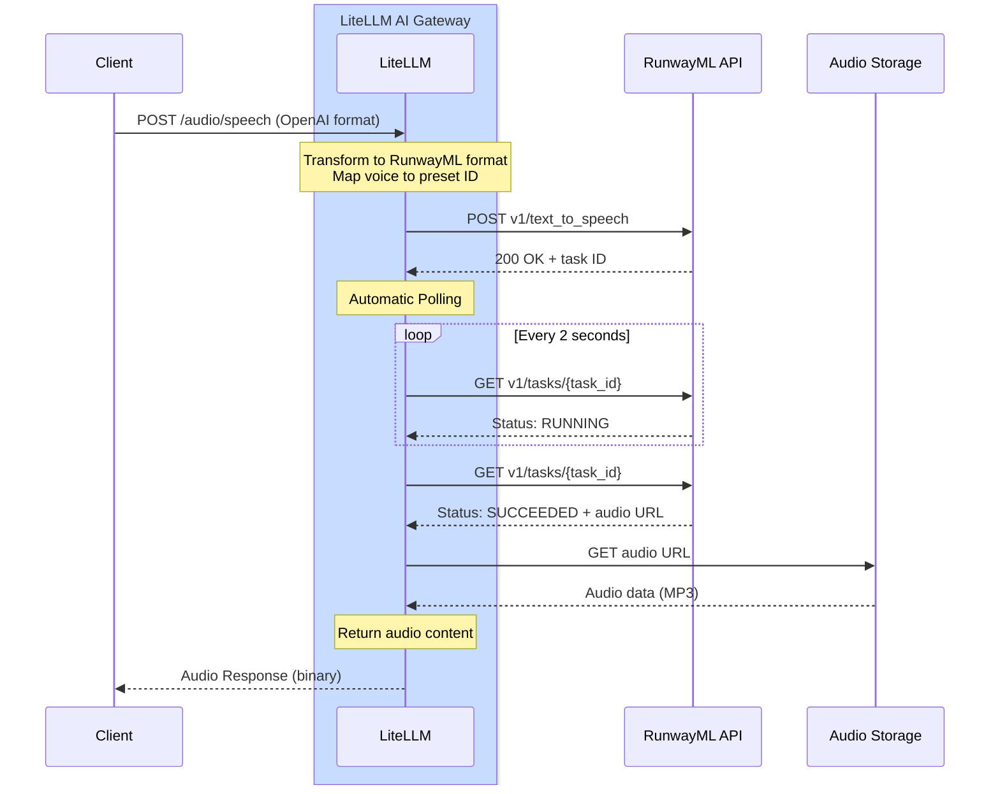

# RunwayML - 텍스트 음성 변환

## 개요

| 속성 | 세부 정보 |
|-------|-------|
| 설명 | RunwayML은 자연스럽게 들리는 음성으로 고품질 AI 기반 텍스트 음성 변환을 제공합니다 |
| LiteLLM의 공급자 라우트 | `runwayml/` |
| 지원 작업 | [`/audio/speech`](#quick-start) |
| 공급자 문서 링크 | [RunwayML API ↗](https://docs.dev.runwayml.com/) |

LiteLLM은 자동 작업 폴링과 함께 RunwayML의 텍스트 음성 변환 API를 지원하여, 텍스트에서 자연스럽게 들리는 오디오를 생성할 수 있게 합니다.

## 빠른 시작

```python showLineNumbers title="Basic Text-to-Speech"
from litellm import speech
import os

os.environ["RUNWAYML_API_KEY"] = "your-api-key"

response = speech(
    model="runwayml/eleven_multilingual_v2",
    input="Step right up, ladies and gentlemen! Have you ever wished for a toaster that's not just a toaster but a marvel of modern ingenuity?",
    voice="alloy"
)

# Save the audio
with open("output.mp3", "wb") as f:
    f.write(response.content)
```

## 인증

RunwayML API 키를 설정합니다.

```python showLineNumbers title="Set API Key"
import os

os.environ["RUNWAYML_API_KEY"] = "your-api-key"
```

## 지원 파라미터

| 파라미터 | 타입 | 필수 | 설명 |
|-----------|------|----------|-------------|
| `model` | string | 예 | 사용할 모델(예: `runwayml/eleven_multilingual_v2`) |
| `input` | string | 예 | 음성으로 변환할 텍스트 |
| `voice` | string 또는 dict | 예 | 사용할 음성(OpenAI 이름, RunwayML 프리셋 또는 음성 구성) |

## 음성 옵션

### OpenAI 음성 이름 사용

OpenAI 음성 이름은 적절한 RunwayML 음성에 자동으로 매핑됩니다.

```python showLineNumbers title="OpenAI Voice Names"
from litellm import speech

# These OpenAI voice names work automatically
response = speech(
    model="runwayml/eleven_multilingual_v2",
    input="Hello, world!",
    voice="alloy"  # Maya - neutral, balanced female voice
)
```

**음성 매핑:**
- `alloy` → Maya(중립적이고 균형 잡힌 여성 음성)
- `echo` → James(남성 음성)
- `fable` → Bernard(따뜻한 스토리텔링 음성)
- `onyx` → Vincent(깊은 남성 음성)
- `nova` → Serene(따뜻하고 표현력 있는 여성 음성)
- `shimmer` → Ella(명확하고 친근한 여성 음성)

### RunwayML 프리셋 음성 사용

프리셋 이름을 문자열로 전달하여 RunwayML 프리셋 음성을 직접 지정할 수 있습니다.

```python showLineNumbers title="RunwayML Preset Names"
from litellm import speech

# Pass the RunwayML voice name as a string
response = speech(
    model="runwayml/eleven_multilingual_v2",
    input="Hello, world!",
    voice="Maya"  # LiteLLM automatically formats this for RunwayML
)

# Try different RunwayML voices
response = speech(
    model="runwayml/eleven_multilingual_v2",
    input="Step right up, ladies and gentlemen!",
    voice="Bernard"  # Great for storytelling
)
```

**사용 가능한 RunwayML 음성:**

`Maya`, `Arjun`, `Serene`, `Bernard`, `Billy`, `Mark`, `Clint`, `Mabel`, `Chad`, `Leslie`, `Eleanor`, `Elias`, `Elliot`, `Grungle`, `Brodie`, `Sandra`, `Kirk`, `Kylie`, `Lara`, `Lisa`, `Malachi`, `Marlene`, `Martin`, `Miriam`, `Monster`, `Paula`, `Pip`, `Rusty`, `Ragnar`, `Xylar`, `Maggie`, `Jack`, `Katie`, `Noah`, `James`, `Rina`, `Ella`, `Mariah`, `Frank`, `Claudia`, `Niki`, `Vincent`, `Kendrick`, `Myrna`, `Tom`, `Wanda`, `Benjamin`, `Kiana`, `Rachel`

:::tip
음성 이름을 문자열로 전달하기만 하면 됩니다. LiteLLM이 내부 RunwayML API 형식 변환을 자동으로 처리합니다.
:::

## 비동기 사용법

```python showLineNumbers title="Async Text-to-Speech"
from litellm import aspeech
import os
import asyncio

os.environ["RUNWAYML_API_KEY"] = "your-api-key"

async def generate_speech():
    response = await aspeech(
        model="runwayml/eleven_multilingual_v2",
        input="This is an asynchronous text-to-speech request.",
        voice="nova"
    )
    
    with open("output.mp3", "wb") as f:
        f.write(response.content)
    
    print("Audio generated successfully!")

asyncio.run(generate_speech())
```

## LiteLLM 프록시 사용법

프록시 구성에 RunwayML을 추가합니다.

```yaml showLineNumbers title="config.yaml"
model_list:
  - model_name: runway-tts
    litellm_params:
      model: runwayml/eleven_multilingual_v2
      api_key: os.environ/RUNWAYML_API_KEY
```

프록시 시작:

```bash
litellm --config /path/to/config.yaml
```

프록시를 통해 음성을 생성합니다.

```bash showLineNumbers title="Proxy Request"
curl --location 'http://localhost:4000/v1/audio/speech' \
--header 'Content-Type: application/json' \
--header 'x-litellm-api-key: sk-1234' \
--data '{
    "model": "runwayml/eleven_multilingual_v2",
    "input": "Hello from the LiteLLM proxy!",
    "voice": "alloy"
}'
```

RunwayML 전용 음성을 사용하는 예시는 다음과 같습니다.

```bash showLineNumbers title="Proxy Request with RunwayML Voice"
curl --location 'http://localhost:4000/v1/audio/speech' \
--header 'Content-Type: application/json' \
--header 'x-litellm-api-key: sk-1234' \
--data '{
    "model": "runwayml/eleven_multilingual_v2",
    "input": "Hello with a custom RunwayML voice!",
    "voice": "Bernard"
}'
```

## 지원 모델

| 모델 | 설명 |
|-------|-------------|
| `runwayml/eleven_multilingual_v2` | 고품질 다국어 텍스트 음성 변환 |

## 비용 추적

LiteLLM은 RunwayML 텍스트 음성 변환 비용을 자동으로 추적합니다.

```python showLineNumbers title="Cost Tracking"
from litellm import speech, completion_cost

response = speech(
    model="runwayml/eleven_multilingual_v2",
    input="Hello, world!",
    voice="alloy"
)

cost = completion_cost(completion_response=response)
print(f"Text-to-speech cost: ${cost}")
```

## 지원 기능

| 기능 | 지원 여부 |
|---------|-----------|
| 텍스트 음성 변환 | ✅ |
| 비용 추적 | ✅ |
| 로깅 | ✅ |
| 폴백 | ✅ |
| 로드 밸런싱 | ✅ |
| 50개 이상의 음성 프리셋 | ✅ |

## 작동 방식

RunwayML은 비동기 작업 기반 API 패턴을 사용합니다. LiteLLM은 폴링과 응답 변환을 자동으로 처리합니다.

### 전체 흐름 다이어그램


