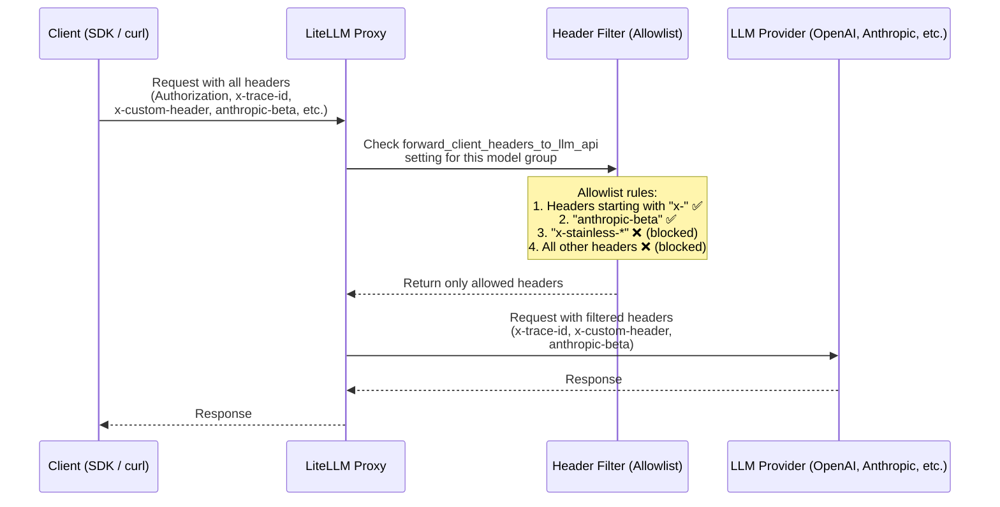

# LLM API로 클라이언트 헤더 전달

어떤 모델 그룹이 하위 LLM provider API로 클라이언트 헤더를 전달할 수 있는지 제어합니다.

## 개요

기본적으로 LiteLLM은 보안상의 이유로 클라이언트 헤더를 LLM provider API에 전달하지 않습니다. 다만 `forward_client_headers_to_llm_api` 설정을 사용하면 특정 모델 그룹에 대해서만 헤더 전달을 선택적으로 활성화할 수 있습니다.

## 동작 방식

LiteLLM은 모든 클라이언트 헤더를 LLM provider로 전달하지 않습니다. 대신 **allowlist** 방식을 사용해 특정 규칙과 일치하는 헤더만 전달합니다. 이 방식은 LiteLLM API key 같은 민감한 헤더가 upstream provider로 실수로 전송되지 않도록 보장합니다.



### 헤더 Allowlist 규칙

어떤 헤더를 전달할지는 다음 규칙으로 결정됩니다. 자세한 구현은 `litellm/proxy/litellm_pre_call_utils.py`의 [`_get_forwardable_headers`](https://github.com/litellm/litellm/blob/main/litellm/proxy/litellm_pre_call_utils.py)를 참고하세요.

| 규칙 | 예제 | 전달 여부 |
|---|---|---|
| `x-`로 시작하는 헤더 | `x-trace-id`, `x-custom-header`, `x-request-source` | 예 |
| `anthropic-beta` 헤더 | `anthropic-beta: prompt-caching-2024-07-31` | 예 |
| `x-stainless-*`로 시작하는 헤더 | `x-stainless-lang`, `x-stainless-arch` | 아니요(OpenAI SDK 문제 유발 가능) |
| 표준 HTTP 헤더 | `Authorization`, `Content-Type`, `Host` | 아니요 |
| 기타 provider 헤더 | `Accept`, `User-Agent` | 아니요 |

### 추가 헤더 메커니즘

| 메커니즘 | 설명 | 참고 |
|---|---|---|
| **`x-pass-` 접두사** | `x-pass-` 접두사가 붙은 헤더는 설정과 관계없이 접두사를 제거한 뒤 항상 전달됩니다. 예: `x-pass-anthropic-beta: value` → `anthropic-beta: value`. 모든 pass-through 엔드포인트에서 동작합니다. | [Source code](https://github.com/litellm/litellm/blob/main/litellm/passthrough/utils.py) |
| **`openai-organization`** | `general_settings`에 `forward_openai_org_id: true`가 설정된 경우에만 전달됩니다. | [OpenAI Org ID 전달](#enable-globally) |
| **사용자 정보 헤더** | `add_user_information_to_llm_headers: true`이면 LiteLLM이 `x-litellm-user-id`, `x-litellm-org-id` 등을 추가합니다. | [사용자 정보 헤더](#user-information-headers-optional) |
| **Vertex AI pass-through** | 별도의 더 엄격한 allowlist를 사용합니다. `anthropic-beta`와 `content-type`만 허용됩니다. | [Source code](https://github.com/litellm/litellm/blob/main/litellm/constants.py) |

## 설정

## 전역으로 활성화

```yaml
general_settings:
  forward_client_headers_to_llm_api: true
```

## LLM Provider 인증 헤더 전달

**v1.82+ 신규 기능**: 기본적으로 LiteLLM은 보안을 위해 클라이언트 요청에서 `x-api-key`, `x-goog-api-key`, `api-key` 같은 인증 헤더를 제거합니다. 이런 헤더는 보통 proxy 자체 인증에 사용되기 때문입니다. 하지만 LLM provider 인증 헤더 전달을 활성화하면 클라이언트가 자신의 API key를 LLM provider로 직접 보내는 **Bring Your Own Key (BYOK)** 시나리오를 지원할 수 있습니다.

### 설정

`general_settings`에 `forward_llm_provider_auth_headers: true`를 추가합니다.

```yaml
general_settings:
  forward_client_headers_to_llm_api: true
  forward_llm_provider_auth_headers: true  # 👈 Enable BYOK
```

### 전달되는 헤더

`forward_llm_provider_auth_headers: true`이면 다음 LLM provider 인증 헤더가 보존되어 전달됩니다.

| 헤더 | 프로바이더 | 예제 |
|--------|----------|---------|
| `x-api-key` | `Anthropic`, `Azure AI`, `Databricks` | `x-api-key: sk-ant-api03-...` |
| `x-goog-api-key` | Google AI Studio | `x-goog-api-key: AIza...` |
| `api-key` | Azure OpenAI | `api-key: your-azure-key` |
| `ocp-apim-subscription-key` | Azure APIM | `ocp-apim-subscription-key: your-key` |

:::warning 중요한 보안 참고
proxy 인증에 사용되는 proxy의 `Authorization` 헤더는 이 설정을 활성화해도 LLM provider로 **절대** 전달되지 않습니다. 따라서 proxy 인증 정보는 안전하게 유지됩니다.
:::

### 사용 사례: 클라이언트 측 API Key(BYOK)

이 기능은 다음 시나리오에 유용합니다.

1. proxy에 설정된 key 대신 **클라이언트가 자신의 LLM provider API key를 가져오는 경우**
2. 각 tenant가 자체 Anthropic/OpenAI 계정을 보유한 **multi-tenant 애플리케이션**
3. 개발자가 공유 proxy를 통해 개인 API key를 사용하는 **개발 환경**

#### 예제: Anthropic BYOK

```yaml
# proxy_config.yaml
model_list:
  - model_name: claude-sonnet-4
    litellm_params:
      model: anthropic/claude-sonnet-4-20250514
      # No api_key configured! Will use client's key

general_settings:
  forward_client_headers_to_llm_api: true
  forward_llm_provider_auth_headers: true  # Enable BYOK
```

`/login`과 자체 Anthropic key를 사용하는 **Claude Code** 구성은 [Claude Code BYOK](../tutorials/claude_code_byok.md)를 참고하세요. `ANTHROPIC_CUSTOM_HEADERS="x-litellm-api-key: sk-12345"`를 사용해 LiteLLM key를 전달하면, `/login`에서 얻은 Anthropic key는 `x-api-key`로 전달됩니다.

클라이언트 요청:
```bash
curl -X POST "http://localhost:4000/v1/messages" \
  -H "Authorization: Bearer sk-proxy-auth-123" \     # Proxy authentication (stripped)
  -H "x-api-key: sk-ant-api03-YOUR-KEY..." \        # Client's Anthropic key (forwarded!)
  -H "Content-Type: application/json" \
  -d '{
    "model": "claude-sonnet-4",
    "messages": [{"role": "user", "content": "Hello"}],
    "max_tokens": 100
  }'
```

#### 예제: Google AI Studio BYOK

```yaml
model_list:
  - model_name: gemini-pro
    litellm_params:
      model: gemini/gemini-1.5-pro
      # No api_key configured

general_settings:
  forward_client_headers_to_llm_api: true
  forward_llm_provider_auth_headers: true
```

클라이언트 요청:
```bash
curl -X POST "http://localhost:4000/v1/chat/completions" \
  -H "Authorization: Bearer sk-proxy-auth-123" \
  -H "x-goog-api-key: AIza..." \
  -d '{
    "model": "gemini-pro",
    "messages": [{"role": "user", "content": "Hello"}]
  }'
```

### 보안 고려사항

**이 기능을 사용하기 좋은 경우:**

- 모든 클라이언트를 신뢰할 수 있는 내부 도구
- 개발/테스트 환경
- 적절한 클라이언트 인증을 갖춘 multi-tenant 앱
- 클라이언트가 자신의 API key를 사용해야 하는 시나리오

**사용하지 않는 것이 좋은 경우:**

- 모든 클라이언트를 신뢰할 수 없는 public API
- 중앙 집중식 billing/cost 제어가 필요한 경우
- proxy 수준에서 rate limit을 강제해야 하는 경우

### 하위 호환성

하위 호환성을 위해 `forward_client_headers_to_llm_api: true`만 설정하고 `forward_llm_provider_auth_headers`를 명시하지 않으면 다음처럼 동작합니다.

- **기본값**: LLM provider auth 헤더를 전달하지 않습니다. 안전한 기본값입니다.
- **명시적 `true`**: LLM provider auth 헤더를 전달합니다. BYOK가 활성화됩니다.

```yaml
# Safe default - auth headers NOT forwarded
general_settings:
  forward_client_headers_to_llm_api: true

# BYOK enabled - auth headers ARE forwarded
general_settings:
  forward_client_headers_to_llm_api: true
  forward_llm_provider_auth_headers: true  # 👈 Opt-in required
```

## 모델 그룹에 활성화

설정의 `model_group_settings` 아래에 `forward_client_headers_to_llm_api`를 추가합니다.

```yaml
model_list:
  - model_name: gpt-4o-mini
    litellm_params:
      model: openai/gpt-4o-mini
      api_key: "your-api-key"
  - model_name: "wildcard-models/*"
    litellm_params:
      model: "openai/*"
      api_key: "your-api-key"

litellm_settings:
  model_group_settings:
    forward_client_headers_to_llm_api:
      - gpt-4o-mini
      - wildcard-models/*
```

## 지원되는 모델 패턴

이 설정은 여러 모델 매칭 패턴을 지원합니다.

### 1. 정확한 모델 이름
```yaml
forward_client_headers_to_llm_api:
  - gpt-4o-mini
  - claude-3-sonnet
```

### 2. Wildcard 패턴
```yaml
forward_client_headers_to_llm_api:
  - "openai/*"          # All OpenAI models
  - "anthropic/*"       # All Anthropic models
  - "wildcard-group/*"  # All models in wildcard-group
```

### 3. 팀 모델 Alias

팀에 모델 alias가 설정되어 있으면 원래 모델 이름과 alias 모두에서 헤더 전달이 동작합니다.

## 전달되는 헤더

모델 그룹에 대해 활성화되면 LiteLLM은 다음 유형의 헤더를 전달합니다.

### Custom Headers(`x-` 접두사)

- `x-`로 시작하는 모든 헤더. 단, OpenAI SDK 문제를 유발할 수 있는 `x-stainless-*`는 제외됩니다.
- 예제: `x-custom-header`, `x-request-id`, `x-trace-id`

### Provider별 헤더

- **Anthropic**: `anthropic-beta` headers
- **OpenAI**: `openai-organization` (when enabled via `forward_openai_org_id: true`)

### 사용자 정보 헤더(선택 사항)

`add_user_information_to_llm_headers`가 활성화되면 LiteLLM은 다음 헤더를 추가합니다.

- `x-litellm-user-id`
- `x-litellm-org-id`
- 기타 사용자 metadata를 `x-litellm-*` 헤더로 추가

## 보안 고려사항

⚠️ **Important Security 참고:**

1. **민감 데이터**: 헤더에는 민감 정보가 포함될 수 있으므로 신뢰할 수 있는 모델 그룹에만 헤더 전달을 활성화하세요.
2. **API Keys**: 전달되는 헤더에 API key나 secret을 포함하지 마세요.
3. **PII**: 개인 식별 정보를 포함할 수 있는 헤더 전달에는 주의하세요.
4. **Provider 제한**: 일부 provider는 custom header에 제한을 둡니다.

## 예제 사용 사례

### 1. 요청 추적

시스템 전반에서 요청을 추적할 수 있도록 tracing 헤더를 전달합니다.

```bash
curl -X POST "https://your-proxy.com/v1/chat/completions" \
  -H "Authorization: Bearer your-key" \
  -H "x-trace-id: abc123" \
  -H "x-request-source: mobile-app" \
  -d '{
    "model": "gpt-4o-mini",
    "messages": [{"role": "user", "content": "Hello"}]
  }'
```

### 2. Custom Metadata

LLM provider에 custom metadata를 전달합니다.

```bash
curl -X POST "https://your-proxy.com/v1/chat/completions" \
  -H "Authorization: Bearer your-key" \
  -H "x-customer-id: customer-123" \
  -H "x-environment: production" \
  -d '{
    "model": "gpt-4o-mini", 
    "messages": [{"role": "user", "content": "Hello"}]
  }'
```

### 3. Anthropic Beta 기능

Anthropic 모델의 beta 기능을 활성화합니다.

```bash
curl -X POST "https://your-proxy.com/v1/chat/completions" \
  -H "Authorization: Bearer your-key" \
  -H "anthropic-beta: tools-2024-04-04" \
  -d '{
    "model": "claude-3-sonnet",
    "messages": [{"role": "user", "content": "Hello"}]
  }'
```

## 전체 설정 예제

```yaml
model_list:
  # Fixed model with header forwarding
  - model_name: byok-fixed-gpt-4o-mini
    litellm_params:
      model: openai/gpt-4o-mini
      api_base: "https://your-openai-endpoint.com"
      api_key: "your-api-key"
      
  # Wildcard model group with header forwarding
  - model_name: "byok-wildcard/*"
    litellm_params:
      model: "openai/*"
      api_base: "https://your-openai-endpoint.com"
      api_key: "your-api-key"
      
  # Standard model without header forwarding
  - model_name: standard-gpt-4
    litellm_params:
      model: openai/gpt-4
      api_key: "your-api-key"

litellm_settings:
  # Enable user info headers globally (optional)
  add_user_information_to_llm_headers: true
  
  model_group_settings:
    forward_client_headers_to_llm_api:
      - byok-fixed-gpt-4o-mini
      - byok-wildcard/*
      # Note: standard-gpt-4 is NOT included, so no headers forwarded

general_settings:
  # Enable OpenAI organization header forwarding (optional)
  forward_openai_org_id: true
```

## 헤더 전달 테스트

헤더가 실제로 전달되는지 테스트하려면 다음을 확인합니다.

1. **Debug Logging 활성화**: 설정에서 `set_verbose: true`를 지정합니다.
2. **Provider 로그 확인**: LLM provider의 요청 로그를 모니터링합니다.
3. **Webhook 사이트 사용**: 테스트 시 webhook.site URL을 `api_base`로 사용해 전달된 헤더를 확인할 수 있습니다.

## 문제 해결

### 헤더가 전달되지 않음

1. **모델 이름 확인**: 요청의 모델 이름이 설정과 일치하는지 확인합니다.
2. **패턴 매칭 확인**: wildcard 패턴은 정확히 일치해야 합니다.
3. **로그 검토**: verbose logging을 활성화해 헤더 처리 과정을 확인합니다.

### Provider 오류

1. **잘못된 헤더**: 일부 provider는 알 수 없는 헤더를 거부합니다.
2. **헤더 제한**: provider마다 헤더 개수/크기 제한이 있을 수 있습니다.
3. **인증**: 전달되는 헤더가 인증과 충돌하지 않는지 확인합니다.

## 관련 기능

- [Request Headers](./request_headers.md) - 지원되는 request header 전체 목록
- [Response Headers](./response_headers.md) - LiteLLM이 반환하는 헤더
- [Team Model Aliases](./team_model_add.md) - 팀용 모델 alias 설정
- [Model Access Control](./model_access.md) - 어떤 사용자가 어떤 모델에 접근할 수 있는지 제어

## API 참조

헤더 전달은 `ModelGroupSettings` 설정으로 제어됩니다.

```python
class ModelGroupSettings(BaseModel):
    forward_client_headers_to_llm_api: Optional[List[str]] = None
```

목록의 각 문자열은 다음 중 하나일 수 있습니다.

- 정확한 모델 이름(예: `"gpt-4o-mini"`)
- wildcard 패턴(예: `"openai/*"`)
- 모델 그룹 이름(예: `"my-model-group/*"`)
