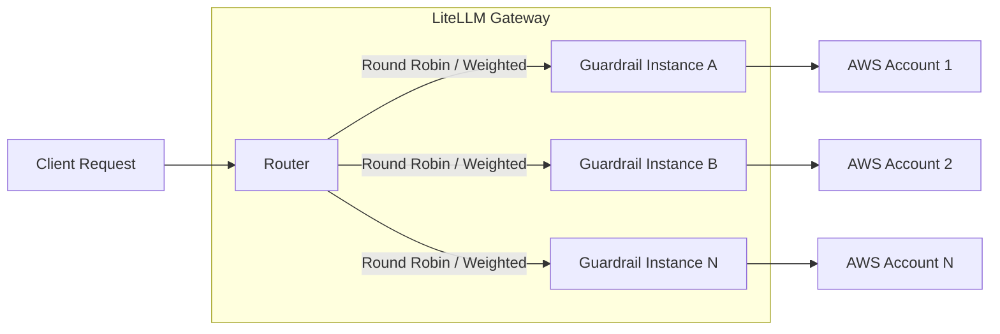
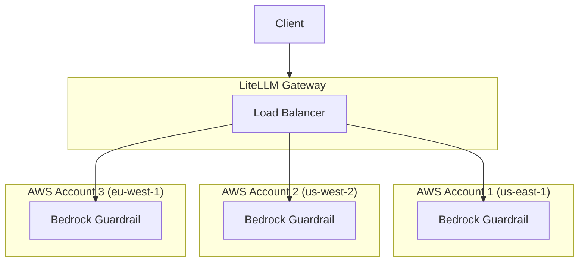

import Tabs from '@theme/Tabs';
import TabItem from '@theme/TabItem';

# 가드레일 로드 밸런싱

여러 가드레일 배포 간에 가드레일 요청을 로드 밸런싱합니다. 가드레일 제공자(예: AWS Bedrock 가드레일)에 속도 제한이 있고, 요청을 여러 계정이나 리전에 분산하려는 경우 유용합니다.

## 작동 방식



**같은 `guardrail_name`**으로 여러 가드레일을 정의하면 LiteLLM은 라우터의 로드 밸런싱 전략을 사용해 요청을 자동으로 분산합니다.

## 가드레일 로드 밸런싱을 사용하는 이유

| 사용 사례 | 이점 |
|----------|---------|
| **AWS Bedrock 속도 제한** | Bedrock 가드레일에는 계정별 속도 제한이 있습니다. 처리량을 늘리려면 여러 AWS 계정에 분산하세요 |
| **멀티 리전 이중화** | 장애 조치와 낮은 지연 시간을 위해 여러 리전에 가드레일을 배포하세요 |
| **비용 최적화** | 서로 다른 가격 티어 또는 크레딧이 있는 계정으로 사용량을 분산하세요 |
| **A/B 테스트** | 가중치 기반 분산으로 서로 다른 가드레일 구성을 테스트하세요 |

## 빠른 시작

### 1. 같은 이름으로 여러 가드레일 정의

**같은 `guardrail_name`**을 사용하되 서로 다른 구성으로 여러 가드레일 항목을 정의합니다.

<Tabs>
<TabItem value="bedrock" label="Bedrock 가드레일">

```yaml showLineNumbers title="config.yaml"
model_list:
  - model_name: gpt-4
    litellm_params:
      model: openai/gpt-4
      api_key: os.environ/OPENAI_API_KEY

guardrails:
  # First Bedrock guardrail - AWS Account 1
  - guardrail_name: "content-filter"
    litellm_params:
      guardrail: bedrock/guardrail
      mode: "pre_call"
      guardrailIdentifier: "abc123"
      guardrailVersion: "1"
      aws_access_key_id: os.environ/AWS_ACCESS_KEY_ID_1
      aws_secret_access_key: os.environ/AWS_SECRET_ACCESS_KEY_1
      aws_region_name: "us-east-1"
  
  # Second Bedrock guardrail - AWS Account 2
  - guardrail_name: "content-filter"
    litellm_params:
      guardrail: bedrock/guardrail
      mode: "pre_call"
      guardrailIdentifier: "def456"
      guardrailVersion: "1"
      aws_access_key_id: os.environ/AWS_ACCESS_KEY_ID_2
      aws_secret_access_key: os.environ/AWS_SECRET_ACCESS_KEY_2
      aws_region_name: "us-west-2"
```

</TabItem>

<TabItem value="custom" label="Custom 가드레일">

```yaml showLineNumbers title="config.yaml"
model_list:
  - model_name: gpt-4
    litellm_params:
      model: openai/gpt-4
      api_key: os.environ/OPENAI_API_KEY

guardrails:
  # First custom guardrail instance
  - guardrail_name: "pii-filter"
    litellm_params:
      guardrail: custom_guardrail.PIIFilterA
      mode: "pre_call"
  
  # Second custom guardrail instance
  - guardrail_name: "pii-filter"
    litellm_params:
      guardrail: custom_guardrail.PIIFilterB
      mode: "pre_call"
```

</TabItem>

<TabItem value="aporia" label="Aporia 가드레일">

```yaml showLineNumbers title="config.yaml"
model_list:
  - model_name: gpt-4
    litellm_params:
      model: openai/gpt-4
      api_key: os.environ/OPENAI_API_KEY

guardrails:
  # First Aporia instance
  - guardrail_name: "toxicity-filter"
    litellm_params:
      guardrail: aporia
      mode: "pre_call"
      api_key: os.environ/APORIA_API_KEY_1
      api_base: os.environ/APORIA_API_BASE_1
  
  # Second Aporia instance
  - guardrail_name: "toxicity-filter"
    litellm_params:
      guardrail: aporia
      mode: "pre_call"
      api_key: os.environ/APORIA_API_KEY_2
      api_base: os.environ/APORIA_API_BASE_2
```

</TabItem>
</Tabs>

### 2. LiteLLM Gateway 시작

```bash showLineNumbers title="Start proxy"
litellm --config config.yaml --detailed_debug
```

### 3. 요청 보내기

가드레일을 사용하는 요청은 자동으로 로드 밸런싱됩니다.

```bash showLineNumbers title="Test request"
curl -X POST http://localhost:4000/v1/chat/completions \
  -H "Content-Type: application/json" \
  -H "Authorization: Bearer sk-1234" \
  -d '{
    "model": "gpt-4",
    "messages": [{"role": "user", "content": "Hello, how are you?"}],
    "guardrails": ["content-filter"]
  }'
```

## 가중치 기반 로드 밸런싱

가중치를 지정해 가드레일 인스턴스 간에 트래픽을 불균등하게 분산합니다.

```yaml showLineNumbers title="config.yaml - Weighted distribution"
guardrails:
  # 80% of traffic
  - guardrail_name: "content-filter"
    litellm_params:
      guardrail: bedrock/guardrail
      mode: "pre_call"
      guardrailIdentifier: "primary-guard"
      guardrailVersion: "1"
      weight: 8  # Higher weight = more traffic
  
  # 20% of traffic
  - guardrail_name: "content-filter"
    litellm_params:
      guardrail: bedrock/guardrail
      mode: "pre_call"
      guardrailIdentifier: "secondary-guard"
      guardrailVersion: "1"
      weight: 2  # Lower weight = less traffic
```

## Bedrock 가드레일 - 멀티 계정 설정

AWS Bedrock 가드레일에는 계정별 속도 제한이 있습니다. 여러 AWS 계정에 걸쳐 로드 밸런싱을 설정하는 방법은 다음과 같습니다.

### 아키텍처



### 설정

```yaml showLineNumbers title="config.yaml - Multi-account Bedrock"
model_list:
  - model_name: claude-3
    litellm_params:
      model: bedrock/anthropic.claude-3-sonnet-20240229-v1:0

guardrails:
  # AWS Account 1 - US East
  - guardrail_name: "bedrock-content-filter"
    litellm_params:
      guardrail: bedrock/guardrail
      mode: "during_call"
      guardrailIdentifier: "guard-us-east"
      guardrailVersion: "DRAFT"
      aws_access_key_id: os.environ/AWS_ACCESS_KEY_1
      aws_secret_access_key: os.environ/AWS_SECRET_KEY_1
      aws_region_name: "us-east-1"
  
  # AWS Account 2 - US West
  - guardrail_name: "bedrock-content-filter"
    litellm_params:
      guardrail: bedrock/guardrail
      mode: "during_call"
      guardrailIdentifier: "guard-us-west"
      guardrailVersion: "DRAFT"
      aws_access_key_id: os.environ/AWS_ACCESS_KEY_2
      aws_secret_access_key: os.environ/AWS_SECRET_KEY_2
      aws_region_name: "us-west-2"
  
  # AWS Account 3 - EU West
  - guardrail_name: "bedrock-content-filter"
    litellm_params:
      guardrail: bedrock/guardrail
      mode: "during_call"
      guardrailIdentifier: "guard-eu-west"
      guardrailVersion: "DRAFT"
      aws_access_key_id: os.environ/AWS_ACCESS_KEY_3
      aws_secret_access_key: os.environ/AWS_SECRET_KEY_3
      aws_region_name: "eu-west-1"
```

### 멀티 계정 설정 테스트

```bash showLineNumbers title="Run multiple requests to verify load balancing"
# Run 10 requests - they will be distributed across accounts
for i in {1..10}; do
  curl -s -X POST http://localhost:4000/v1/chat/completions \
    -H "Content-Type: application/json" \
    -H "Authorization: Bearer sk-1234" \
    -d '{
      "model": "claude-3",
      "messages": [{"role": "user", "content": "Hello"}],
      "guardrails": ["bedrock-content-filter"]
    }' &
done
wait
```

요청이 서로 다른 AWS 계정으로 분산되는지 확인하려면 Proxy 로그를 확인하세요.

## Custom 가드레일 예제

로드 밸런싱을 위해 두 개의 custom 가드레일 클래스를 만듭니다.

```python showLineNumbers title="custom_guardrail.py"
from litellm.integrations.custom_guardrail import CustomGuardrail
from litellm.proxy._types import UserAPIKeyAuth
from litellm.caching.caching import DualCache


class PIIFilterA(CustomGuardrail):
    """PII Filter Instance A"""
    
    async def async_pre_call_hook(
        self,
        user_api_key_dict: UserAPIKeyAuth,
        cache: DualCache,
        data: dict,
        call_type: str,
    ):
        print("PIIFilterA processing request")
        # Your PII filtering logic here
        return data


class PIIFilterB(CustomGuardrail):
    """PII Filter Instance B"""
    
    async def async_pre_call_hook(
        self,
        user_api_key_dict: UserAPIKeyAuth,
        cache: DualCache,
        data: dict,
        call_type: str,
    ):
        print("PIIFilterB processing request")
        # Your PII filtering logic here
        return data
```

```yaml showLineNumbers title="config.yaml"
guardrails:
  - guardrail_name: "pii-filter"
    litellm_params:
      guardrail: custom_guardrail.PIIFilterA
      mode: "pre_call"
  
  - guardrail_name: "pii-filter"
    litellm_params:
      guardrail: custom_guardrail.PIIFilterB
      mode: "pre_call"
```

## 로드 밸런싱 확인

로드 밸런싱이 작동하는지 확인하려면 상세 디버그 로깅을 활성화합니다.

```bash showLineNumbers title="Start with debug logging"
litellm --config config.yaml --detailed_debug
```

어떤 가드레일 인스턴스가 선택되었는지 나타내는 로그가 표시되어야 합니다.

```
Selected guardrail deployment: bedrock/guardrail (guard-us-east)
Selected guardrail deployment: bedrock/guardrail (guard-us-west)
Selected guardrail deployment: bedrock/guardrail (guard-eu-west)
...
```

## 관련 항목

- [가드레일 빠른 시작](./quick_start.md)
- [Bedrock 가드레일](./bedrock.md)
- [Custom 가드레일](./custom_guardrail.md)
- [LLM 호출 로드 밸런싱](../load_balancing.md)
