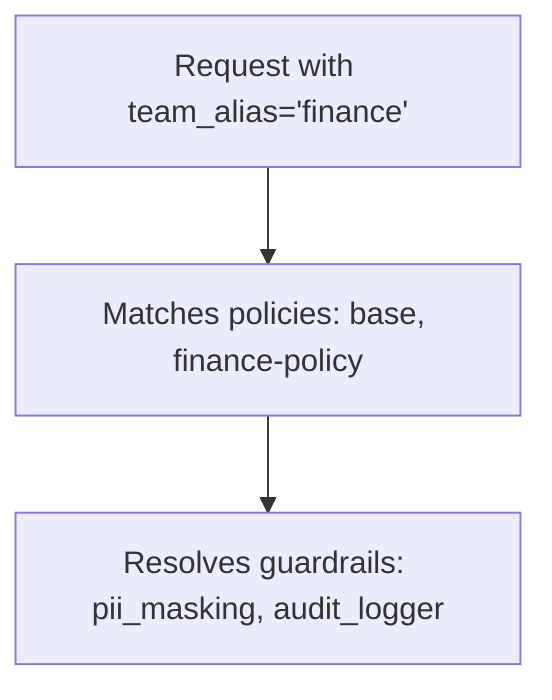

import Image from '@theme/IdealImage';
import Tabs from '@theme/Tabs';
import TabItem from '@theme/TabItem';

# [Beta] Guardrail Policies

정책을 사용하면 가드레일을 그룹화하고, 특정 팀, 키, 모델에서 어떤 가드레일을 실행할지 제어할 수 있습니다.

## 정책을 사용하는 이유

- 팀, 키, 모델별로 특정 가드레일을 활성화하거나 비활성화할 수 있습니다.
- 여러 가드레일을 하나의 정책으로 묶을 수 있습니다.
- 기존 정책을 상속하고 필요한 부분만 재정의할 수 있습니다.

## 빠른 시작

<Tabs>
<TabItem value="config" label="config.yaml">

```yaml showLineNumbers title="config.yaml"
model_list:
  - model_name: gpt-4
    litellm_params:
      model: openai/gpt-4

# 1. Define your guardrails
guardrails:
  - guardrail_name: pii_masking
    litellm_params:
      guardrail: presidio
      mode: pre_call

  - guardrail_name: prompt_injection
    litellm_params:
      guardrail: lakera
      mode: pre_call
      api_key: os.environ/LAKERA_API_KEY

# 2. Create a policy
policies:
  my-policy:
    guardrails:
      add:
        - pii_masking
        - prompt_injection

# 3. Attach the policy
policy_attachments:
  - policy: my-policy
    scope: "*"  # apply to all requests
```

</TabItem>
<TabItem value="ui" label="UI (LiteLLM Dashboard)">

**1단계: 정책 생성**

**Policies** 탭으로 이동한 뒤 **+ Create New Policy**를 클릭합니다. 정책 이름과 설명을 입력하고 추가할 가드레일을 선택합니다.


</TabItem>
</Tabs>

응답 헤더에서 실제로 실행된 항목을 확인할 수 있습니다.

```
x-litellm-applied-policies: my-policy
x-litellm-applied-guardrails: pii_masking,prompt_injection
```

## 특정 팀에 가드레일 추가

:::info
✨ 팀/키 기반 정책 연결은 엔터프라이즈 전용 기능입니다. [무료 평가판 받기](https://www.litellm.ai/enterprise#trial)
:::

전역 기본 정책은 유지하면서 특정 팀에만 추가 가드레일을 적용하려는 경우입니다.

<Tabs>
<TabItem value="config" label="config.yaml">

```yaml showLineNumbers title="config.yaml"
policies:
  global-baseline:
    guardrails:
      add:
        - pii_masking

  finance-team-policy:
    inherit: global-baseline
    guardrails:
      add:
        - strict_compliance_check
        - audit_logger

policy_attachments:
  - policy: global-baseline
    scope: "*"

  - policy: finance-team-policy
    teams:
      - finance  # team alias from /team/new
```

</TabItem>
<TabItem value="ui" label="UI (LiteLLM Dashboard)">

**옵션 1: 팀 범위 attachment 생성**

**Policies** > **Attachments** 탭으로 이동한 뒤 **+ Create New Attachment**를 클릭합니다. 정책과 적용 범위에 포함할 팀을 선택합니다.


**옵션 2: 팀 설정에서 연결**

**Teams**로 이동해 팀을 클릭한 뒤 **Settings** 탭의 **Policies** 섹션에서 연결할 정책을 선택합니다.


<Image img={require('../../../img/policy_team_attach.png')} />

</TabItem>
</Tabs>

이제 `finance` 팀에는 `pii_masking` + `strict_compliance_check` + `audit_logger`가 적용되고, 나머지 요청에는 `pii_masking`만 적용됩니다.

## 특정 팀에서 가드레일 제거

:::info
✨ 팀/키 기반 정책 연결은 엔터프라이즈 전용 기능입니다. [무료 평가판 받기](https://www.litellm.ai/enterprise#trial)
:::

전역으로 실행 중인 가드레일 중 일부를 특정 팀에서만 비활성화하려는 경우입니다. 예를 들어 내부 테스트 팀에 적용할 수 있습니다.

```yaml showLineNumbers title="config.yaml"
policies:
  global-baseline:
    guardrails:
      add:
        - pii_masking
        - prompt_injection

  internal-team-policy:
    inherit: global-baseline
    guardrails:
      remove:
        - pii_masking  # don't need PII masking for internal testing

policy_attachments:
  - policy: global-baseline
    scope: "*"

  - policy: internal-team-policy
    teams:
      - internal-testing  # team alias from /team/new
```

이제 `internal-testing` 팀에는 `prompt_injection`만 적용되고, 나머지 요청에는 두 가드레일이 모두 적용됩니다.

## 상속

기본 정책에서 시작해 그 위에 필요한 항목을 추가할 수 있습니다.

```yaml showLineNumbers title="config.yaml"
policies:
  base:
    guardrails:
      add:
        - pii_masking
        - toxicity_filter

  strict:
    inherit: base
    guardrails:
      add:
        - prompt_injection

  relaxed:
    inherit: base
    guardrails:
      remove:
        - toxicity_filter
```

결과는 다음과 같습니다.
- `base` → `[pii_masking, toxicity_filter]`
- `strict` → `[pii_masking, toxicity_filter, prompt_injection]`
- `relaxed` → `[pii_masking]`

## 모델 조건

특정 모델에서만 가드레일을 실행합니다.

```yaml showLineNumbers title="config.yaml"
policies:
  gpt4-safety:
    guardrails:
      add:
        - strict_content_filter
    condition:
      model: "gpt-4.*"  # regex - matches gpt-4, gpt-4-turbo, gpt-4o

  bedrock-compliance:
    guardrails:
      add:
        - audit_logger
    condition:
      model:  # exact match list
        - bedrock/claude-3
        - bedrock/claude-2
```

## Attachments

정책은 연결되기 전까지 아무 동작도 하지 않습니다. Attachment는 LiteLLM에 각 정책을 *어디에* 적용할지 알려줍니다.

**Global** - 모든 요청에서 실행됩니다.

```yaml showLineNumbers title="config.yaml"
policy_attachments:
  - policy: default
    scope: "*"
```

**Team-specific** (`/team/new`의 팀 alias 사용):

```yaml showLineNumbers title="config.yaml"
policy_attachments:
  - policy: hipaa-compliance
    teams:
      - healthcare-team  # team alias
      - medical-research  # team alias
```

**Key-specific** (`/key/generate`의 키 alias 사용, 와일드카드 지원):

```yaml showLineNumbers title="config.yaml"
policy_attachments:
  - policy: internal-testing
    keys:
      - "dev-*"  # key alias pattern
      - "test-*"  # key alias pattern
```

**Tag-based** (metadata 태그로 키/팀 매칭, 와일드카드 지원):

```yaml showLineNumbers title="config.yaml"
policy_attachments:
  - policy: hipaa-compliance
    tags:
      - "healthcare"
      - "health-*"  # wildcard - matches health-team, health-dev, etc.
```

태그는 키와 팀의 `metadata.tags`에서 읽습니다. 예를 들어 `metadata: {"tags": ["healthcare"]}`로 생성된 키는 위 attachment와 매칭됩니다.

## 정책 매칭 테스트

주어진 컨텍스트에 어떤 정책과 가드레일이 적용되는지 디버그합니다. 배포 전에 정책 구성을 검증할 때 사용합니다.

<Tabs>
<TabItem value="ui" label="UI (LiteLLM Dashboard)">

**Policies** > **Test** 탭으로 이동합니다. 팀 alias, 키 alias, 모델 또는 태그를 입력하고 **Test**를 클릭하면 어떤 정책이 매칭되는지와 어떤 가드레일이 적용될지 확인할 수 있습니다.

<Image img={require('../../../img/policy_test_matching.png')} />

</TabItem>
<TabItem value="api" label="API">

```bash
curl -X POST "http://localhost:4000/policies/resolve" \
    -H "Authorization: Bearer <your_api_key>" \
    -H "Content-Type: application/json" \
    -d '{
        "tags": ["healthcare"],
        "model": "gpt-4"
    }'
```

응답:

```json
{
    "effective_guardrails": ["pii_masking"],
    "matched_policies": [
        {
            "policy_name": "hipaa-compliance",
            "matched_via": "tag:healthcare",
            "guardrails_added": ["pii_masking"]
        }
    ]
}
```

</TabItem>
</Tabs>

## 정책 흐름 빌더 {#policy-flow-builder}

조건부 실행이 필요한 경우, 예를 들어 첫 번째 가드레일이 실패할 때만 두 번째 가드레일을 실행하려면 [정책 흐름 빌더](./policy_flow_builder)를 사용해 단계별 **pass**, **fail**, 선택적 **error** 액션(`on_pass`, `on_fail`, `on_error`)이 있는 파이프라인을 정의합니다.

## Config 참조

### `policies`

```yaml
policies:
  <policy-name>:
    description: ...
    inherit: ...
    guardrails:
      add: [...]
      remove: [...]
    condition:
      model: ...
    pipeline: ...  # optional; see Policy Flow Builder
```

| Field | Type | 설명 |
|-------|------|-------------|
| `description` | `string` | 선택 사항. 이 정책이 수행하는 작업입니다. |
| `inherit` | `string` | 선택 사항. 가드레일을 상속할 상위 정책입니다. |
| `guardrails.add` | `list[string]` | 활성화할 가드레일입니다. |
| `guardrails.remove` | `list[string]` | 비활성화할 가드레일입니다. 상속과 함께 사용할 때 유용합니다. |
| `condition.model` | `string` or `list[string]` | 선택 사항. 모델이 매칭될 때만 적용합니다. regex를 지원합니다. |
| `pipeline` | `object` | 선택 사항. 단계별 액션(`on_pass`, `on_fail`, 선택적 `on_error`)이 있는 순차 가드레일 실행입니다. [Policy Flow Builder](./policy_flow_builder)를 참고하세요. |

### `policy_attachments`

```yaml
policy_attachments:
  - policy: ...
    scope: ...
    teams: [...]
    keys: [...]
    models: [...]
    tags: [...]
```

| Field | Type | 설명 |
|-------|------|-------------|
| `policy` | `string` | **필수.** 연결할 정책 이름입니다. |
| `scope` | `string` | 전역으로 적용하려면 `"*"`를 사용합니다. |
| `teams` | `list[string]` | `/team/new`의 팀 alias입니다. `*` 와일드카드를 지원합니다. |
| `keys` | `list[string]` | `/key/generate`의 키 alias입니다. `*` 와일드카드를 지원합니다. |
| `models` | `list[string]` | 모델 이름입니다. `*` 와일드카드를 지원합니다. |
| `tags` | `list[string]` | 키/팀 `metadata.tags`의 태그 패턴입니다. `*` 와일드카드를 지원합니다. |

### 응답 헤더

| Header | 설명 |
|--------|-------------|
| `x-litellm-applied-policies` | 이 요청에 매칭된 정책입니다. |
| `x-litellm-applied-guardrails` | 실제로 실행된 가드레일입니다. |
| `x-litellm-policy-sources` | 각 정책이 매칭된 이유입니다. 예: `hipaa=tag:healthcare; baseline=scope:*` |

## 동작 방식

예제 config:

```yaml showLineNumbers title="config.yaml"
policies:
  base:
    guardrails:
      add: [pii_masking]

  finance-policy:
    inherit: base
    guardrails:
      add: [audit_logger]

policy_attachments:
  - policy: base
    scope: "*"
  - policy: finance-policy
    teams: [finance]
```



1. `team_alias='finance'`가 포함된 요청이 들어옵니다.
2. `base`(`scope: "*"` 기준)와 `finance-policy`(`teams: [finance]` 기준)가 매칭됩니다.
3. 가드레일을 해석합니다. `base`는 `pii_masking`을 추가하고, `finance-policy`는 이를 상속한 뒤 `audit_logger`를 추가합니다.
4. 최종 가드레일은 `pii_masking`, `audit_logger`입니다.
