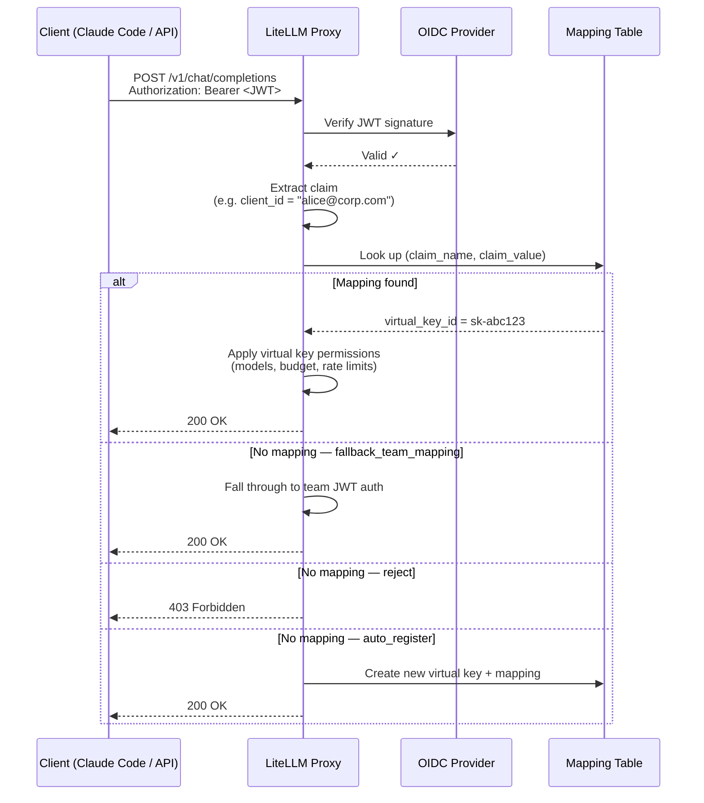

# JWT → 가상 키 매핑

:::info 엔터프라이즈

JWT → Virtual Key Mapping은 엔터프라이즈 기능입니다.

[무료 체험 시작하기](https://enterprise.litellm.ai/demo)

:::

JWT 토큰을 LiteLLM 가상 키에 매핑합니다. 이렇게 하면 모든 JWT 클라이언트에 가상 키와 동일한 세밀한 제어를 적용할 수 있습니다. 모델 제한, 지출 한도, 속도 제한, 가드레일, 전체 지출 추적을 모두 지원합니다.

**이 기능이 중요한 이유:** 표준 JWT 인증은 JWT를 *팀*에 매핑합니다. 이는 공유 경계이므로 한 팀 아래의 모든 클라이언트가 같은 한도를 공유합니다. JWT → Virtual Key Mapping을 사용하면 `client_id`, `azp`, `sub` 같은 클레임으로 식별되는 각 JWT 클라이언트가 자체 가상 키에 매핑됩니다. 사용자에게 API 키를 발급하지 않고도 클라이언트별 책임 추적이 가능합니다.

**일반적인 사용 사례:** 회사에서 SSO/OIDC를 사용합니다. 개발자는 자신의 ID 토큰으로 Claude Code를 사용합니다. 각 사용자에게 LiteLLM API 키를 제공하지 않으면서 개발자별 모델 접근 권한과 지출 한도를 적용하고 싶을 때 사용할 수 있습니다.

---

## 작동 방식



---

## 설정

### 사전 준비

먼저 [OIDC JWT Auth 설정](./token_auth.md)을 완료하세요. 프록시 구성에 `JWT_PUBLIC_KEY_URL`이 설정되어 있고 `enable_jwt_auth: True`가 필요합니다.

### Step 1. 매핑할 JWT 클레임 구성

`litellm_jwtauth` 구성에 `jwt_client_id_field`를 추가합니다. LiteLLM은 이 JWT 클레임을 조회 키로 사용합니다.

```yaml
general_settings:
  master_key: sk-1234
  enable_jwt_auth: True
  litellm_jwtauth:
    team_id_jwt_field: "team_id"          # existing team mapping (optional)
    user_id_jwt_field: "sub"
    jwt_client_id_field: "client_id"      # 👈 claim used for key mapping
    unregistered_jwt_client_behavior: "fallback_team_mapping"  # see below
```

**`unregistered_jwt_client_behavior`**는 JWT에 등록된 매핑이 없을 때의 동작을 제어합니다.

| 값 | 동작 |
|-------|----------|
| `fallback_team_mapping` | 팀 기반 JWT 인증으로 계속 진행합니다. 기본값이며 이전 버전과 호환됩니다. |
| `reject` | 매핑을 찾지 못하면 403을 반환합니다. |
| `auto_register` | 처음 발견될 때 가상 키와 매핑을 자동 생성합니다. |

### Step 2. JWT 클라이언트 → 가상 키 매핑 등록

**옵션 A: 단일 호출(키와 매핑을 원자적으로 생성)**

```bash
curl -X POST 'http://0.0.0.0:4000/jwt_client/new' \
  -H 'Authorization: Bearer <PROXY_MASTER_KEY>' \
  -H 'Content-Type: application/json' \
  -d '{
    "jwt_claim_name": "client_id",
    "jwt_claim_value": "dev-alice",
    "models": ["claude-sonnet-4-5", "claude-haiku-4-5"],
    "max_budget": 50.0,
    "budget_duration": "30d",
    "rpm_limit": 100,
    "tpm_limit": 50000,
    "team_id": "engineering"
  }'
```

응답에는 가상 키 토큰이 포함됩니다. 이 토큰은 생성 시에만 표시됩니다.

```json
{
  "key": "sk-abc123...",
  "key_id": "key_123",
  "mapping_id": "mapping_456",
  "jwt_claim_name": "client_id",
  "jwt_claim_value": "dev-alice"
}
```

**옵션 B: 기존 가상 키 매핑**

```bash
curl -X POST 'http://0.0.0.0:4000/jwt/key/mapping/new' \
  -H 'Authorization: Bearer <PROXY_MASTER_KEY>' \
  -H 'Content-Type: application/json' \
  -d '{
    "jwt_claim_name": "client_id",
    "jwt_claim_value": "dev-alice",
    "virtual_key_id": "key_123"
  }'
```

### Step 3. 테스트

```bash
# Get a JWT from your OIDC provider (must have client_id: dev-alice)
JWT_TOKEN="eyJhbG..."

curl -X POST 'http://0.0.0.0:4000/v1/chat/completions' \
  -H "Authorization: Bearer $JWT_TOKEN" \
  -H 'Content-Type: application/json' \
  -d '{
    "model": "claude-sonnet-4-5",
    "messages": [{"role": "user", "content": "Hello"}]
  }'
```

이제 요청은 `dev-alice`의 가상 키 기준으로 추적됩니다. 지출, 속도 제한, 모델 접근 권한이 클라이언트별로 적용됩니다.

---

## 워크스루: 관리자가 세밀한 접근 권한을 부여하고 팀은 Claude Code 사용

회사 SSO로 Claude Code를 사용하는 엔지니어링 팀의 전체 흐름입니다.

### 관리자 설정

**1. 엔지니어링 팀 생성**

```bash
curl -X POST 'http://0.0.0.0:4000/team/new' \
  -H 'Authorization: Bearer <MASTER_KEY>' \
  -H 'Content-Type: application/json' \
  -d '{
    "team_alias": "engineering",
    "models": ["claude-sonnet-4-5", "claude-haiku-4-5"]
  }'
```

**2. 각 개발자를 자체 키와 지출 한도로 등록**

```bash
# Alice — senior eng, higher budget
curl -X POST 'http://0.0.0.0:4000/jwt_client/new' \
  -H 'Authorization: Bearer <MASTER_KEY>' \
  -H 'Content-Type: application/json' \
  -d '{
    "jwt_claim_name": "client_id",
    "jwt_claim_value": "alice@corp.com",
    "team_id": "engineering",
    "models": ["claude-sonnet-4-5", "claude-haiku-4-5"],
    "max_budget": 200.0,
    "budget_duration": "30d",
    "rpm_limit": 200
  }'

# Bob — contractor, tighter limits
curl -X POST 'http://0.0.0.0:4000/jwt_client/new' \
  -H 'Authorization: Bearer <MASTER_KEY>' \
  -H 'Content-Type: application/json' \
  -d '{
    "jwt_claim_name": "client_id",
    "jwt_claim_value": "bob@contractor.com",
    "team_id": "engineering",
    "models": ["claude-haiku-4-5"],
    "max_budget": 20.0,
    "budget_duration": "30d",
    "rpm_limit": 30
  }'
```

**3. Claude Code가 프록시를 사용하도록 구성**

팀의 Claude Code 구성에서 프록시를 API base로 설정합니다.

```bash
# Point Claude Code at the LiteLLM proxy instead of Anthropic directly.
# ANTHROPIC_API_KEY here is the bearer token sent to the proxy — set it to
# the user's SSO/OIDC JWT token (obtained from your IdP at login).
export ANTHROPIC_API_KEY="<user-sso-jwt-token>"
export ANTHROPIC_BASE_URL="http://your-litellm-proxy:4000"
```

Or in `~/.claude/settings.json`:

```json
{
  "env": {
    "ANTHROPIC_BASE_URL": "http://your-litellm-proxy:4000"
  }
}
```

**4. 개발자는 평소처럼 SSO로 인증**

Alice가 Claude Code를 실행하면 `client_id: alice@corp.com`으로 IdP에서 발급된 JWT가 프록시로 전달됩니다. LiteLLM은 매핑을 조회하고 Alice의 가상 키를 찾은 뒤, 월 $200 예산, 200 RPM 한도, Sonnet 및 Haiku 전용 접근 권한을 적용합니다.

Bob의 토큰은 Bob의 자체 키에 매핑됩니다. 월 $20, Haiku 전용, 30 RPM이 적용됩니다.

API 키를 배포할 필요가 없습니다. 공유 한도도 없습니다. LiteLLM 대시보드에서 개발자별 지출을 완전하게 확인할 수 있습니다.

---

## 매핑 관리

**매핑과 해당 키 설정 보기**

```bash
curl 'http://0.0.0.0:4000/jwt/key/mapping/info?jwt_claim_name=client_id&jwt_claim_value=alice@corp.com' \
  -H 'Authorization: Bearer <MASTER_KEY>'
```

응답에는 연결된 키의 `models`, `max_budget`, `spend`, `rpm_limit`, `expires` 등이 포함됩니다.

**매핑 업데이트**

```bash
curl -X POST 'http://0.0.0.0:4000/jwt_client/update' \
  -H 'Authorization: Bearer <MASTER_KEY>' \
  -H 'Content-Type: application/json' \
  -d '{
    "jwt_claim_name": "client_id",
    "jwt_claim_value": "alice@corp.com",
    "max_budget": 300.0
  }'
```

**매핑 삭제**

```bash
curl -X DELETE 'http://0.0.0.0:4000/jwt/key/mapping/delete' \
  -H 'Authorization: Bearer <MASTER_KEY>' \
  -H 'Content-Type: application/json' \
  -d '{
    "jwt_claim_name": "client_id",
    "jwt_claim_value": "alice@corp.com"
  }'
```

---

## 보안

JWT에 바인딩된 키는 다음과 같이 제한됩니다.

- 관리자가 아닌 사용자는 JWT에 바인딩된 키에 대해 `/key/update`, `/key/delete`, `/key/regenerate`를 호출할 수 없습니다. 이러한 요청은 403을 반환합니다.
- JWT에 바인딩된 키는 자동으로 `llm_api_routes`로 제한됩니다. LLM 호출은 가능하지만 다른 키나 관리자 리소스는 관리할 수 없습니다.
- 프록시 관리자만 매핑을 생성, 업데이트, 삭제할 수 있습니다.

---

## Multi-IdP 지원

동일한 클레임 값을 공유하는 여러 identity provider에 사용자가 있는 경우, 예를 들어 서로 다른 issuer에서 온 두 서비스가 모두 `sub: user-123`을 가진 경우 매핑을 생성할 때 `issuer`를 설정합니다.

```bash
curl -X POST 'http://0.0.0.0:4000/jwt_client/new' \
  -H 'Authorization: Bearer <MASTER_KEY>' \
  -H 'Content-Type: application/json' \
  -d '{
    "jwt_claim_name": "sub",
    "jwt_claim_value": "user-123",
    "issuer": "https://idp-a.corp.com",
    "models": ["claude-sonnet-4-5"],
    "max_budget": 50.0
  }'
```

매핑은 `(claim_name, claim_value, issuer)`별로 고유합니다. 따라서 IdP A의 `user-123`과 IdP B의 `user-123`은 서로 다른 가상 키로 해석됩니다.

---

## JWT 클라이언트와 가상 키의 기능 비교

| 기능 | Virtual Key | JWT → Key Mapping |
|---|---|---|
| 클라이언트별 모델 접근 | ✅ | ✅ |
| 클라이언트별 지출 예산 | ✅ | ✅ |
| 클라이언트별 RPM/TPM 제한 | ✅ | ✅ |
| 팀 멤버십 | ✅ | ✅ |
| 대시보드 지출 추적 | ✅ | ✅ |
| 가드레일 | ✅ | ✅ |
| 키 로테이션 | ✅ | ✅ (관리자만) |
| 키 만료 | ✅ | ✅ |
| API 키 배포 불필요 | ❌ | ✅ |
| 기존 SSO/OIDC와 연동 | ❌ | ✅ |

---

## 관련 문서

- [OIDC JWT Auth](./token_auth.md) — 이 기능을 사용하기 전에 필요한 기본 JWT 인증 설정
- [가상 키](./virtual_keys.md) — 전체 가상 키 문서
- [Access Control](./access_control.md) — 모델 및 팀 접근 제어
