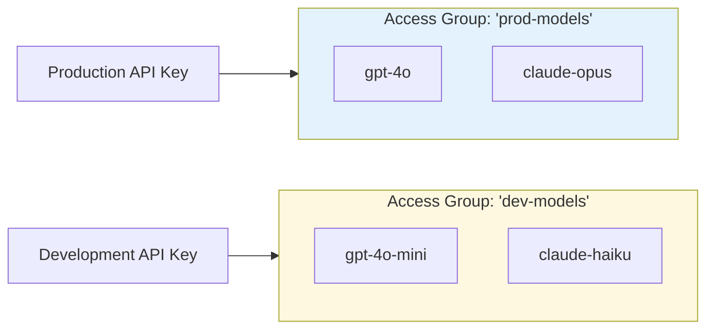

import Tabs from '@theme/Tabs';
import TabItem from '@theme/TabItem';

# 모델 액세스 그룹

### 개요

여러 모델을 하나의 이름으로 묶은 다음, 키 또는 팀에 전체 그룹 접근 권한을 부여합니다. 개별 키를 업데이트하지 않고도 그룹에서 모델을 추가하거나 제거할 수 있습니다.

사용 사례:
- 프로덕션 모델과 개발 모델 분리
- 비용이 높은 모델을 특정 팀으로 제한
- 공급자 또는 기능별로 모델 구성
- 와일드카드로 모델 제품군 접근 제어(예: `openai/*`)

### 작동 방식



**핵심 개념:** 모델을 그룹으로 묶기 → 그룹을 키에 연결하기 → 키가 그룹 내 모든 모델에 접근

**1단계. config.yaml에서 모델과 액세스 그룹 할당**

```yaml showLineNumbers title="config.yaml"
model_list:
  - model_name: gpt-4
    litellm_params:
      model: openai/fake
      api_key: fake-key
      api_base: https://exampleopenaiendpoint-production.up.railway.app/
    model_info:
      access_groups: ["beta-models"] # 👈 Model Access Group
  - model_name: fireworks-llama-v3-70b-instruct
    litellm_params:
      model: fireworks_ai/accounts/fireworks/models/llama-v3-70b-instruct
      api_key: "os.environ/FIREWORKS"
    model_info:
      access_groups: ["beta-models"] # 👈 Model Access Group
```

<Tabs>

<TabItem value="key" label="키 액세스 그룹">

**액세스 그룹이 포함된 키 생성**

```bash showLineNumbers title="Create Key with Access Group"
curl --location 'http://localhost:4000/key/generate' \
-H 'Authorization: Bearer <your-master-key>' \
-H 'Content-Type: application/json' \
-d '{"models": ["beta-models"], # 👈 Model Access Group
			"max_budget": 0,}'
```

키 테스트

<Tabs>
<TabItem label="허용된 접근" value = "allowed">

```bash showLineNumbers title="Test Key - Allowed Access"
curl -i http://localhost:4000/v1/chat/completions \
  -H "Content-Type: application/json" \
  -H "Authorization: Bearer sk-<key-from-previous-step>" \
  -d '{
    "model": "gpt-4",
    "messages": [
      {"role": "user", "content": "Hello"}
    ]
  }'
```

</TabItem>

<TabItem label="허용되지 않는 접근" value = "not-allowed">

:::info

gpt-4o는 `beta-models` 액세스 그룹에 없으므로 실패해야 합니다.

:::

```bash showLineNumbers title="Test Key - Disallowed Access"
curl -i http://localhost:4000/v1/chat/completions \
  -H "Content-Type: application/json" \
  -H "Authorization: Bearer sk-<key-from-previous-step>" \
  -d '{
    "model": "gpt-4o",
    "messages": [
      {"role": "user", "content": "Hello"}
    ]
  }'
```

</TabItem>

</Tabs>

</TabItem>

<TabItem value="team" label="팀 액세스 그룹">

팀 생성

```bash showLineNumbers title="Create Team"
curl --location 'http://localhost:4000/team/new' \
-H 'Authorization: Bearer sk-<key-from-previous-step>' \
-H 'Content-Type: application/json' \
-d '{"models": ["beta-models"]}'
```

팀용 키 생성

```bash showLineNumbers title="Create Key for Team"
curl --location 'http://0.0.0.0:4000/key/generate' \
--header 'Authorization: Bearer sk-<key-from-previous-step>' \
--header 'Content-Type: application/json' \
--data '{"team_id": "0ac97648-c194-4c90-8cd6-40af7b0d2d2a"}
```


키 테스트

<Tabs>
<TabItem label="허용된 접근" value = "allowed">

```bash showLineNumbers title="Test Team Key - Allowed Access"
curl -i http://localhost:4000/v1/chat/completions \
  -H "Content-Type: application/json" \
  -H "Authorization: Bearer sk-<key-from-previous-step>" \
  -d '{
    "model": "gpt-4",
    "messages": [
      {"role": "user", "content": "Hello"}
    ]
  }'
```

</TabItem>

<TabItem label="허용되지 않는 접근" value = "not-allowed">

:::info

gpt-4o는 `beta-models` 액세스 그룹에 없으므로 실패해야 합니다.

:::

```bash showLineNumbers title="Test Team Key - Disallowed Access"
curl -i http://localhost:4000/v1/chat/completions \
  -H "Content-Type: application/json" \
  -H "Authorization: Bearer sk-<key-from-previous-step>" \
  -d '{
    "model": "gpt-4o",
    "messages": [
      {"role": "user", "content": "Hello"}
    ]
  }'
```

</TabItem>

</Tabs>

</TabItem>

</Tabs>


### ✨ 와일드카드 모델 접근 제어

특정 접두사를 가진 모든 모델의 접근을 제어합니다(예: `openai/*`).

사용자가 대부분의 모델에 접근할 수 있게 하되, 사용하지 못하게 하려는 일부 모델만 제외할 때도 사용할 수 있습니다(예: `openai/o1-*`).

:::info

와일드카드 모델에 모델 액세스 그룹을 설정하는 기능은 엔터프라이즈 기능입니다.

가격 정보는 [여기](https://litellm.ai/#pricing)를 참고하세요.

평가판 키는 [여기](https://litellm.ai/#trial)에서 받을 수 있습니다.
:::


1. config.yaml 설정


```yaml showLineNumbers title="config.yaml - Wildcard Models"
model_list:
  - model_name: openai/*
    litellm_params:
      model: openai/*
      api_key: os.environ/OPENAI_API_KEY
    model_info:
      access_groups: ["default-models"]
  - model_name: openai/o1-*
    litellm_params:
      model: openai/o1-*
      api_key: os.environ/OPENAI_API_KEY
    model_info:
      access_groups: ["restricted-models"]
```

2. `default-models` 접근 권한이 있는 키 생성

```bash showLineNumbers title="Generate Key for Wildcard Access Group"
curl -L -X POST 'http://0.0.0.0:4000/key/generate' \
-H 'Authorization: Bearer sk-1234' \
-H 'Content-Type: application/json' \
-d '{
    "models": ["default-models"],
}'
``` 

3. 키 테스트

<Tabs>
<TabItem label="성공한 요청" value = "success">

```bash showLineNumbers title="Test Wildcard Access - Allowed"
curl -i http://localhost:4000/v1/chat/completions \
  -H "Content-Type: application/json" \
  -H "Authorization: Bearer sk-<key-from-previous-step>" \
  -d '{
    "model": "openai/gpt-4",
    "messages": [
      {"role": "user", "content": "Hello"}
    ]
  }'
```
</TabItem>
<TabItem value="bad-request" label="거부된 요청">

```bash showLineNumbers title="Test Wildcard Access - Rejected"
curl -i http://localhost:4000/v1/chat/completions \
  -H "Content-Type: application/json" \
  -H "Authorization: Bearer sk-<key-from-previous-step>" \
  -d '{
    "model": "openai/o1-mini",
    "messages": [
      {"role": "user", "content": "Hello"}
    ]
  }'
```

</TabItem>
</Tabs>

## API로 액세스 그룹 관리

:::warning 데이터베이스 모델만 지원
액세스 그룹 관리 API는 데이터베이스에 저장된 모델(`/model/new`로 추가된 모델)에서만 작동합니다.

`config.yaml`에 정의된 모델은 이 API로 관리할 수 없으며, 설정 파일에서 직접 구성해야 합니다.
:::

프록시를 다시 시작하지 않고 액세스 그룹 관리 엔드포인트를 사용해 액세스 그룹을 동적으로 생성, 업데이트, 삭제할 수 있습니다.

### 튜토리얼: 전체 액세스 그룹 워크플로

이 튜토리얼에서는 액세스 그룹을 만들고, 세부 정보를 확인하고, 키에 연결한 뒤, 그룹 내 모델을 업데이트하는 방법을 보여줍니다.

**사전 준비:**
- 모델은 먼저 데이터베이스에 추가되어야 합니다(`config.yaml`에만 있으면 안 됨).
- 권한 부여를 위해 마스터 키가 필요합니다.

#### 1단계: 데이터베이스에 모델 추가

먼저 몇 가지 모델을 데이터베이스에 추가합니다.

```bash showLineNumbers title="Add Models to Database"
# Add GPT-4 to database
curl -X POST 'http://localhost:4000/model/new' \
  -H 'Authorization: Bearer sk-1234' \
  -H 'Content-Type: application/json' \
  -d '{
    "model_name": "gpt-4",
    "litellm_params": {
      "model": "gpt-4",
      "api_key": "os.environ/OPENAI_API_KEY"
    }
  }'

# Add Claude to database
curl -X POST 'http://localhost:4000/model/new' \
  -H 'Authorization: Bearer sk-1234' \
  -H 'Content-Type: application/json' \
  -d '{
    "model_name": "claude-3-opus",
    "litellm_params": {
      "model": "claude-3-opus-20240229",
      "api_key": "os.environ/ANTHROPIC_API_KEY"
    }
  }'
```

#### 2단계: 액세스 그룹 생성

여러 모델을 포함하는 액세스 그룹을 생성합니다.

```bash showLineNumbers title="Create Access Group"
curl -X POST 'http://localhost:4000/access_group/new' \
  -H 'Authorization: Bearer sk-1234' \
  -H 'Content-Type: application/json' \
  -d '{
    "access_group": "production-models",
    "model_names": ["gpt-4", "claude-3-opus"]
  }'
```

**응답:**
```json showLineNumbers title="Response"
{
  "access_group": "production-models",
  "model_names": ["gpt-4", "claude-3-opus"],
  "models_updated": 2
}
```

#### 3단계: 액세스 그룹 정보 보기

액세스 그룹 세부 정보를 확인합니다.

```bash showLineNumbers title="Get Access Group Info"
curl -X GET 'http://localhost:4000/access_group/production-models/info' \
  -H 'Authorization: Bearer sk-1234'
```

**응답:**
```json showLineNumbers title="Response"
{
  "access_group": "production-models",
  "model_names": ["gpt-4", "claude-3-opus"],
  "deployment_count": 2
}
```

#### 4단계: 액세스 그룹이 포함된 키 생성

그룹 내 모든 모델에 접근할 수 있는 API 키를 생성합니다.

```bash showLineNumbers title="Create Key with Access Group"
curl -X POST 'http://localhost:4000/key/generate' \
  -H 'Authorization: Bearer sk-1234' \
  -H 'Content-Type: application/json' \
  -d '{
    "models": ["production-models"],
    "max_budget": 100
  }'
```

**응답:**
```json showLineNumbers title="Response"
{
  "key": "sk-...",
  "models": ["production-models"]
}
```

**키 테스트:**
```bash showLineNumbers title="Test Key Access"
# This succeeds - gpt-4 is in production-models
curl -X POST 'http://localhost:4000/v1/chat/completions' \
  -H 'Authorization: Bearer sk-...' \
  -H 'Content-Type: application/json' \
  -d '{
    "model": "gpt-4",
    "messages": [{"role": "user", "content": "Hello"}]
  }'

# This succeeds - claude-3-opus is in production-models
curl -X POST 'http://localhost:4000/v1/chat/completions' \
  -H 'Authorization: Bearer sk-...' \
  -H 'Content-Type: application/json' \
  -d '{
    "model": "claude-3-opus",
    "messages": [{"role": "user", "content": "Hello"}]
  }'
```

#### 5단계: 액세스 그룹 업데이트

액세스 그룹에서 모델을 추가하거나 제거합니다.

```bash showLineNumbers title="Update Access Group"
curl -X PUT 'http://localhost:4000/access_group/production-models/update' \
  -H 'Authorization: Bearer sk-1234' \
  -H 'Content-Type: application/json' \
  -d '{
    "model_names": ["gpt-4", "claude-3-opus", "gemini-pro"]
  }'
```

**응답:**
```json showLineNumbers title="Response"
{
  "access_group": "production-models",
  "model_names": ["gpt-4", "claude-3-opus", "gemini-pro"],
  "models_updated": 3
}
```

이제 4단계의 API 키는 키 자체를 변경하지 않아도 `gemini-pro`에 자동으로 접근할 수 있습니다.
### API 레퍼런스 - 액세스 그룹 관리

모든 엔드포인트, 파라미터, 응답 스키마를 포함한 전체 API 문서는 [액세스 그룹 관리 API 레퍼런스](https://litellm-api.up.railway.app/#/model%20management/create_model_group_access_group_new_post)를 참고하세요.

## UI로 액세스 그룹 관리

LiteLLM 관리자 UI에서도 액세스 그룹을 관리할 수 있습니다.

### 1단계: 액세스 그룹에 모델 추가

데이터베이스에 모델을 추가할 때 "Model Access Group" 필드를 사용해 액세스 그룹에 할당합니다.


이 예시에서는 `gpt-4`가 `production-models` 액세스 그룹에 추가됩니다.

### 2단계: 액세스 그룹이 포함된 키 생성

API 키를 생성할 때 "모델" 필드에 액세스 그룹을 지정합니다.


이 키는 `production-models` 그룹의 모든 모델에 접근할 수 있습니다.

### 3단계: 키 테스트

생성된 키로 요청을 보냅니다.

```bash showLineNumbers title="Test Key with Access Group"
# This succeeds - gpt-4 is in production-models
curl -X POST 'http://localhost:4000/v1/chat/completions' \
  -H 'Authorization: Bearer sk-...' \
  -H 'Content-Type: application/json' \
  -d '{
    "model": "gpt-4",
    "messages": [{"role": "user", "content": "Hello"}]
  }'
```

**응답:**
```json showLineNumbers title="Success Response"
{
  "id": "chatcmpl-...",
  "object": "chat.completion",
  "created": 1234567890,
  "model": "gpt-4",
  "choices": [
    {
      "index": 0,
      "message": {
        "role": "assistant",
        "content": "Hello! How can I help you today?"
      },
      "finish_reason": "stop"
    }
  ]
}
```

액세스 그룹에 없는 모델에 접근하려고 하면 요청이 거부됩니다.

```bash showLineNumbers title="Test Rejected Request"
# This fails - gpt-4o is not in production-models
curl -X POST 'http://localhost:4000/v1/chat/completions' \
  -H 'Authorization: Bearer sk-...' \
  -H 'Content-Type: application/json' \
  -d '{
    "model": "gpt-4o",
    "messages": [{"role": "user", "content": "Hello"}]
  }'
```

**응답:**
```json showLineNumbers title="Error Response"
{
  "error": {
    "message": "Invalid model for key",
    "type": "invalid_request_error"
  }
}
```
