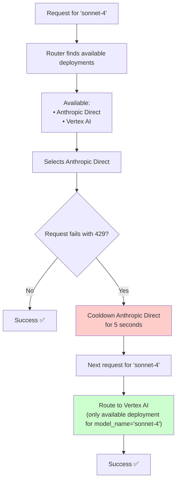

import Image from '@theme/IdealImage';
import Tabs from '@theme/Tabs';
import TabItem from '@theme/TabItem';


# Router - 부하 분산

LiteLLM은 다음을 관리합니다.
- 여러 deployment 간 load balancing. 예: Azure/OpenAI.
- 중요한 request가 실패하지 않도록 우선순위 처리. 예: queueing.
- 여러 deployment/provider에 걸친 기본 reliability logic. cooldown, fallback, timeout, retry(fixed + exponential backoff).

production에서 litellm은 cooldown server와 usage를 추적하는 방법으로 Redis 사용을 지원합니다. tpm/rpm limit 관리에 사용됩니다.

:::info

서버가 여러 LLM API 간 load balancing을 수행해야 한다면 [LiteLLM Proxy Server](./proxy/load_balancing.md)를 사용하세요.

:::


## 부하 분산
(이 implementation에 기여해 주신 [@paulpierre](https://www.linkedin.com/in/paulpierre/) 및 [sweep proxy](https://docs.sweep.dev/blogs/openai-proxy)에 감사드립니다)
[**코드 보기**](https://github.com/BerriAI/litellm/blob/main/litellm/router.py)

### 빠른 시작

여러 [azure](./providers/azure)/[bedrock](./providers/bedrock.md)/[provider](./providers/) deployment 간 load balancing을 수행합니다. call이 실패하면 LiteLLM이 다른 region에서 retry를 처리합니다.

<Tabs>
<TabItem value="sdk" label="SDK">

```python
from litellm import Router

model_list = [{ # list of model deployments 
	"model_name": "gpt-3.5-turbo", # model alias -> loadbalance between models with same `model_name`
	"litellm_params": { # params for litellm completion/embedding call 
		"model": "azure/chatgpt-v-2", # actual model name
		"api_key": os.getenv("AZURE_API_KEY"),
		"api_version": os.getenv("AZURE_API_VERSION"),
		"api_base": os.getenv("AZURE_API_BASE")
	}
}, {
    "model_name": "gpt-3.5-turbo", 
	"litellm_params": { # params for litellm completion/embedding call 
		"model": "azure/chatgpt-functioncalling", 
		"api_key": os.getenv("AZURE_API_KEY"),
		"api_version": os.getenv("AZURE_API_VERSION"),
		"api_base": os.getenv("AZURE_API_BASE")
	}
}, {
    "model_name": "gpt-3.5-turbo", 
	"litellm_params": { # params for litellm completion/embedding call 
		"model": "gpt-3.5-turbo", 
		"api_key": os.getenv("OPENAI_API_KEY"),
	}
}, {
    "model_name": "gpt-4", 
	"litellm_params": { # params for litellm completion/embedding call 
		"model": "azure/gpt-4", 
		"api_key": os.getenv("AZURE_API_KEY"),
		"api_base": os.getenv("AZURE_API_BASE"),
		"api_version": os.getenv("AZURE_API_VERSION"),
	}
}, {
    "model_name": "gpt-4", 
	"litellm_params": { # params for litellm completion/embedding call 
		"model": "gpt-4", 
		"api_key": os.getenv("OPENAI_API_KEY"),
	}
},

]

router = Router(model_list=model_list)

# openai.ChatCompletion.create replacement
# requests with model="gpt-3.5-turbo" will pick a deployment where model_name="gpt-3.5-turbo"
response = await router.acompletion(model="gpt-3.5-turbo", 
				messages=[{"role": "user", "content": "Hey, how's it going?"}])

print(response)

# openai.ChatCompletion.create replacement
# requests with model="gpt-4" will pick a deployment where model_name="gpt-4"
response = await router.acompletion(model="gpt-4", 
				messages=[{"role": "user", "content": "Hey, how's it going?"}])

print(response)
```
</TabItem>
<TabItem value="proxy" label="PROXY">

:::info

자세한 proxy load balancing/fallback 문서는 [여기](./proxy/reliability.md)를 참고하세요.

:::

1. 여러 deployment가 포함된 model_list 설정
```yaml
model_list:
  - model_name: gpt-3.5-turbo
    litellm_params:
      model: azure/<your-deployment-name>
      api_base: <your-azure-endpoint>
      api_key: <your-azure-api-key>
  - model_name: gpt-3.5-turbo
    litellm_params:
      model: azure/gpt-turbo-small-ca
      api_base: https://my-endpoint-canada-berri992.openai.azure.com/
      api_key: <your-azure-api-key>
  - model_name: gpt-3.5-turbo
    litellm_params:
      model: azure/gpt-turbo-large
      api_base: https://openai-france-1234.openai.azure.com/
      api_key: <your-azure-api-key>
```

2. proxy 시작

```bash
litellm --config /path/to/config.yaml 
```

3. 테스트

```bash
curl -X POST 'http://0.0.0.0:4000/chat/completions' \
-H 'Content-Type: application/json' \
-H 'Authorization: Bearer sk-1234' \
-d '{
  "model": "gpt-3.5-turbo",
  "messages": [
        {"role": "user", "content": "Hi there!"}
    ],
    "mock_testing_rate_limit_error": true
}'
```
</TabItem>
</Tabs>

### 사용 가능한 Endpoint
- `router.completion()` - 100개 이상의 LLM을 호출하는 chat completions endpoint
- `router.acompletion()` - async chat completion 호출
- `router.embedding()` - Azure, OpenAI, Huggingface endpoint용 embedding endpoint
- `router.aembedding()` - async embedding 호출
- `router.text_completion()` - 기존 OpenAI `/v1/completions` endpoint format의 completion call
- `router.atext_completion()` - async text completion 호출
- `router.image_generation()` - OpenAI `/v1/images/generations` endpoint format의 completion call
- `router.aimage_generation()` - async image generation 호출

## 고급 - Routing Strategy
#### Routing Strategy - 가중 선택 / rate limit 인식 / least busy / latency 기반 / cost 기반 {#routing-strategy-weighted-pick-rate-limit-aware-least-busy-latency-based-cost-based}

Router는 여러 deployment에 call을 라우팅하는 다양한 strategy를 제공합니다. **production에서 최상의 performance를 위해 `simple-shuffle`(기본값) 사용을 권장합니다.**

<Tabs>
<TabItem value="simple-shuffle" label="(기본값) Weighted Pick - 권장">

**production 기본 및 권장값** - latency overhead를 최소화하면서 가장 좋은 performance를 제공합니다.

제공된 **Requests per minute(rpm) 또는 Tokens per minute(tpm)**을 기준으로 deployment를 선택합니다.

`rpm` 또는 `tpm`이 제공되지 않으면 deployment를 무작위로 선택합니다.

어떤 model을 어느 정도 선택할지 지정하려면 `weight` param도 설정할 수 있습니다.

<Tabs>
<TabItem value="rpm" label="RPM 기반 shuffling">

##### **LiteLLM Proxy `Config.yaml`**

```yaml
model_list:
	- model_name: gpt-3.5-turbo
	  litellm_params:
	  	model: azure/chatgpt-v-2
		api_key: os.environ/AZURE_API_KEY
		api_version: os.environ/AZURE_API_VERSION
		api_base: os.environ/AZURE_API_BASE
		rpm: 900 
	- model_name: gpt-3.5-turbo
	  litellm_params:
	  	model: azure/chatgpt-functioncalling
		api_key: os.environ/AZURE_API_KEY
		api_version: os.environ/AZURE_API_VERSION
		api_base: os.environ/AZURE_API_BASE
		rpm: 10 
```

##### **Python SDK**

```python
from litellm import Router 
import asyncio

model_list = [{ # list of model deployments 
	"model_name": "gpt-3.5-turbo", # model alias 
	"litellm_params": { # params for litellm completion/embedding call 
		"model": "azure/chatgpt-v-2", # actual model name
		"api_key": os.getenv("AZURE_API_KEY"),
		"api_version": os.getenv("AZURE_API_VERSION"),
		"api_base": os.getenv("AZURE_API_BASE"),
		"rpm": 900,			# requests per minute for this API
	}
}, {
    "model_name": "gpt-3.5-turbo", 
	"litellm_params": { # params for litellm completion/embedding call 
		"model": "azure/chatgpt-functioncalling", 
		"api_key": os.getenv("AZURE_API_KEY"),
		"api_version": os.getenv("AZURE_API_VERSION"),
		"api_base": os.getenv("AZURE_API_BASE"),
		"rpm": 10,
	}
},]

# init router
router = Router(model_list=model_list, routing_strategy="simple-shuffle")
async def router_acompletion():
	response = await router.acompletion(
		model="gpt-3.5-turbo", 
		messages=[{"role": "user", "content": "Hey, how's it going?"}]
	)
	print(response)
	return response

asyncio.run(router_acompletion())
```

</TabItem>
<TabItem value="weight" label="Weight 기반 shuffling">

##### **LiteLLM Proxy `Config.yaml`**

```yaml
model_list:
	- model_name: gpt-3.5-turbo
	  litellm_params:
	  	model: azure/chatgpt-v-2
		api_key: os.environ/AZURE_API_KEY
		api_version: os.environ/AZURE_API_VERSION
		api_base: os.environ/AZURE_API_BASE
		weight: 9
	- model_name: gpt-3.5-turbo
	  litellm_params:
	  	model: azure/chatgpt-functioncalling
		api_key: os.environ/AZURE_API_KEY
		api_version: os.environ/AZURE_API_VERSION
		api_base: os.environ/AZURE_API_BASE
		weight: 1 
```

##### **Python SDK**

```python
from litellm import Router 
import asyncio

model_list = [{
	"model_name": "gpt-3.5-turbo", # model alias 
	"litellm_params": { 
		"model": "azure/chatgpt-v-2", # actual model name
		"api_key": os.getenv("AZURE_API_KEY"),
		"api_version": os.getenv("AZURE_API_VERSION"),
		"api_base": os.getenv("AZURE_API_BASE"),
		"weight": 9, # pick this 90% of the time
	}
}, {
    "model_name": "gpt-3.5-turbo", 
	"litellm_params": { 
		"model": "azure/chatgpt-functioncalling", 
		"api_key": os.getenv("AZURE_API_KEY"),
		"api_version": os.getenv("AZURE_API_VERSION"),
		"api_base": os.getenv("AZURE_API_BASE"),
		"weight": 1,
	}
}]

# init router
router = Router(model_list=model_list, routing_strategy="simple-shuffle")
async def router_acompletion():
	response = await router.acompletion(
		model="gpt-3.5-turbo", 
		messages=[{"role": "user", "content": "Hey, how's it going?"}]
	)
	print(response)
	return response

asyncio.run(router_acompletion())
```

</TabItem>
</Tabs>

</TabItem>
<TabItem value="usage-based-v2" label="Rate-Limit Aware v2 (ASYNC)">

> [!WARNING]  
**usage-based routing은 performance 영향 때문에 production에 권장되지 않습니다.** 고트래픽 환경에서 최적 performance를 위해 `simple-shuffle`(기본값)을 사용하세요. usage-based routing은 deployment 간 usage를 추적하는 Redis operation 때문에 상당한 latency를 추가합니다.


**신규** usage-based-routing의 async implementation입니다.

**tpm/rpm limit을 초과하면 deployment를 제외** - deployment의 tpm/rpm limit을 전달한 경우 적용됩니다.

해당 minute에 **TPM usage가 가장 낮은 deployment**로 라우팅합니다.

production에서는 여러 deployment의 usage(TPM/RPM)를 추적하기 위해 Redis를 사용합니다. 이 implementation은 **async redis call**(`redis.incr`, `redis.mget`)을 사용합니다.

Azure에서는 [1000 TPM당 6 RPM](https://stackoverflow.com/questions/77368844/what-is-the-request-per-minute-rate-limit-for-azure-openai-models-for-gpt-3-5-tu)을 받습니다.

<Tabs>
<TabItem value="sdk" label="sdk">

```python
from litellm import Router 


model_list = [{ # list of model deployments 
	"model_name": "gpt-3.5-turbo", # model alias 
	"litellm_params": { # params for litellm completion/embedding call 
		"model": "azure/chatgpt-v-2", # actual model name
		"api_key": os.getenv("AZURE_API_KEY"),
		"api_version": os.getenv("AZURE_API_VERSION"),
		"api_base": os.getenv("AZURE_API_BASE")
		"tpm": 100000,
		"rpm": 10000,
	}, 
}, {
    "model_name": "gpt-3.5-turbo", 
	"litellm_params": { # params for litellm completion/embedding call 
		"model": "azure/chatgpt-functioncalling", 
		"api_key": os.getenv("AZURE_API_KEY"),
		"api_version": os.getenv("AZURE_API_VERSION"),
		"api_base": os.getenv("AZURE_API_BASE")
		"tpm": 100000,
		"rpm": 1000,
	},
}, {
    "model_name": "gpt-3.5-turbo", 
	"litellm_params": { # params for litellm completion/embedding call 
		"model": "gpt-3.5-turbo", 
		"api_key": os.getenv("OPENAI_API_KEY"),
		"tpm": 100000,
		"rpm": 1000,
	},
}]
router = Router(model_list=model_list, 
                redis_host=os.environ["REDIS_HOST"], 
				redis_password=os.environ["REDIS_PASSWORD"], 
				redis_port=os.environ["REDIS_PORT"], 
                routing_strategy="simple-shuffle" # 👈 RECOMMENDED - best performance
				enable_pre_call_checks=True, # enables router rate limits for concurrent calls
				)

response = await router.acompletion(model="gpt-3.5-turbo", 
				messages=[{"role": "user", "content": "Hey, how's it going?"}]

print(response)
```
</TabItem>
<TabItem value="proxy" label="proxy">

**1. config에서 strategy 설정**

```yaml
model_list:
	- model_name: gpt-3.5-turbo # model alias 
	  litellm_params: # params for litellm completion/embedding call 
		model: azure/chatgpt-v-2 # actual model name
		api_key: os.environ/AZURE_API_KEY
		api_version: os.environ/AZURE_API_VERSION
		api_base: os.environ/AZURE_API_BASE
      tpm: 100000
	  rpm: 10000
	- model_name: gpt-3.5-turbo 
	  litellm_params: # params for litellm completion/embedding call 
		model: gpt-3.5-turbo 
		api_key: os.getenv(OPENAI_API_KEY)
      tpm: 100000
	  rpm: 1000

router_settings:
  routing_strategy: simple-shuffle # 👈 RECOMMENDED - best performance
  redis_host: <your-redis-host>
  redis_password: <your-redis-password>
  redis_port: <your-redis-port>
  enable_pre_call_check: true

general_settings:
  master_key: sk-1234
```

**2. proxy 시작**

```bash
litellm --config /path/to/config.yaml
```

**3. 테스트**

```bash
curl --location 'http://localhost:4000/v1/chat/completions' \
--header 'Content-Type: application/json' \
--header 'Authorization: Bearer sk-1234' \
--data '{
    "model": "gpt-3.5-turbo", 
    "messages": [{"role": "user", "content": "Hey, how's it going?"}]
}'
```

</TabItem>
</Tabs>


</TabItem>
<TabItem value="latency-based" label="Latency 기반">


response time이 가장 낮은 deployment를 선택합니다.

request가 deployment로 전송되고 response가 수신된 시간을 기준으로 deployment의 response time을 cache하고 업데이트합니다.

[**테스트 방법**](https://github.com/BerriAI/litellm/blob/main/tests/local_testing/test_lowest_latency_routing.py)

```python
from litellm import Router 
import asyncio

model_list = [{ ... }]

# init router
router = Router(model_list=model_list,
				routing_strategy="latency-based-routing",# 👈 set routing strategy
				enable_pre_call_check=True, # enables router rate limits for concurrent calls
				)

## CALL 1+2
tasks = []
response = None
final_response = None
for _ in range(2):
	tasks.append(router.acompletion(model=model, messages=messages))
response = await asyncio.gather(*tasks)

if response is not None:
	## CALL 3 
	await asyncio.sleep(1)  # let the cache update happen
	picked_deployment = router.lowestlatency_logger.get_available_deployments(
		model_group=model, healthy_deployments=router.healthy_deployments
	)
	final_response = await router.acompletion(model=model, messages=messages)
	print(f"min deployment id: {picked_deployment}")
	print(f"model id: {final_response._hidden_params['model_id']}")
	assert (
		final_response._hidden_params["model_id"]
		== picked_deployment["model_info"]["id"]
	)
```

#### Time Window 설정

deployment의 latency average를 계산할 때 얼마나 과거까지 고려할지 time window를 설정합니다.

**Router에서**
```python 
router = Router(..., routing_strategy_args={"ttl": 10})
```

**Proxy에서**

```yaml
router_settings:
	routing_strategy_args: {"ttl": 10}
```

#### Lowest Latency Buffer 설정

call 대상으로 고려할 deployment 후보 범위의 buffer를 설정합니다.

예:

deployment가 5개 있고

```
https://litellm-prod-1.openai.azure.com/: 0.07s
https://litellm-prod-2.openai.azure.com/: 0.1s
https://litellm-prod-3.openai.azure.com/: 0.1s
https://litellm-prod-4.openai.azure.com/: 0.1s
https://litellm-prod-5.openai.azure.com/: 4.66s
```

초기에 모든 request가 `prod-1`로 몰리는 것을 방지하려면 50% buffer를 설정해 `prod-2`, `prod-3`, `prod-4` deployment도 고려하도록 할 수 있습니다.

**Router에서**
```python 
router = Router(..., routing_strategy_args={"lowest_latency_buffer": 0.5})
```

**Proxy에서**

```yaml
router_settings:
	routing_strategy_args: {"lowest_latency_buffer": 0.5}
```

</TabItem>

<TabItem value="usage-based" label="Rate-Limit 인식">

해당 minute에 TPM usage가 가장 낮은 deployment로 라우팅합니다.

production에서는 여러 deployment의 usage(TPM/RPM)를 추적하기 위해 Redis를 사용합니다.

deployment의 tpm/rpm limit을 전달하면 해당 limit도 확인하고, 초과될 deployment를 filter out합니다.

Azure에서는 RPM = TPM/6입니다.


```python
from litellm import Router 


model_list = [{ # list of model deployments 
	"model_name": "gpt-3.5-turbo", # model alias 
	"litellm_params": { # params for litellm completion/embedding call 
		"model": "azure/chatgpt-v-2", # actual model name
		"api_key": os.getenv("AZURE_API_KEY"),
		"api_version": os.getenv("AZURE_API_VERSION"),
		"api_base": os.getenv("AZURE_API_BASE")
	}, 
    "tpm": 100000,
	"rpm": 10000,
}, {
    "model_name": "gpt-3.5-turbo", 
	"litellm_params": { # params for litellm completion/embedding call 
		"model": "azure/chatgpt-functioncalling", 
		"api_key": os.getenv("AZURE_API_KEY"),
		"api_version": os.getenv("AZURE_API_VERSION"),
		"api_base": os.getenv("AZURE_API_BASE")
	},
    "tpm": 100000,
	"rpm": 1000,
}, {
    "model_name": "gpt-3.5-turbo", 
	"litellm_params": { # params for litellm completion/embedding call 
		"model": "gpt-3.5-turbo", 
		"api_key": os.getenv("OPENAI_API_KEY"),
	},
    "tpm": 100000,
	"rpm": 1000,
}]
router = Router(model_list=model_list, 
                redis_host=os.environ["REDIS_HOST"], 
				redis_password=os.environ["REDIS_PASSWORD"], 
				redis_port=os.environ["REDIS_PORT"], 
                routing_strategy="usage-based-routing"
				enable_pre_call_check=True, # enables router rate limits for concurrent calls
				)

response = await router.acompletion(model="gpt-3.5-turbo", 
				messages=[{"role": "user", "content": "Hey, how's it going?"}]

print(response)
```


</TabItem>
<TabItem value="least-busy" label="Least-Busy">


처리 중인 ongoing call 수가 가장 적은 deployment를 선택합니다.

[**테스트 방법**](https://github.com/BerriAI/litellm/blob/main/tests/local_testing/test_least_busy_routing.py)

```python
from litellm import Router 
import asyncio

model_list = [{ # list of model deployments 
	"model_name": "gpt-3.5-turbo", # model alias 
	"litellm_params": { # params for litellm completion/embedding call 
		"model": "azure/chatgpt-v-2", # actual model name
		"api_key": os.getenv("AZURE_API_KEY"),
		"api_version": os.getenv("AZURE_API_VERSION"),
		"api_base": os.getenv("AZURE_API_BASE"),
	}
}, {
    "model_name": "gpt-3.5-turbo", 
	"litellm_params": { # params for litellm completion/embedding call 
		"model": "azure/chatgpt-functioncalling", 
		"api_key": os.getenv("AZURE_API_KEY"),
		"api_version": os.getenv("AZURE_API_VERSION"),
		"api_base": os.getenv("AZURE_API_BASE"),
	}
}, {
    "model_name": "gpt-3.5-turbo", 
	"litellm_params": { # params for litellm completion/embedding call 
		"model": "gpt-3.5-turbo", 
		"api_key": os.getenv("OPENAI_API_KEY"),
	}
}]

# init router
router = Router(model_list=model_list, routing_strategy="least-busy")
async def router_acompletion():
	response = await router.acompletion(
		model="gpt-3.5-turbo", 
		messages=[{"role": "user", "content": "Hey, how's it going?"}]
	)
	print(response)
	return response

asyncio.run(router_acompletion())
```

</TabItem>

<TabItem value="custom" label="Custom Routing Strategy">

deployment 선택을 위한 custom routing strategy를 연결합니다.


1단계. custom routing strategy 정의

```python

from litellm.router import CustomRoutingStrategyBase
class CustomRoutingStrategy(CustomRoutingStrategyBase):
    async def async_get_available_deployment(
        self,
        model: str,
        messages: Optional[List[Dict[str, str]]] = None,
        input: Optional[Union[str, List]] = None,
        specific_deployment: Optional[bool] = False,
        request_kwargs: Optional[Dict] = None,
    ):
        """
        Asynchronously retrieves the available deployment based on the given parameters.

        Args:
            model (str): The name of the model.
            messages (Optional[List[Dict[str, str]]], optional): The list of messages for a given request. Defaults to None.
            input (Optional[Union[str, List]], optional): The input for a given embedding request. Defaults to None.
            specific_deployment (Optional[bool], optional): Whether to retrieve a specific deployment. Defaults to False.
            request_kwargs (Optional[Dict], optional): Additional request keyword arguments. Defaults to None.

        Returns:
            Returns an element from litellm.router.model_list

        """
        print("In CUSTOM async get available deployment")
        model_list = router.model_list
        print("router model list=", model_list)
        for model in model_list:
            if isinstance(model, dict):
                if model["litellm_params"]["model"] == "openai/very-special-endpoint":
                    return model
        pass

    def get_available_deployment(
        self,
        model: str,
        messages: Optional[List[Dict[str, str]]] = None,
        input: Optional[Union[str, List]] = None,
        specific_deployment: Optional[bool] = False,
        request_kwargs: Optional[Dict] = None,
    ):
        """
        Synchronously retrieves the available deployment based on the given parameters.

        Args:
            model (str): The name of the model.
            messages (Optional[List[Dict[str, str]]], optional): The list of messages for a given request. Defaults to None.
            input (Optional[Union[str, List]], optional): The input for a given embedding request. Defaults to None.
            specific_deployment (Optional[bool], optional): Whether to retrieve a specific deployment. Defaults to False.
            request_kwargs (Optional[Dict], optional): Additional request keyword arguments. Defaults to None.

        Returns:
            Returns an element from litellm.router.model_list

        """
        pass
```

2단계. custom routing strategy로 Router 초기화
```python
from litellm import Router

router = Router(
    model_list=[
        {
            "model_name": "azure-model",
            "litellm_params": {
                "model": "openai/very-special-endpoint",
                "api_base": "https://exampleopenaiendpoint-production.up.railway.app/",  # If you are Krrish, this is OpenAI Endpoint3 on our Railway endpoint :)
                "api_key": "fake-key",
            },
            "model_info": {"id": "very-special-endpoint"},
        },
        {
            "model_name": "azure-model",
            "litellm_params": {
                "model": "openai/fast-endpoint",
                "api_base": "https://exampleopenaiendpoint-production.up.railway.app/",
                "api_key": "fake-key",
            },
            "model_info": {"id": "fast-endpoint"},
        },
    ],
    set_verbose=True,
    debug_level="DEBUG",
    timeout=1,
)  # type: ignore

router.set_custom_routing_strategy(CustomRoutingStrategy()) # 👈 Set your routing strategy here
```

3단계. routing strategy 테스트. `router.acompletion` request 실행 시 custom routing strategy가 호출되어야 합니다.
```python
for _ in range(10):
	response = await router.acompletion(
		model="azure-model", messages=[{"role": "user", "content": "hello"}]
	)
	print(response)
	_picked_model_id = response._hidden_params["model_id"]
	print("picked model=", _picked_model_id)
```


</TabItem>

<TabItem value="lowest-cost" label="최저 Cost Routing (Async)">

가장 낮은 cost를 기준으로 deployment를 선택합니다.

동작 방식:
- 모든 healthy deployment를 가져옵니다.
- 제공된 `rpm/tpm` limit 아래에 있는 deployment를 모두 선택합니다.
- 각 deployment에 대해 `litellm_param["model"]`이 [`litellm_model_cost_map`](https://github.com/BerriAI/litellm/blob/main/model_prices_and_context_window.json)에 존재하는지 확인합니다.
	- deployment가 `litellm_model_cost_map`에 없으면 deployment_cost=`$1`을 사용합니다.
- cost가 가장 낮은 deployment를 선택합니다.

```python
from litellm import Router 
import asyncio

model_list =  [
	{
		"model_name": "gpt-3.5-turbo",
		"litellm_params": {"model": "gpt-4"},
		"model_info": {"id": "openai-gpt-4"},
	},
	{
		"model_name": "gpt-3.5-turbo",
		"litellm_params": {"model": "groq/llama3-8b-8192"},
		"model_info": {"id": "groq-llama"},
	},
]

# init router
router = Router(model_list=model_list, routing_strategy="cost-based-routing")
async def router_acompletion():
	response = await router.acompletion(
		model="gpt-3.5-turbo", 
		messages=[{"role": "user", "content": "Hey, how's it going?"}]
	)
	print(response)

	print(response._hidden_params["model_id"]) # expect groq-llama, since groq/llama has lowest cost
	return response

asyncio.run(router_acompletion())

```


#### Custom Input/Output pricing 사용

routing 시 custom pricing을 사용하려면 `litellm_params["input_cost_per_token"]` 및 `litellm_params["output_cost_per_token"]`을 설정하세요.

```python
model_list = [
	{
		"model_name": "gpt-3.5-turbo",
		"litellm_params": {
			"model": "azure/chatgpt-v-2",
			"input_cost_per_token": 0.00003,
			"output_cost_per_token": 0.00003,
		},
		"model_info": {"id": "chatgpt-v-experimental"},
	},
	{
		"model_name": "gpt-3.5-turbo",
		"litellm_params": {
			"model": "azure/chatgpt-v-1",
			"input_cost_per_token": 0.000000001,
			"output_cost_per_token": 0.00000001,
		},
		"model_info": {"id": "chatgpt-v-1"},
	},
	{
		"model_name": "gpt-3.5-turbo",
		"litellm_params": {
			"model": "azure/chatgpt-v-5",
			"input_cost_per_token": 10,
			"output_cost_per_token": 12,
		},
		"model_info": {"id": "chatgpt-v-5"},
	},
]
# init router
router = Router(model_list=model_list, routing_strategy="cost-based-routing")
async def router_acompletion():
	response = await router.acompletion(
		model="gpt-3.5-turbo", 
		messages=[{"role": "user", "content": "Hey, how's it going?"}]
	)
	print(response)

	print(response._hidden_params["model_id"]) # expect chatgpt-v-1, since chatgpt-v-1 has lowest cost
	return response

asyncio.run(router_acompletion())
```

</TabItem>
</Tabs>

## Routing Group - Model별 Strategy {#routing-groups---per-model-strategies}

동일한 router 안에서 model별로 다른 routing strategy를 적용합니다. **routing group**은 `model_name` 목록을 strategy 및 선택적 strategy args에 연결합니다. 어떤 group에도 포함되지 않은 model은 router 최상위 `routing_strategy`로 fallback됩니다.

:::tip
dashboard에서 routing group을 생성, 수정, 삭제할 수도 있습니다. [UI로 Routing Group 관리](./proxy/ui/routing_groups.md)를 참고하세요.
:::

**사용 시점:** 두 번째 router를 띄우지 않고 `gpt-4o`에는 latency-based routing을, 더 저렴한 model에는 일반 weighted-pick을 적용하고 싶을 때 사용합니다.

#### 규칙

- 각 `model_name`은 **최대 하나의** group에만 속할 수 있습니다. 중복되면 초기화 시 `ValueError`가 발생합니다.
- 어떤 group에도 속하지 않은 model은 최상위 `routing_strategy` / `routing_strategy_args`를 사용합니다. 이는 암시적 `"default"` group입니다. `"default"` name은 예약되어 있습니다.
- 각 group은 `routing_strategy_args`를 override할 수 있습니다. 예: latency window TTL, TPM ceiling.
- group은 post-pre-routing-hook의 `model` name을 기준으로 request별로 결정됩니다.

<Tabs>
<TabItem value="config-yaml" label="LiteLLM Proxy Config.yaml">

```yaml
model_list:
  - model_name: gpt-4o
    litellm_params:
      model: openai/gpt-4o
      api_key: os.environ/OPENAI_API_KEY
  - model_name: gpt-4o
    litellm_params:
      model: azure/gpt-4o
      api_base: os.environ/AZURE_API_BASE
      api_key: os.environ/AZURE_API_KEY
      api_version: "2024-08-01-preview"
  - model_name: cheap-model
    litellm_params:
      model: openai/gpt-4o-mini
      api_key: os.environ/OPENAI_API_KEY

router_settings:
  # fallback strategy for models not in any explicit group
  routing_strategy: simple-shuffle

  routing_groups:
    - group_name: latency-sensitive
      models: [gpt-4o]
      routing_strategy: latency-based-routing
      routing_strategy_args:
        ttl: 3600
```

동작:
- `gpt-4o` -> OpenAI + Azure deployment 간 latency-based routing.
- `cheap-model` -> simple-shuffle(기본 group).

</TabItem>
<TabItem value="sdk" label="Python SDK">

```python
from litellm import Router

router = Router(
    model_list=[
        {"model_name": "gpt-4o", "litellm_params": {"model": "openai/gpt-4o"}},
        {"model_name": "gpt-4o", "litellm_params": {"model": "azure/gpt-4o", "api_base": "...", "api_key": "..."}},
        {"model_name": "cheap-model", "litellm_params": {"model": "openai/gpt-4o-mini"}},
    ],
    routing_strategy="simple-shuffle",  # fallback for ungrouped models
    routing_groups=[
        {
            "group_name": "latency-sensitive",
            "models": ["gpt-4o"],
            "routing_strategy": "latency-based-routing",
            "routing_strategy_args": {"ttl": 3600},
        },
    ],
)
```

</TabItem>
</Tabs>

#### 여러 group

두 group은 같은 strategy를 서로 다른 args로 사용할 수 있으며, 각 group은 독립적인 state instance를 가집니다.

```yaml
router_settings:
  routing_strategy: simple-shuffle
  routing_groups:
    - group_name: hot-path
      models: [gpt-4o, claude-sonnet]
      routing_strategy: latency-based-routing
      routing_strategy_args:
        ttl: 60          # short window — react quickly to latency changes
    - group_name: batch
      models: [gpt-4o-mini, llama-70b]
      routing_strategy: usage-based-routing-v2
      routing_strategy_args:
        rpm: 10000
```

#### runtime 중 업데이트

Routing group은 `Router.update_settings(routing_groups=[...])` 또는 proxy의 `/config/update` endpoint를 통해 업데이트할 수 있습니다. 업데이트 시 group별 state가 다시 생성됩니다.

## 트래픽 미러링 / silent experiment {#traffic-mirroring-silent-experiment}

Traffic mirroring을 사용하면 평가 목적으로 production traffic을 secondary(silent) model에 "복제"할 수 있습니다. silent model의 response는 background에서 수집되며 primary request의 latency나 result에 영향을 주지 않습니다.

[**A/B Testing 및 Traffic Mirroring 상세 가이드 보기**](./traffic_mirroring.md)

## 기본 Reliability {#fallbacks}

### Deployment 우선순위 지정 {#deployment-ordering-priority}

deployment 우선순위를 지정하려면 `litellm_params`에 `order`를 설정하세요. 낮은 값일수록 더 높은 priority입니다. 여러 deployment가 같은 `order`를 공유하면 routing strategy가 그중 하나를 선택합니다.

`order=1` deployment 요청이 실패하면(connection error, 404, 429 등) router는 자동으로 `order=2` deployment, 그 다음 `order=3`을 시도합니다. 각 order level은 다음 level로 넘어가기 전에 자체 retry set을 사용합니다. 모든 order level이 소진되면 router는 설정된 [fallback](#fallbacks)으로 넘어갑니다.

<Tabs>
<TabItem value="sdk" label="SDK">

```python
from litellm import Router

model_list = [
    {
        "model_name": "gpt-4",
        "litellm_params": {
            "model": "azure/gpt-4-primary",
            "api_key": os.getenv("AZURE_API_KEY"),
            "order": 1,  # 👈 Highest priority
        },
    },
    {
        "model_name": "gpt-4",
        "litellm_params": {
            "model": "azure/gpt-4-fallback",
            "api_key": os.getenv("AZURE_API_KEY_2"),
            "order": 2,  # 👈 Tried when order=1 fails
        },
    },
]

router = Router(model_list=model_list)
```

</TabItem>
<TabItem value="proxy" label="PROXY">

```yaml
model_list:
  - model_name: gpt-4
    litellm_params:
      model: azure/gpt-4-primary
      api_key: os.environ/AZURE_API_KEY
      order: 1  # 👈 Highest priority

  - model_name: gpt-4
    litellm_params:
      model: azure/gpt-4-fallback
      api_key: os.environ/AZURE_API_KEY_2
      order: 2  # 👈 Tried when order=1 fails
```

</TabItem>
</Tabs>

### 가중치 기반 deployment {#weighted-deployment}

특정 deployment가 다른 deployment보다 더 자주 선택되도록 하려면 deployment에 `weight`를 설정하세요.

이는 **simple-shuffle** routing strategy에서 동작합니다. routing strategy를 선택하지 않으면 기본값입니다.

<Tabs>
<TabItem value="sdk" label="SDK">

```python
from litellm import Router 

model_list = [
	{
		"model_name": "o1",
		"litellm_params": {
			"model": "o1-preview", 
			"api_key": os.getenv("OPENAI_API_KEY"), 
			"weight": 1
		},
	},
	{
		"model_name": "o1",
		"litellm_params": {
			"model": "o1-preview", 
			"api_key": os.getenv("OPENAI_API_KEY"), 
			"weight": 2 # 👈 PICK THIS DEPLOYMENT 2x MORE OFTEN THAN o1-preview
		},
	},
]

router = Router(model_list=model_list, routing_strategy="cost-based-routing")

response = await router.acompletion(
	model="gpt-3.5-turbo", 
	messages=[{"role": "user", "content": "Hey, how's it going?"}]
)
print(response)
```
</TabItem>
<TabItem value="proxy" label="PROXY">

```yaml
model_list:
  - model_name: o1
  	litellm_params:
		model: o1
		api_key: os.environ/OPENAI_API_KEY
		weight: 1	
  - model_name: o1
    litellm_params:
		model: o1-preview
		api_key: os.environ/OPENAI_API_KEY
		weight: 2 # 👈 PICK THIS DEPLOYMENT 2x MORE OFTEN THAN o1-preview
```

</TabItem>
</Tabs>

### 최대 병렬 request(ASYNC) {#max-parallel-requests-async}

router의 async request semaphore에서 사용됩니다. deployment로 보내는 최대 concurrent call 수를 제한합니다. high-traffic scenario에서 유용합니다.

tpm/rpm이 설정되어 있고 max parallel request limit이 주어지지 않으면 RPM 또는 계산된 RPM(tpm/1000/6)을 max parallel request limit으로 사용합니다.


```python
from litellm import Router 

model_list = [{
	"model_name": "gpt-4",
	"litellm_params": {
		"model": "azure/gpt-4",
		...
		"max_parallel_requests": 10 # 👈 SET PER DEPLOYMENT
	}
}]

### OR ### 

router = Router(model_list=model_list, default_max_parallel_requests=20) # 👈 SET DEFAULT MAX PARALLEL REQUESTS 


# deployment max parallel requests > default max parallel requests
```

[**코드 보기**](https://github.com/BerriAI/litellm/blob/a978f2d8813c04dad34802cb95e0a0e35a3324bc/litellm/utils.py#L5605)

### Cooldowns

model이 1분간 cooldown되기 전에 1분 내 실패할 수 있는 call 수의 limit을 설정합니다.

<Tabs>
<TabItem value="sdk" label="SDK">

```python
from litellm import Router

model_list = [{...}]

router = Router(model_list=model_list, 
                allowed_fails=1,      # cooldown model if it fails > 1 call in a minute. 
				cooldown_time=100    # cooldown the deployment for 100 seconds if it num_fails > allowed_fails
		)

user_message = "Hello, whats the weather in San Francisco??"
messages = [{"content": user_message, "role": "user"}]

# normal call 
response = router.completion(model="gpt-3.5-turbo", messages=messages)

print(f"response: {response}")
```

</TabItem>
<TabItem value="proxy" label="PROXY">

**Global Value 설정**

```yaml
router_settings:
	allowed_fails: 3 # cooldown model if it fails > 1 call in a minute. 
  	cooldown_time: 30 # (in seconds) how long to cooldown model if fails/min > allowed_fails
```

기본값:
- allowed_fails: 3
- `cooldown_time`: 5s (`DEFAULT_COOLDOWN_TIME_SECONDS`, constants.py)

**Model별 설정**

```yaml
model_list:
- model_name: fake-openai-endpoint
  litellm_params:
    model: predibase/llama-3-8b-instruct
    api_key: os.environ/PREDIBASE_API_KEY
    tenant_id: os.environ/PREDIBASE_TENANT_ID
    max_new_tokens: 256
    cooldown_time: 0 # 👈 KEY CHANGE
```

</TabItem>
</Tabs>

**예상 Response**

```
No deployments available for selected model, Try again in 60 seconds. Passed model=claude-3-5-sonnet. pre-call-checks=False, allowed_model_region=n/a.
```

#### **cooldown 비활성화**


<Tabs>
<TabItem value="sdk" label="SDK">

```python
from litellm import Router 


router = Router(..., disable_cooldowns=True)
```
</TabItem>
<TabItem value="proxy" label="PROXY">

```yaml
router_settings:
	disable_cooldowns: True
```

</TabItem>
</Tabs>

### Cooldown 동작 방식 {#how-cooldowns-work}

Cooldown은 전체 model group이 아니라 개별 deployment에 적용됩니다. router는 healthy alternative를 계속 사용할 수 있도록 failure를 특정 deployment로 격리합니다.

#### deployment란?

deployment는 `config.yaml` model list의 단일 entry입니다. 각 deployment는 자체 `litellm_params`를 가진 고유 configuration을 나타냅니다.

LiteLLM은 모든 `litellm_params`의 deterministic hash를 생성해 각 deployment에 고유한 `model_id`를 부여합니다. 이를 통해 router는 각 deployment를 독립적으로 추적하고 관리할 수 있습니다.

**예제: 같은 model을 위한 여러 deployment**

```yaml showLineNumbers title="Load Balancing config.yaml"
model_list:
  - model_name: sonnet-4              # Deployment 1
    litellm_params:
      model: anthropic/claude-sonnet-4-20250514
      api_key: <our-real-key>
      
  - model_name: byok-sonnet-4         # Deployment 2  
    litellm_params:
      model: anthropic/claude-sonnet-4-20250514
      api_key: <customer-managed-key>
      api_base: https://proxy.litellm.ai/api.anthropic.com
      
  - model_name: sonnet-4              # Deployment 3
    litellm_params:
      model: vertex_ai/claude-sonnet-4-20250514
      vertex_project: my-project
```

각 deployment는 router가 health 및 cooldown status 추적에 사용하는 고유 `model_id`를 받습니다. 예: `1234567890`, `9129922`, `4982929292`.

#### deployment는 언제 cooldown되나요?

router는 다음 조건을 기준으로 deployment를 자동 cooldown합니다.

| 조건 | Trigger | Cooldown 기간 |
|-----------|---------|-------------------|
| **Rate Limiting (429)** | 429 response 즉시 | 5초(기본값) |
| **높은 Failure Rate** | 현재 minute의 failure가 50% 초과 | 5초(기본값) |
| **Non-Retryable Error** | 401(Auth), 404(Not Found), 408(Timeout) | 5초(기본값) |

cooldown 중에는 해당 deployment가 available pool에서 일시적으로 제거되고, 다른 healthy deployment는 계속 request를 처리합니다.

#### Cooldown 복구

deployment는 cooldown 기간이 끝나면 자동으로 복구됩니다. router는 다음을 수행합니다.

1. 각 deployment의 **cooldown timer 모니터링**
2. cooldown 만료 시 deployment **자동 재활성화**
3. cooled-down deployment를 rotation에 **점진적으로 재도입**
4. deployment가 다시 healthy 상태가 되면 **failure counter reset**

#### 실제 예제

여러 provider가 포함된 다음 high-availability setup을 생각해 보세요.

```yaml showLineNumbers title="Load Balancing config.yaml"
model_list:
  - model_name: sonnet-4              # Primary: Anthropic Direct
    litellm_params:
      model: anthropic/claude-sonnet-4-20250514
      api_key: <anthropic-key>
      
  - model_name: byok-sonnet-4         # BYOK: Customer-managed keys
    litellm_params:
      model: anthropic/claude-sonnet-4-20250514
      api_key: <customer-managed-key>
      api_base: https://proxy.litellm.ai/api.anthropic.com
      
  - model_name: sonnet-4              # Fallback: Vertex AI
    litellm_params:
      model: vertex_ai/claude-sonnet-4-20250514
      vertex_project: my-project
```

**Failure Scenario:**



### Retry

async 및 sync function 모두에서 실패한 request 재시도를 지원합니다.

RateLimitError에는 exponential backoff를 구현합니다.

일반 error의 경우 즉시 retry합니다.

`num_retries = 3`을 설정하는 간단한 예시는 다음과 같습니다.

```python 
from litellm import Router

model_list = [{...}]

router = Router(model_list=model_list,  
                num_retries=3)

user_message = "Hello, whats the weather in San Francisco??"
messages = [{"content": user_message, "role": "user"}]

# normal call 
response = router.completion(model="gpt-3.5-turbo", messages=messages)

print(f"response: {response}")
```

실패한 request를 retry하기 전에 기다릴 최소 시간 설정도 지원합니다. 이는 `retry_after` param으로 지정합니다.

```python 
from litellm import Router

model_list = [{...}]

router = Router(model_list=model_list,  
                num_retries=3, retry_after=5) # waits min 5s before retrying request

user_message = "Hello, whats the weather in San Francisco??"
messages = [{"content": user_message, "role": "user"}]

# normal call 
response = router.completion(model="gpt-3.5-turbo", messages=messages)

print(f"response: {response}")
```

### [고급]: Error Type 기반 Custom Retry 및 Cooldown

- 수신한 Exception에 따라 `num_retries`를 설정하려면 `RetryPolicy`를 사용하세요.
- deployment를 cooldown하기 전 minute당 `allowed_fails` 수를 custom하게 설정하려면 `AllowedFailsPolicy`를 사용하세요.

[**모든 Exception Type 보기**](https://github.com/BerriAI/litellm/blob/ccda616f2f881375d4e8586c76fe4662909a7d22/litellm/types/router.py#L436)


<Tabs>
<TabItem value="sdk" label="SDK">

예제:

```python
retry_policy = RetryPolicy(
    ContentPolicyViolationErrorRetries=3, 		  # run 3 retries for ContentPolicyViolationErrors
    AuthenticationErrorRetries=0,         		  # run 0 retries for AuthenticationErrorRetries
)

allowed_fails_policy = AllowedFailsPolicy(
	ContentPolicyViolationErrorAllowedFails=1000, # Allow 1000 ContentPolicyViolationError before cooling down a deployment
	RateLimitErrorAllowedFails=100,               # Allow 100 RateLimitErrors before cooling down a deployment
)
```

예제 사용법

```python
from litellm.router import RetryPolicy, AllowedFailsPolicy

retry_policy = RetryPolicy(
	ContentPolicyViolationErrorRetries=3,         # run 3 retries for ContentPolicyViolationErrors
	AuthenticationErrorRetries=0,		          # run 0 retries for AuthenticationErrorRetries
	BadRequestErrorRetries=1,
	TimeoutErrorRetries=2,
	RateLimitErrorRetries=3,
)

allowed_fails_policy = AllowedFailsPolicy(
	ContentPolicyViolationErrorAllowedFails=1000, # Allow 1000 ContentPolicyViolationError before cooling down a deployment
	RateLimitErrorAllowedFails=100,               # Allow 100 RateLimitErrors before cooling down a deployment
)

router = litellm.Router(
	model_list=[
		{
			"model_name": "gpt-3.5-turbo",  # openai model name
			"litellm_params": {  # params for litellm completion/embedding call
				"model": "azure/chatgpt-v-2",
				"api_key": os.getenv("AZURE_API_KEY"),
				"api_version": os.getenv("AZURE_API_VERSION"),
				"api_base": os.getenv("AZURE_API_BASE"),
			},
		},
		{
			"model_name": "bad-model",  # openai model name
			"litellm_params": {  # params for litellm completion/embedding call
				"model": "azure/chatgpt-v-2",
				"api_key": "bad-key",
				"api_version": os.getenv("AZURE_API_VERSION"),
				"api_base": os.getenv("AZURE_API_BASE"),
			},
		},
	],
	retry_policy=retry_policy,
	allowed_fails_policy=allowed_fails_policy,
)

response = await router.acompletion(
	model=model,
	messages=messages,
)
```

</TabItem>
<TabItem value="proxy" label="PROXY">

```yaml
router_settings: 
  retry_policy: {
    "BadRequestErrorRetries": 3,
    "ContentPolicyViolationErrorRetries": 4
  }
  allowed_fails_policy: {
	"ContentPolicyViolationErrorAllowedFails": 1000, # Allow 1000 ContentPolicyViolationError before cooling down a deployment
	"RateLimitErrorAllowedFails": 100 # Allow 100 RateLimitErrors before cooling down a deployment
  }
```

</TabItem>
</Tabs>

### 캐싱

production에서는 Redis cache 사용을 권장합니다. 로컬에서 빠르게 테스트할 수 있도록 간단한 in-memory caching도 지원합니다.

**In-memory Cache**

```python
router = Router(model_list=model_list, 
                cache_responses=True)

print(response)
```

**Redis Cache**
```python
router = Router(model_list=model_list, 
                redis_host=os.getenv("REDIS_HOST"), 
                redis_password=os.getenv("REDIS_PASSWORD"), 
                redis_port=os.getenv("REDIS_PORT"),
                cache_responses=True)

print(response)
```

**Redis URL 및 추가 kwargs 전달**
```python 
router = Router(model_list: Optional[list] = None,
                 ## CACHING ## 
                 redis_url=os.getenv("REDIS_URL")",
				 cache_kwargs= {}, # additional kwargs to pass to RedisCache (see caching.py)
				 cache_responses=True)
```

:::info
router settings에서 Redis caching을 설정할 때는 `cache_kwargs`를 사용해 추가 Redis parameter를 전달하세요. 특히 `REDIS_*` environment variable로 설정하면 실패할 수 있는 non-string 값에 유용합니다.
:::

## 사전 호출 검사(Context Window, EU region) {#pre-call-checks-context-window-eu-regions}

pre-call check를 활성화하면 다음을 filter out합니다.
1. call의 messages보다 context window limit이 작은 deployment.
2. eu-region 밖의 deployment.

<Tabs>
<TabItem value="sdk" label="SDK">

**1. pre-call check 활성화**
```python 
from litellm import Router 
# ...
router = Router(model_list=model_list, enable_pre_call_checks=True) # 👈 Set to True
```


**2. Model List 설정**

Azure deployment에서 context window check를 사용하려면 base model을 설정하세요. [이 목록](https://github.com/BerriAI/litellm/blob/main/model_prices_and_context_window.json)에서 base model을 선택하면 되며, 모든 Azure model은 `azure/`로 시작합니다.

'eu-region' filtering을 위해서는 deployment의 `region_name`을 설정하세요.

**참고:** Vertex AI, Bedrock, IBM WatsonxAI의 경우 LiteLLM이 litellm params를 기준으로 region_name을 자동 추론합니다. Azure의 경우 `litellm.enable_preview = True`를 설정하세요.


[**코드 보기**](https://github.com/BerriAI/litellm/blob/d33e49411d6503cb634f9652873160cd534dec96/litellm/router.py#L2958)

```python
model_list = [
            {
                "model_name": "gpt-3.5-turbo", # model group name
                "litellm_params": {  # params for litellm completion/embedding call
                    "model": "azure/chatgpt-v-2",
                    "api_key": os.getenv("AZURE_API_KEY"),
                    "api_version": os.getenv("AZURE_API_VERSION"),
                    "api_base": os.getenv("AZURE_API_BASE"),
					"region_name": "eu" # 👈 SET 'EU' REGION NAME
					"base_model": "azure/gpt-35-turbo", # 👈 (Azure-only) SET BASE MODEL
                },
            },
            {
                "model_name": "gpt-3.5-turbo", # model group name
                "litellm_params": {  # params for litellm completion/embedding call
                    "model": "gpt-3.5-turbo-1106",
                    "api_key": os.getenv("OPENAI_API_KEY"),
                },
            },
			{
				"model_name": "gemini-pro",
				"litellm_params: {
					"model": "vertex_ai/gemini-pro-1.5", 
					"vertex_project": "adroit-crow-1234",
					"vertex_location": "us-east1" # 👈 AUTOMATICALLY INFERS 'region_name'
				}
			}
        ]

router = Router(model_list=model_list, enable_pre_call_checks=True) 
```


**3. 테스트**


<Tabs>
<TabItem value="context-window-check" label="Context Window Check">

```python
"""
- Give a gpt-3.5-turbo model group with different context windows (4k vs. 16k)
- Send a 5k prompt
- Assert it works
"""
from litellm import Router
import os

model_list = [
	{
		"model_name": "gpt-3.5-turbo",  # model group name
		"litellm_params": {  # params for litellm completion/embedding call
			"model": "azure/chatgpt-v-2",
			"api_key": os.getenv("AZURE_API_KEY"),
			"api_version": os.getenv("AZURE_API_VERSION"),
			"api_base": os.getenv("AZURE_API_BASE"),
			"base_model": "azure/gpt-35-turbo",
		},
		"model_info": {
			"base_model": "azure/gpt-35-turbo", 
		}
	},
	{
		"model_name": "gpt-3.5-turbo",  # model group name
		"litellm_params": {  # params for litellm completion/embedding call
			"model": "gpt-3.5-turbo-1106",
			"api_key": os.getenv("OPENAI_API_KEY"),
		},
	},
]

router = Router(model_list=model_list, enable_pre_call_checks=True) 

text = "What is the meaning of 42?" * 5000

response = router.completion(
	model="gpt-3.5-turbo",
	messages=[
		{"role": "system", "content": text},
		{"role": "user", "content": "Who was Alexander?"},
	],
)

print(f"response: {response}")
```
</TabItem>
<TabItem value="eu-region-check" label="EU Region Check">

```python
"""
- Give 2 gpt-3.5-turbo deployments, in eu + non-eu regions
- Make a call
- Assert it picks the eu-region model
"""

from litellm import Router
import os

model_list = [
	{
		"model_name": "gpt-3.5-turbo",  # model group name
		"litellm_params": {  # params for litellm completion/embedding call
			"model": "azure/chatgpt-v-2",
			"api_key": os.getenv("AZURE_API_KEY"),
			"api_version": os.getenv("AZURE_API_VERSION"),
			"api_base": os.getenv("AZURE_API_BASE"),
			"region_name": "eu"
		},
		"model_info": {
			"id": "1"
		}
	},
	{
		"model_name": "gpt-3.5-turbo",  # model group name
		"litellm_params": {  # params for litellm completion/embedding call
			"model": "gpt-3.5-turbo-1106",
			"api_key": os.getenv("OPENAI_API_KEY"),
		},
		"model_info": {
			"id": "2"
		}
	},
]

router = Router(model_list=model_list, enable_pre_call_checks=True) 

response = router.completion(
	model="gpt-3.5-turbo",
	messages=[{"role": "user", "content": "Who was Alexander?"}],
)

print(f"response: {response}")

print(f"response id: {response._hidden_params['model_id']}")
```

</TabItem>
</Tabs>
</TabItem>
<TabItem value="proxy" label="Proxy">

:::info
proxy에서 이를 수행하는 방법은 [여기](./proxy/reliability.md#advanced---context-window-fallbacks)를 참고하세요.
:::
</TabItem>
</Tabs>

## Model Group 간 캐싱

서로 다른 두 model group(예: Azure deployment와 OpenAI) 간에 cache하려면 caching group을 사용하세요.

```python
import litellm, asyncio, time
from litellm import Router 

# set os env
os.environ["OPENAI_API_KEY"] = ""
os.environ["AZURE_API_KEY"] = ""
os.environ["AZURE_API_BASE"] = ""
os.environ["AZURE_API_VERSION"] = ""

async def test_acompletion_caching_on_router_caching_groups(): 
	# tests acompletion + caching on router 
	try:
		litellm.set_verbose = True
		model_list = [
			{
				"model_name": "openai-gpt-3.5-turbo",
				"litellm_params": {
					"model": "gpt-3.5-turbo-0613",
					"api_key": os.getenv("OPENAI_API_KEY"),
				},
			},
			{
				"model_name": "azure-gpt-3.5-turbo",
				"litellm_params": {
					"model": "azure/chatgpt-v-2",
					"api_key": os.getenv("AZURE_API_KEY"),
					"api_base": os.getenv("AZURE_API_BASE"),
					"api_version": os.getenv("AZURE_API_VERSION")
				},
			}
		]

		messages = [
			{"role": "user", "content": f"write a one sentence poem {time.time()}?"}
		]
		start_time = time.time()
		router = Router(model_list=model_list, 
				cache_responses=True, 
				caching_groups=[("openai-gpt-3.5-turbo", "azure-gpt-3.5-turbo")])
		response1 = await router.acompletion(model="openai-gpt-3.5-turbo", messages=messages, temperature=1)
		print(f"response1: {response1}")
		await asyncio.sleep(1) # add cache is async, async sleep for cache to get set
		response2 = await router.acompletion(model="azure-gpt-3.5-turbo", messages=messages, temperature=1)
		assert response1.id == response2.id
		assert len(response1.choices[0].message.content) > 0
		assert response1.choices[0].message.content == response2.choices[0].message.content
	except Exception as e:
		traceback.print_exc()

asyncio.run(test_acompletion_caching_on_router_caching_groups())
```

## Alerting {#alerting-}

다음 event에 대해 Slack 또는 webhook URL로 alert를 보냅니다.
- LLM API Exception
- 느린 LLM Response

Slack webhook URL은 https://api.slack.com/messaging/webhooks 에서 받을 수 있습니다.

#### 사용법
`AlertingConfig`를 초기화한 뒤 `litellm.Router`에 전달하세요. 다음 코드는 유효하지 않은 `api_key=bad-key` 때문에 alert를 trigger합니다.

```python
import litellm
from litellm.router import Router
from litellm.types.router import AlertingConfig
import os
import asyncio

router = Router(
	model_list=[
		{
			"model_name": "gpt-3.5-turbo",
			"litellm_params": {
				"model": "gpt-3.5-turbo",
				"api_key": "bad_key",
			},
		}
	],
	alerting_config= AlertingConfig(
		alerting_threshold=10,
		webhook_url= "https:/..."
	),
)

async def main():
	print(f"\n=== Configuration ===")
	print(f"Slack logger exists: {router.slack_alerting_logger is not None}")
	
	try:
		await router.acompletion(
			model="gpt-3.5-turbo",
			messages=[{"role": "user", "content": "Hey, how's it going?"}],
		)
	except Exception as e:
		print(f"\n=== Exception caught ===")
		print(f"Waiting 10 seconds for alerts to be sent via periodic flush...")
		await asyncio.sleep(10)
		print(f"\n=== After waiting ===")
		print(f"Alert should have been sent to Slack!")

asyncio.run(main())
```

## Azure Deployment Cost 추적

**문제**: `azure/gpt-4-1106-preview`를 사용할 때 Azure가 response에서 `gpt-4`를 반환합니다. 이로 인해 cost tracking이 부정확해집니다.

**해결책**: router init에서 `model_info["base_model"]`을 설정해 LiteLLM이 Azure cost 계산에 올바른 model을 사용하도록 하세요.

1단계. Router 설정

```python
from litellm import Router

model_list = [
	{ # list of model deployments 
		"model_name": "gpt-4-preview", # model alias 
		"litellm_params": { # params for litellm completion/embedding call 
			"model": "azure/chatgpt-v-2", # actual model name
			"api_key": os.getenv("AZURE_API_KEY"),
			"api_version": os.getenv("AZURE_API_VERSION"),
			"api_base": os.getenv("AZURE_API_BASE")
		},
		"model_info": {
			"base_model": "azure/gpt-4-1106-preview" # azure/gpt-4-1106-preview will be used for cost tracking, ensure this exists in litellm model_prices_and_context_window.json
		}
	}, 
	{
		"model_name": "gpt-4-32k", 
		"litellm_params": { # params for litellm completion/embedding call 
			"model": "azure/chatgpt-functioncalling", 
			"api_key": os.getenv("AZURE_API_KEY"),
			"api_version": os.getenv("AZURE_API_VERSION"),
			"api_base": os.getenv("AZURE_API_BASE")
		},
		"model_info": {
			"base_model": "azure/gpt-4-32k" # azure/gpt-4-32k will be used for cost tracking, ensure this exists in litellm model_prices_and_context_window.json
		}
	}
]

router = Router(model_list=model_list)

```

2단계. custom callback에서 `response_cost`에 접근합니다. **LiteLLM이 response cost를 계산합니다.**

```python
import litellm
from litellm.integrations.custom_logger import CustomLogger

class MyCustomHandler(CustomLogger):        
	def log_success_event(self, kwargs, response_obj, start_time, end_time): 
		print(f"On Success")
		response_cost = kwargs.get("response_cost")
		print("response_cost=", response_cost)

customHandler = MyCustomHandler()
litellm.callbacks = [customHandler]

# router completion call
response = router.completion(
	model="gpt-4-32k", 
	messages=[{ "role": "user", "content": "Hi who are you"}]
)
```


#### 기본 litellm.completion/embedding params

litellm completion/embedding call의 기본 params도 설정할 수 있습니다. 방법은 다음과 같습니다.

```python 
from litellm import Router

fallback_dict = {"gpt-3.5-turbo": "gpt-3.5-turbo-16k"}

router = Router(model_list=model_list, 
                default_litellm_params={"context_window_fallback_dict": fallback_dict})

user_message = "Hello, whats the weather in San Francisco??"
messages = [{"content": user_message, "role": "user"}]

# normal call 
response = router.completion(model="gpt-3.5-turbo", messages=messages)

print(f"response: {response}")
```

## Custom Callback - 사용된 API Key, API Endpoint, Model 추적

각 completion call에 사용된 api_key, api endpoint, model, custom_llm_provider를 추적해야 한다면 [custom callback](https://docs.litellm.ai/docs/observability/custom_callback)을 설정할 수 있습니다.

### 사용법

```python
import litellm
from litellm.integrations.custom_logger import CustomLogger

class MyCustomHandler(CustomLogger):        
	def log_success_event(self, kwargs, response_obj, start_time, end_time): 
		print(f"On Success")
		print("kwargs=", kwargs)
		litellm_params= kwargs.get("litellm_params")
		api_key = litellm_params.get("api_key")
		api_base = litellm_params.get("api_base")
		custom_llm_provider= litellm_params.get("custom_llm_provider")
		response_cost = kwargs.get("response_cost")

		# print the values
		print("api_key=", api_key)
		print("api_base=", api_base)
		print("custom_llm_provider=", custom_llm_provider)
		print("response_cost=", response_cost)

	def log_failure_event(self, kwargs, response_obj, start_time, end_time): 
		print(f"On Failure")
		print("kwargs=")

customHandler = MyCustomHandler()

litellm.callbacks = [customHandler]

# Init Router
router = Router(model_list=model_list, routing_strategy="simple-shuffle")

# router completion call
response = router.completion(
	model="gpt-3.5-turbo", 
	messages=[{ "role": "user", "content": "Hi who are you"}]
)
```

## Router 배포

서로 다른 LLM API 간 load balancing을 수행하는 server가 필요하다면 [LiteLLM Proxy Server](./simple_proxy)를 사용하세요.


## Router Debugging
### 기본 Debugging
`Router(set_verbose=True)`를 설정하세요.

```python
from litellm import Router

router = Router(
    model_list=model_list,
    set_verbose=True
)
```

### 상세 Debugging
`Router(set_verbose=True,debug_level="DEBUG")`를 설정하세요.

```python
from litellm import Router

router = Router(
    model_list=model_list,
    set_verbose=True,
    debug_level="DEBUG"  # defaults to INFO
)
```

### 매우 상세한 Debugging
`litellm.set_verbose=True` 및 `Router(set_verbose=True,debug_level="DEBUG")`를 설정하세요.

```python
from litellm import Router
import litellm

litellm.set_verbose = True

router = Router(
    model_list=model_list,
    set_verbose=True,
    debug_level="DEBUG"  # defaults to INFO
)
```

## Router 일반 Settings {#router-general-settings}

### 사용법 

```python
router = Router(model_list=..., router_general_settings=RouterGeneralSettings(async_only_mode=True))
```

### Spec 
```python
class RouterGeneralSettings(BaseModel):
    async_only_mode: bool = Field(
        default=False
    )  # this will only initialize async clients. Good for memory utils
    pass_through_all_models: bool = Field(
        default=False
    )  # if passed a model not llm_router model list, pass through the request to litellm.acompletion/embedding
```
