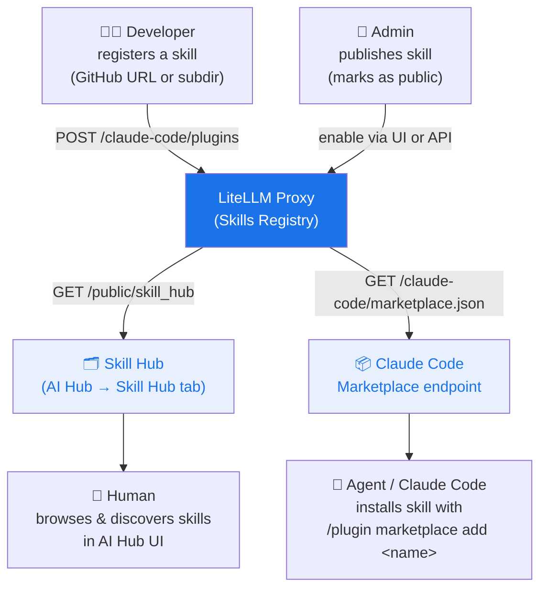

# Skills Gateway

<iframe width="840" height="500" src="https://www.loom.com/embed/cb74eb79df3e4c2b83a6efae54a589f9" frameborder="0" webkitallowfullscreen mozallowfullscreen allowfullscreen></iframe>

LiteLLM은 조직 전체에서 Claude Code 스킬을 등록, 관리, 검색할 수 있는 중앙 공간인 **Skills Registry**로 동작합니다. 팀은 스킬을 한 번 게시하고, 에이전트와 개발자가 단일 허브에서 해당 스킬을 찾도록 할 수 있습니다.

## 동작 방식



## 빠른 시작

### 1. 스킬 등록

Skills UI에 GitHub URL을 붙여 넣으면 LiteLLM이 소스 유형과 스킬 이름을 자동으로 감지합니다.

```bash
curl -X POST https://your-proxy/claude-code/plugins \
  -H "Authorization: Bearer $LITELLM_KEY" \
  -H "Content-Type: application/json" \
  -d '{
    "name": "grill-me",
    "source": {
      "source": "git-subdir",
      "url": "https://github.com/mattpocock/skills",
      "path": "grill-me"
    },
    "description": "Interview skill for relentless questioning",
    "domain": "Productivity",
    "namespace": "interviews"
  }'
```

하위 디렉터리에 있는 스킬도 지원됩니다(예: `github.com/org/repo/tree/main/skill-name`). LiteLLM은 UI에서 URL을 자동으로 파싱합니다.

### 2. 허브에 게시

관리자 UI에서 **AI Hub → Skill Hub → 공개할 스킬 선택**을 선택합니다.

또는 API로 실행합니다.

```bash
curl -X POST https://your-proxy/claude-code/plugins/grill-me/enable \
  -H "Authorization: Bearer $LITELLM_KEY"
```

### 3. 허브 탐색

공개 스킬은 다음 위치에 표시됩니다.
- **관리자 UI**: AI Hub → Skill Hub tab
- **공개 페이지**: `/ui/model_hub` → Skill Hub tab(로그인 필요 없음)
- **API**: `GET /public/skill_hub`

### 4. Claude Code에 설치

Claude Code가 프록시 marketplace를 한 번 가리키도록 설정합니다.

```json title="~/.claude/settings.json"
{
  "extraKnownMarketplaces": {
    "my-org": {
      "source": "url",
      "url": "https://your-proxy/claude-code/marketplace.json"
    }
  }
}
```

그런 다음 원하는 스킬을 설치합니다.

```
/plugin marketplace add grill-me
```

## 스킬 필드

| 필드 | 설명 |
|-------|-------------|
| `name` | 고유한 스킬 식별자(`/plugin marketplace add`에서 사용) |
| `source` | Git 소스: `github`, `url` 또는 `git-subdir` |
| `description` | 허브에 표시되는 짧은 설명 |
| `domain` | 그룹화를 위한 카테고리(예: `Engineering`, `Productivity`) |
| `namespace` | 도메인 내 하위 카테고리(예: `quality`, `meetings`) |
| `keywords` | 검색 및 필터링용 태그 |
| `version` | Semver 문자열 |

## API 참조

| Endpoint | Auth | 설명 |
|----------|------|-------------|
| `POST /claude-code/plugins` | Required | 스킬 등록 |
| `GET /claude-code/plugins` | Required | 모든 스킬 목록 조회(관리자) |
| `POST /claude-code/plugins/{name}/enable` | Required | 스킬 게시 |
| `POST /claude-code/plugins/{name}/disable` | Required | 스킬 게시 취소 |
| `GET /public/skill_hub` | None | 공개 스킬 목록 조회 |
| `GET /claude-code/marketplace.json` | None | Claude Code marketplace 매니페스트 |
