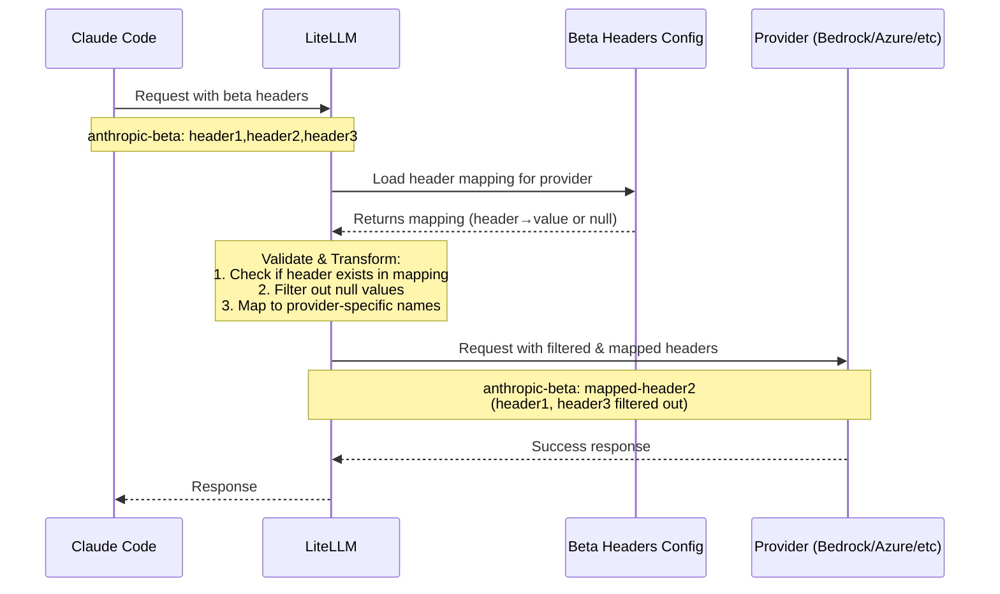

import Image from '@theme/IdealImage';

# Claude Code - Anthropic Beta Header 관리

Claude Code를 LiteLLM 및 non-Anthropic provider(Bedrock, Azure AI, Vertex AI)와 함께 사용할 때는 각 provider가 지원하는 beta header만 전송되도록 해야 합니다. 이 가이드는 새 beta header 지원을 추가하거나 잘못된 beta header error를 수정하는 방법을 설명합니다.

## Beta Header란?

Anthropic은 Claude의 실험 기능을 활성화하기 위해 beta header를 사용합니다. Claude Code를 사용하면 다음과 같은 beta header를 보낼 수 있습니다.

```
anthropic-beta: prompt-caching-scope-2026-01-05,advanced-tool-use-2025-11-20
```

하지만 모든 provider가 모든 Anthropic beta 기능을 지원하지는 않습니다. LiteLLM은 각 provider가 지원하는 beta header를 관리하기 위해 `anthropic_beta_headers_config.json`을 사용합니다.

## 일반적인 Error Message

```bash
Error: The model returned the following errors: invalid beta flag
```

## LiteLLM이 Beta Header를 처리하는 방식

LiteLLM은 configuration file을 사용해 엄격한 validation 방식을 적용합니다.

```
litellm/litellm/anthropic_beta_headers_config.json
```

이 JSON file에는 각 provider별 beta header **mapping**이 들어 있습니다.
- **Keys**: input beta header name(Anthropic 기준)
- **Values**: provider별 header name(미지원 시 `null`)
- **Validation**: mapping에 있고 non-null value를 가진 header만 forwarding됩니다.

이는 unsupported header를 단순히 filtering하는 것보다 엄격합니다. 허용하려면 header가 명시적으로 정의되어 있어야 합니다.

## 새 Beta Header 지원 추가

Anthropic이 새 beta feature를 release하면 각 provider의 configuration file에 해당 항목을 추가해야 합니다.

### Step 1: Config File 위치 찾기

LiteLLM 설치 경로에서 file을 찾습니다.

```bash
# If installed via pip
cd $(python -c "import litellm; import os; print(os.path.dirname(litellm.__file__))")

# The config file is at:
# litellm/anthropic_beta_headers_config.json
```

### Step 2: 새 Beta Header 추가

`anthropic_beta_headers_config.json`을 열고 각 provider mapping에 새 header를 추가합니다.

```json title="anthropic_beta_headers_config.json"
{
  "description": "Mapping of Anthropic beta headers for each provider. Keys are input header names, values are provider-specific header names (or null if unsupported). Only headers present in mapping keys with non-null values can be forwarded.",
  "anthropic": {
    "advanced-tool-use-2025-11-20": "advanced-tool-use-2025-11-20",
    "new-feature-2026-03-01": "new-feature-2026-03-01",
    ...
  },
  "azure_ai": {
    "advanced-tool-use-2025-11-20": "advanced-tool-use-2025-11-20",
    "new-feature-2026-03-01": "new-feature-2026-03-01",
    ...
  },
  "bedrock_converse": {
    "advanced-tool-use-2025-11-20": "tool-search-tool-2025-10-19",
    "new-feature-2026-03-01": null,
    ...
  },
  "bedrock": {
    "advanced-tool-use-2025-11-20": "tool-search-tool-2025-10-19",
    "new-feature-2026-03-01": null,
    ...
  },
  "vertex_ai": {
    "advanced-tool-use-2025-11-20": "tool-search-tool-2025-10-19",
    "new-feature-2026-03-01": null,
    ...
  }
}
```

**핵심 사항:**
- **지원 header**: value를 provider별 header name으로 설정합니다(대개 key와 동일).
- **미지원 header**: value를 `null`로 설정합니다.
- **Header 변환**: 일부 provider는 다른 header name을 사용합니다(예: Bedrock은 `advanced-tool-use-2025-11-20`을 `tool-search-tool-2025-10-19`로 mapping).
- **알파벳순 정렬**: 유지보수를 위해 header를 alphabetic order로 정렬합니다.

### Step 3: 설정 Reload(Restart 불필요)

**Option 1: restart 없는 dynamic reload**

application을 restart하지 않고 환경 변수와 API endpoint를 사용해 beta header 설정을 동적으로 reload할 수 있습니다.

```bash
# Set environment variable to fetch from remote URL (Do this if you want to point it to some other URL)
export LITELLM_ANTHROPIC_BETA_HEADERS_URL="https://raw.githubusercontent.com/BerriAI/litellm/main/litellm/anthropic_beta_headers_config.json"

# Manually trigger reload via API (no restart needed!)
curl -X POST "https://your-proxy-url/reload/anthropic_beta_headers" \
  -H "Authorization: Bearer YOUR_ADMIN_TOKEN"
```

**Option 2: 자동 reload schedule 설정**

최신 beta header를 유지하도록 automatic reload를 설정합니다.

```bash
# Reload configuration every 24 hours
curl -X POST "https://your-proxy-url/schedule/anthropic_beta_headers_reload?hours=24" \
  -H "Authorization: Bearer YOUR_ADMIN_TOKEN"
```

**Option 3: 기존 방식의 restart**

기존 방식을 선호한다면 LiteLLM proxy 또는 application을 restart합니다.

```bash
# If using LiteLLM proxy
litellm --config config.yaml

# If using Python SDK
# Just restart your Python application
```

:::tip Zero-Downtime 업데이트
Dynamic reloading을 사용하면 **service를 restart하지 않고** 잘못된 beta header error를 수정할 수 있습니다. downtime 비용이 큰 production 환경에서 특히 유용합니다.

전체 문서는 [Auto Sync Anthropic Beta Headers](../proxy/sync_anthropic_beta_headers.md)를 참고하세요.
:::

## 잘못된 Beta Header Error 수정

"invalid beta flag" error가 발생하면 provider가 지원하지 않는 beta header가 전송되고 있다는 뜻입니다.

### Step 1: 문제가 되는 Header 식별

어떤 header가 문제를 일으키는지 log에서 확인합니다.

```bash
Error: The model returned the following errors: invalid beta flag: new-feature-2026-03-01
```

### Step 2: Config 업데이트

해당 provider에서 header value를 `null`로 설정합니다.

```json title="anthropic_beta_headers_config.json"
{
  "bedrock_converse": {
    "new-feature-2026-03-01": null
  }
}
```

### Step 3: Restart 및 Test

application을 restart하고 해당 header가 filtering되는지 확인합니다.

## LiteLLM에 Fix 기여하기

수정 내용을 기여해 community에 도움을 줄 수 있습니다.

### PR에 포함할 내용

1. **config file 업데이트**: `litellm/anthropic_beta_headers_config.json`에 새 beta header를 추가합니다.
2. **변경사항 test**: 각 provider에서 header가 올바르게 filtered/mapped 되는지 확인합니다.
3. **Documentation**: 어떤 header가 지원되는지 보여주는 provider 문서 link를 포함합니다.

### 예제 PR Description

```markdown
## Add support for new-feature-2026-03-01 beta header

### Changes
- Added `new-feature-2026-03-01` to anthropic_beta_headers_config.json
- Set to `null` for bedrock_converse (unsupported)
- Set to header name for anthropic, azure_ai (supported)

### Testing
Tested with:
- ✅ Anthropic: Header passed through correctly
- ✅ Azure AI: Header passed through correctly  
- ✅ Bedrock Converse: Header filtered out (returns error without fix)

### References
- Anthropic docs: [link]
- AWS Bedrock docs: [link]
```


## Beta Header Filtering 동작 방식

LiteLLM을 통해 request를 보내면 다음 흐름으로 처리됩니다.



### Filtering Rules

1. **Header가 mapping에 존재해야 함**: unknown header는 filtering됩니다.
2. **Header value가 non-null이어야 함**: `null` value를 가진 header는 filtering됩니다.
3. **Header 변환**: header는 provider별 name으로 mapping됩니다(예: Bedrock의 `advanced-tool-use-2025-11-20` -> `tool-search-tool-2025-10-19`).

### 예제

Header가 포함된 request:
```
anthropic-beta: advanced-tool-use-2025-11-20,computer-use-2025-01-24,unknown-header
```

Bedrock Converse의 경우:
- ✅ `computer-use-2025-01-24` -> `computer-use-2025-01-24` (지원, pass-through)
- ❌ `advanced-tool-use-2025-11-20` -> filtering됨(config의 null value)
- ❌ `unknown-header` -> filtering됨(config에 없음)

Bedrock으로 전송되는 결과:
```
anthropic-beta: computer-use-2025-01-24
```

## Dynamic 설정 관리(Restart 불필요)

### 환경 변수

LiteLLM이 beta header 설정을 load하는 방식을 제어합니다.

| Variable | Description | Default |
|----------|-------------|---------|
| `LITELLM_ANTHROPIC_BETA_HEADERS_URL` | config를 fetch할 URL | GitHub main branch |
| `LITELLM_LOCAL_ANTHROPIC_BETA_HEADERS` | local config만 사용하려면 `True`로 설정 | `False` |

**예제: Custom Config URL 사용**
```bash
export LITELLM_ANTHROPIC_BETA_HEADERS_URL="https://your-company.com/custom-beta-headers.json"
```

**예제: Local Config만 사용(remote fetch 없음)**
```bash
export LITELLM_LOCAL_ANTHROPIC_BETA_HEADERS=True
```
## Provider-Specific 참고

### Bedrock
- Beta header는 HTTP header와 request body(`additionalModelRequestFields.anthropic_beta`)에 모두 나타납니다.
- 일부 header는 transformation됩니다(예: `advanced-tool-use` -> `tool-search-tool`).

### Azure AI
- Anthropic과 동일한 header name을 사용합니다.
- 아직 지원되지 않는 feature가 있습니다(null value는 config에서 확인).

### Vertex AI
- 일부 header는 Vertex AI 구현에 맞게 transformation됩니다.
- Anthropic에 비해 beta feature 지원 범위가 제한적입니다.
