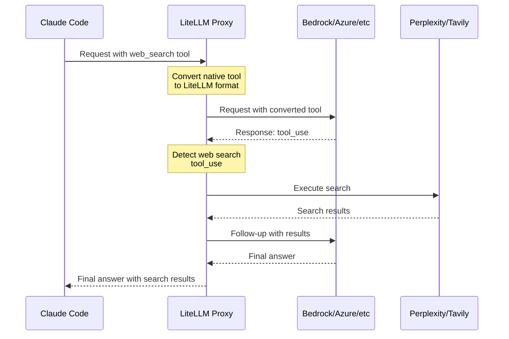

import Image from '@theme/IdealImage';

# Claude Code - 모든 프로바이더에서 WebSearch 사용

Claude Code의 웹 검색 도구가 모든 프로바이더(Bedrock, Azure, Vertex 등)에서 작동하도록 설정합니다. LiteLLM은 웹 검색 요청을 자동으로 가로채 서버 측에서 실행합니다.

<Image img={require('../../img/claude_code_websearch.png')} />

## Proxy 설정

`litellm_config.yaml`에 WebSearch 가로채기를 추가합니다.

```yaml showLineNumbers title="litellm_config.yaml"
model_list:
  - model_name: bedrock-sonnet
    litellm_params:
      model: bedrock/us.anthropic.claude-sonnet-4-5-20250929-v1:0
      aws_region_name: us-east-1

# Enable WebSearch interception for providers
litellm_settings:
  callbacks:
    - websearch_interception:
        enabled_providers:
          - bedrock
          - azure
          - vertex_ai
        search_tool_name: perplexity-search  # Optional: specific search tool

# Configure search provider
search_tools:
  - search_tool_name: perplexity-search
    litellm_params:
      search_provider: perplexity
      api_key: os.environ/PERPLEXITY_API_KEY
```

## 빠른 시작

### 1. LiteLLM Proxy 설정

`config.yaml`을 생성합니다.

```yaml showLineNumbers title="config.yaml"
model_list:
  - model_name: bedrock-sonnet
    litellm_params:
      model: bedrock/us.anthropic.claude-sonnet-4-5-20250929-v1:0
      aws_region_name: us-east-1

litellm_settings:
  callbacks:
    - websearch_interception:
        enabled_providers: [bedrock]

search_tools:
  - search_tool_name: perplexity-search
    litellm_params:
      search_provider: perplexity
      api_key: os.environ/PERPLEXITY_API_KEY
```

### 2. Proxy 시작

```bash showLineNumbers title="Start LiteLLM Proxy"
export PERPLEXITY_API_KEY=your-key
litellm --config config.yaml
```

### 3. Claude Code와 함께 사용

```bash showLineNumbers title="Configure Claude Code"
export ANTHROPIC_BASE_URL=http://localhost:4000
export ANTHROPIC_API_KEY=sk-1234
claude
```

이제 Claude Code에서 웹 검색을 사용하면 모든 프로바이더에서 작동합니다.

## 작동 방식

Claude Code가 웹 검색 요청을 보내면 LiteLLM은 다음을 수행합니다.
1. 네이티브 `web_search` 도구를 가로챕니다.
2. LiteLLM의 표준 형식으로 변환합니다.
3. Perplexity/Tavily를 통해 검색을 실행합니다.
4. 최종 답변을 Claude Code에 반환합니다.



**결과**: Claude Code의 API 호출 1회 → 검색 결과가 포함된 완성된 답변

## 지원 프로바이더

| 프로바이더 | 네이티브 웹 검색 | LiteLLM 사용 시 |
|----------|-------------------|--------------|
| **Anthropic** | ✅ 예 | ✅ 예 |
| **Bedrock** | ❌ 아니요 | ✅ 예 |
| **Azure** | ❌ 아니요 | ✅ 예 |
| **Vertex AI** | ❌ 아니요 | ✅ 예 |
| **기타 프로바이더** | ❌ 아니요 | ✅ 예 |

## 검색 프로바이더

사용할 검색 프로바이더를 설정합니다. LiteLLM은 여러 검색 프로바이더를 지원합니다.

| 프로바이더 | `search_provider` 값 | 환경 변수 |
|----------|------------------------|----------------------|
| **Perplexity AI** | `perplexity` | `PERPLEXITYAI_API_KEY` |
| **Tavily** | `tavily` | `TAVILY_API_KEY` |
| **Exa AI** | `exa_ai` | `EXA_API_KEY` |
| **Parallel AI** | `parallel_ai` | `PARALLEL_AI_API_KEY` |
| **Google PSE** | `google_pse` | `GOOGLE_PSE_API_KEY`, `GOOGLE_PSE_ENGINE_ID` |
| **DataForSEO** | `dataforseo` | `DATAFORSEO_LOGIN`, `DATAFORSEO_PASSWORD` |
| **Firecrawl** | `firecrawl` | `FIRECRAWL_API_KEY` |
| **SearXNG** | `searxng` | `SEARXNG_API_BASE` (필수) |
| **Linkup** | `linkup` | `LINKUP_API_KEY` |

자세한 설정 지침과 프로바이더별 파라미터는 [지원되는 모든 검색 프로바이더](../search/index.md)를 참조하세요.

## 설정 옵션

### WebSearch 가로채기 파라미터

| 파라미터 | 타입 | 필수 여부 | 설명 | 예제 |
|-----------|------|----------|-------------|---------|
| `enabled_providers` | List[String] | 예 | 웹 검색 가로채기를 활성화할 프로바이더 목록 | `[bedrock, azure, vertex_ai]` |
| `search_tool_name` | String | 아니요 | `search_tools` 설정의 특정 검색 도구입니다. 설정하지 않으면 사용 가능한 첫 번째 검색 도구를 사용합니다. | `perplexity-search` |

### 지원되는 프로바이더 값

`enabled_providers`에는 다음 값을 사용합니다.

| 프로바이더 | 값 | 설명 |
|----------|-------|-------------|
| AWS Bedrock | `bedrock` | Amazon Bedrock Claude 모델 |
| Azure OpenAI | `azure` | Azure에서 호스팅되는 모델 |
| Google Vertex AI | `vertex_ai` | `Google Cloud Vertex AI` |
| 기타 | 프로바이더 이름 | LiteLLM이 지원하는 모든 프로바이더 |

### 전체 설정 예제

```yaml showLineNumbers title="Complete config.yaml"
model_list:
  - model_name: bedrock-sonnet
    litellm_params:
      model: bedrock/us.anthropic.claude-sonnet-4-5-20250929-v1:0
      aws_region_name: us-east-1

  - model_name: azure-gpt4
    litellm_params:
      model: azure/gpt-4
      api_base: https://my-azure.openai.azure.com
      api_key: os.environ/AZURE_API_KEY

litellm_settings:
  callbacks:
    - websearch_interception:
        enabled_providers:
          - bedrock        # Enable for AWS Bedrock
          - azure          # Enable for Azure OpenAI
          - vertex_ai      # Enable for Google Vertex
        search_tool_name: perplexity-search  # Optional: use specific search tool

# Configure search tools
search_tools:
  - search_tool_name: perplexity-search
    litellm_params:
      search_provider: perplexity
      api_key: os.environ/PERPLEXITY_API_KEY

  - search_tool_name: tavily-search
    litellm_params:
      search_provider: tavily
      api_key: os.environ/TAVILY_API_KEY
```

**검색 도구 선택 방식:**
- `search_tool_name`이 지정된 경우 → 해당 특정 검색 도구를 사용합니다.
- `search_tool_name`이 지정되지 않은 경우 → `search_tools` 목록의 첫 번째 검색 도구를 사용합니다.
- 위 예제에서 `search_tool_name`이 없으면 `perplexity-search`(목록의 첫 번째 항목)를 사용합니다.

## 관련 문서

- [Claude Code 빠른 시작](./claude_responses_api.md)
- [Claude Code 비용 추적](./claude_code_customer_tracking.md)
- [Non-Anthropic 모델 사용](./claude_non_anthropic_models.md)
