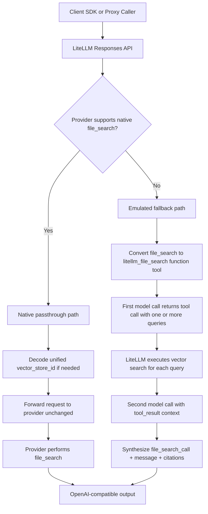

import Tabs from '@theme/Tabs';
import TabItem from '@theme/TabItem';

# Responses API의 File Search

LiteLLM은 이제 Responses API에서 다음 두 경로 모두에 대해 `file_search`를 지원합니다.

- OpenAI / Azure처럼 이를 native로 지원하는 provider
- Anthropic, Bedrock, 기타 non-native provider처럼 emulation이 필요한 provider

## 이 기능의 의미

`file_search`를 사용하면 모델이 vector store에서 근거 context를 검색하고 citation과 함께 답변할 수 있습니다.
LiteLLM은 요청을 native passthrough 또는 emulated fallback으로 routing하면서도 하나의 OpenAI-compatible output shape를 유지합니다.

두 가지 경로를 다룹니다.

| 경로 | 실행 조건 | LiteLLM 동작 |
| --- | --- | --- |
| **Native passthrough** | Provider가 `file_search`를 native로 지원함(OpenAI, Azure) | Unified vector store ID를 decode한 뒤 provider로 그대로 전달 |
| **Emulated fallback** | Provider가 `file_search`를 지원하지 않음(Anthropic, Bedrock 등) | Function tool로 변환 → tool call 가로채기 → vector search 실행 → OpenAI-format output 합성 |

`tools[].vector_store_ids`에서 LiteLLM은 provider-native ID(예: `vs_...`)와 **managed vector store unified ID**(proxy managed-vector flow에서 나온 URL-safe base64 string)를 모두 허용합니다. 예: `litellm.responses(..., tools=[{"type": "file_search", "vector_store_ids": ["bGl0ZWxsbV9wcm94eT..."]}])`.

## 사용법

<Tabs>
<TabItem value="proxy" label="LiteLLM Proxy" default>

### 1. `config.yaml` 설정

```yaml title="config.yaml"
model_list:
  - model_name: gpt-4.1
    litellm_params:
      model: openai/gpt-4.1
      api_key: os.environ/OPENAI_API_KEY

  - model_name: claude-sonnet
    litellm_params:
      model: anthropic/claude-sonnet-4-5
      api_key: os.environ/ANTHROPIC_API_KEY
```

### 2. 프록시 시작

```bash
litellm --config config.yaml
```

### 3. `file_search`로 Responses API 호출

```python title="Proxy call"
from openai import OpenAI

client = OpenAI(base_url="http://localhost:4000", api_key="sk-your-proxy-key")

response = client.responses.create(
    model="claude-sonnet",  # swap to "gpt-4.1" for native path
    input="What does LiteLLM support?",
    tools=[{
        "type": "file_search",
        "vector_store_ids": ["vs_abc123"]
    }],
    include=["file_search_call.results"],
)

print(response.output)
```

</TabItem>
<TabItem value="sdk" label="LiteLLM SDK">

### 1. 설치 및 key 설정

```bash
uv add litellm
export OPENAI_API_KEY="sk-..."
export ANTHROPIC_API_KEY="sk-ant-..."
```

### 2. `file_search`로 Responses API 호출

```python title="SDK call"
import litellm

response = litellm.responses(
    model="anthropic/claude-sonnet-4-5",  # swap to openai/gpt-4.1 for native path
    input="What does LiteLLM support?",
    tools=[{
        "type": "file_search",
        "vector_store_ids": ["vs_abc123"]
    }],
    include=["file_search_call.results"],
)

print(response.output)
```

</TabItem>
</Tabs>

### 동작 매트릭스

| 경로 | SDK model | Proxy model | 동작 |
| --- | --- | --- | --- |
| Native passthrough | `openai/gpt-4.1` | `gpt-4.1` | Provider가 native `file_search`를 실행합니다. |
| Emulated fallback | `anthropic/claude-sonnet-4-5` | `claude-sonnet` | LiteLLM이 function tool로 변환하고 OpenAI-format output을 합성합니다. |


## 아키텍처 Diagram




## 사전 준비

```bash
uv tool install 'litellm[proxy]'
export OPENAI_API_KEY="sk-..."          # for native path
export ANTHROPIC_API_KEY="sk-ant-..."  # for emulated path
```


## 예제 response shape

## Output Format 검증

어떤 경로가 실행되든 response는 항상 OpenAI Responses API format을 따릅니다.

```json
{
  "output": [
    {
      "type": "file_search_call",
      "id": "fs_abc123",
      "status": "completed",
      "queries": ["What does LiteLLM support?"],
      "search_results": null
    },
    {
      "type": "message",
      "role": "assistant",
      "content": [
        {
          "type": "output_text",
          "text": "LiteLLM is a unified interface...",
          "annotations": [
            {
              "type": "file_citation",
              "index": 150,
              "file_id": "file-xxxx",
              "filename": "knowledge.txt"
            }
          ]
        }
      ]
    }
  ]
}
```

**검증 script:**

```python showLineNumbers title="Validate response structure"
def validate_file_search_response(response):
    """Assert that response follows OpenAI file_search output format."""
    output = response.output
    assert len(output) >= 2, "Expected at least 2 output items"

    # First item: file_search_call
    fs_call = output[0]
    fs_type = fs_call["type"] if isinstance(fs_call, dict) else fs_call.type
    assert fs_type == "file_search_call", f"Expected file_search_call, got {fs_type}"

    fs_status = fs_call["status"] if isinstance(fs_call, dict) else fs_call.status
    assert fs_status == "completed"

    # Second item: message
    msg = output[1]
    msg_type = msg["type"] if isinstance(msg, dict) else msg.type
    assert msg_type == "message"

    content = msg["content"] if isinstance(msg, dict) else msg.content
    assert len(content) > 0
    text_block = content[0]
    text = text_block["text"] if isinstance(text_block, dict) else text_block.text
    assert isinstance(text, str) and len(text) > 0

    print("✅ Response structure valid")
    print(f"   Queries: {fs_call['queries'] if isinstance(fs_call, dict) else fs_call.queries}")
    print(f"   Answer length: {len(text)} chars")
    annotations = text_block["annotations"] if isinstance(text_block, dict) else text_block.annotations
    print(f"   Citations: {len(annotations)}")

validate_file_search_response(response)
```


## Q&A

- **왜 `UnsupportedParamsError`가 보이나요?** 보통 `file_search`가 native로 지원하지 않는 provider에 전달됐고 emulation routing도 올바르게 처리되지 않았다는 뜻입니다. 다음을 확인하세요.
  - Model string이 유효한지 확인합니다(예: `anthropic/claude-sonnet-4-5`).
  - LiteLLM이 provider config를 load할 수 있도록 `custom_llm_provider`가 올바르게 resolve되는지 확인합니다.
- **왜 vector search 결과가 없나요?** 일반적인 원인은 다음과 같습니다.
  - Vector store ID가 틀렸거나 연결된 file이 없습니다.
  - LiteLLM-managed store에서 file ingestion이 완료되지 않았습니다(`status != completed`).
  - Query가 너무 좁습니다. 더 넓은 query를 시도하세요.
- **Vector store 호출에서 왜 `403 Access denied`가 발생하나요?** 호출자가 해당 vector store에 접근 권한이 없습니다.
  - Store가 다른 team에 속해 있을 수 있습니다.
  - Cross-team access가 필요한 설정이라면 admin/proxy key를 사용하세요.
- **Emulated mode에서 왜 `annotations`가 비어 있나요?** `file_citation` annotation에는 search result의 `file_id` metadata가 필요합니다. Vector backend가 file-level metadata를 반환하지 않으면 답변 text는 생성되지만 citation은 비어 있을 수 있습니다.


## 다음에 확인할 항목

- [Responses API docs의 File Search reference](/litellm-docs-kr/docs/response_api#file-search-vector-stores) — 전체 API reference
- [Vector Store 관리](/litellm-docs-kr/docs/vector_store_files) — vector store 생성 및 관리
- [Managed vector stores](/litellm-docs-kr/docs/providers/bedrock_vector_store) — provider-specific setup
