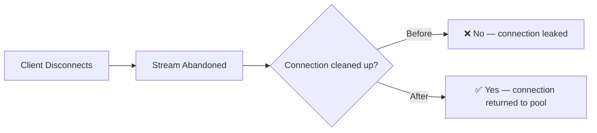
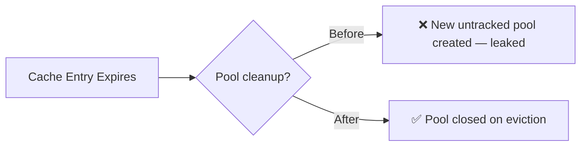

## 이 버전 배포

import Tabs from '@theme/Tabs';
import TabItem from '@theme/TabItem';
import Image from '@theme/IdealImage';

<Tabs>
<TabItem value="docker" label="Docker">

``` showLineNumbers title="docker run litellm"
docker run \
-e STORE_MODEL_IN_DB=True \
-p 4000:4000 \
ghcr.io/berriai/litellm:main-v1.81.14-stable
```

</TabItem>
<TabItem value="pip" label="Pip">

``` showLineNumbers title="pip install litellm"
pip install litellm==1.81.14
```

</TabItem>
</Tabs>

## 주요 하이라이트

- **Guardrail Garden** — [competitor blocking, topic filtering, GDPR, prompt injection 등 use case별 built-in/partner guardrail을 탐색합니다. template을 선택해 맞춤 설정하고 team 또는 key에 연결할 수 있습니다.](../../docs/proxy/guardrails/policy_templates)
- **Compliance Playground** — [guardrail policy를 production 적용 전에 자체 traffic으로 테스트합니다. precision, recall, false positive rate를 확인해 production 동작을 예측할 수 있습니다.](../../docs/proxy/guardrails/policy_templates)
- **신규 zero-cost built-in guardrail 3개** — [Competitor name blocker, topic blocker, insults filter를 제공합니다. 모두 gateway-level이며 &lt;0.1ms latency, 외부 API 없음, team/key별 설정을 지원합니다.](../../docs/proxy/guardrails)
- **UI를 통한 Store Model in DB 설정** - [config file 수정이나 proxy restart 없이 관리자 UI에서 model storage를 직접 설정합니다. cloud deployment에 적합합니다.](../../docs/proxy/ui_store_model_db_setting)
- **Claude Sonnet 4.6 — day 0** — [Anthropic과 Vertex AI 전반에서 reasoning, computer use, prompt caching, 200K context를 완전 지원합니다.](../../docs/providers/anthropic)
- **20개 이상 performance optimization** — 더 빠른 routing, 낮은 logging overhead, cost-calculator latency 감소, connection pool 수정으로 request마다 CPU와 latency가 의미 있게 줄었습니다.

---


### Guardrail Garden

AI Platform Admin은 이제 Guardrail Garden에서 built-in 및 partner guardrail을 탐색할 수 있습니다. guardrail은 financial advice 차단, insults filtering, competitor mention 감지 등 use case별로 구성되어 있어 적절한 항목을 찾아 몇 번의 클릭으로 배포할 수 있습니다.


### 3 New Built-in 가드레일

이번 release에는 gateway에서 직접 실행되는 신규 `built-in guardrail` 세 가지가 포함됩니다. scenario별 낮은 latency와 zero cost guardrail이 필요한 AI Gateway Admin에게 적합합니다.

- **Denied Financial Advice** — 개인화된 financial advice, investment recommendation, financial planning 요청을 감지합니다.
- **Denied Insults** — chatbot, staff 또는 다른 사람을 향한 insult, name-calling, personal attack을 감지합니다.
- **Competitor Name Blocker** — response에서 competitor brand 언급을 감지합니다.

이 guardrail들은 production 용도로 설계되었으며 benchmark에서 100% Recall과 Precision을 기록했습니다.

### UI를 통한 Store Model in DB 설정

이전에는 `store_model_in_db` 설정을 `proxy_config.yaml`의 `general_settings` 아래에서만 구성할 수 있었고, 적용하려면 proxy restart가 필요했습니다. 이제 관리자 UI에서 restart 없이 이 설정을 직접 켜거나 끌 수 있습니다. config file에 직접 접근하기 어렵거나 downtime을 피해야 하는 cloud deployment에서 특히 유용합니다. `store_model_in_db`를 활성화하면 model definition을 YAML에서 database로 옮겨 config 복잡도를 줄이고 scalability를 개선하며 여러 proxy instance에서 dynamic model management를 사용할 수 있습니다.


#### Eval 결과

출시 전에 신규 built-in guardrail을 labeled dataset으로 benchmark했습니다. Denied Financial Advice(207 cases)와 Denied Insults(299 cases)의 결과는 다음과 같습니다.

| Guardrail | Precision | Recall | F1 | Latency p50 | Cost/req |
|-----------|-----------|--------|----|-------------|----------|
| `Denied Financial Advice` | 100% | 100% | 100% | &lt;0.1ms | $0 |
| Denied Insults | 100% | 100% | 100% | &lt;0.1ms | $0 |

100% precision은 false positive가 0이라는 뜻입니다. 정상 message가 잘못 차단되지 않았습니다. 100% recall은 false negative가 0이라는 뜻입니다. 차단되어야 할 모든 message가 감지되었습니다.


### Compliance Playground 사용

Compliance Playground에서는 guardrail을 사전 구성된 eval dataset 또는 자체 custom dataset으로 테스트할 수 있습니다. production에 rollout하기 전에 precision, recall, false positive rate를 확인할 수 있습니다.


---

## Performance & Reliability — 최대 13% 낮은 Latency

<Image img={require('../../img/release_notes/v1_81_14_perf.png')} />

이번 release는 logging, cost calculation, routing, connection management 전반의 20개 이상 micro-optimization으로 모든 percentile의 latency를 낮췄습니다. 직접 benchmark하는 방법은 [benchmarking](../../docs/benchmarks)을 참고하세요.

- **Mean latency:** 78.4 ms → **70.3 ms** (−10.3%)
- **p50 latency:** 64.8 ms → **57.3 ms** (−11.7%)
- **p99 latency:** 288.9 ms → **250.0 ms** (−13.4%)

**Streaming Connection Pool 수정**

streaming workload에서 TCP connection starvation을 일으키던 3중 connection leak을 수정했습니다. aiohttp transport가 connection을 닫지 않았고, disconnect 시 `finally` block에서 close를 호출하지 않았으며, Uvicorn bug가 disconnect signaling을 막고 있었습니다. [PR #21213](https://github.com/BerriAI/litellm/pull/21213)



**Redis Connection Pool Reliability**

Redis 사용 안정성을 높이기 위해 별도 connection pool bug 4개를 수정했습니다. 가장 중요한 변경은 cache expiry 시 pool이 leak되던 문제이며, 다른 수정 사항은 [PR #21717](https://github.com/BerriAI/litellm/pull/21717)에 정리되어 있습니다.



---

## 신규 Provider 및 Endpoint

### 신규 Provider(1개)

| Provider | 지원 LiteLLM Endpoint | 설명 |
| -------- | --------------------------- | ----------- |
| [IBM watsonx.ai](../../docs/providers/watsonx) | `/rerank` | IBM watsonx.ai model용 rerank 지원 |

### 신규 LLM API Endpoint(1개)

| Endpoint | Method | 설명 | 문서 |
| -------- | ------ | ----------- | ------------- |
| `/v1/evals` | POST/GET | model evaluation을 위한 OpenAI-compatible Evals API | [문서](../../docs/evals_api) |

---

## New 모델 / Updated 모델

#### 신규 Model 지원(13개 model)

| Provider | Model | Context Window | Input($/1M tokens) | Output($/1M tokens) | 기능 |
| -------- | ----- | -------------- | ------------------- | -------------------- | -------- |
| Anthropic | `claude-sonnet-4-6` | 200K | $3.00 | $15.00 | `reasoning`, `computer use`, `prompt caching`, `vision`, `PDF` 기능 |
| Vertex AI | `vertex_ai/claude-opus-4-6@default` | 1M | $5.00 | $25.00 | `reasoning`, `computer use`, `prompt caching` 기능 |
| Google Gemini | `gemini/gemini-3.1-pro-preview` | 1M | $2.00 | $12.00 | audio, video, image, PDF 지원 |
| Google Gemini | `gemini/gemini-3.1-pro-preview-customtools` | 1M | $2.00 | $12.00 | Custom tools |
| GitHub Copilot | `github_copilot/gpt-5.3-codex` | 128K | - | - | Responses API, function calling, vision 지원 |
| GitHub Copilot | `github_copilot/claude-opus-4.6-fast` | 128K | - | - | chat completions, function calling, vision 지원 |
| Mistral | `mistral/devstral-small-latest` | 256K | $0.10 | $0.30 | function calling, response schema 지원 |
| Mistral | `mistral/devstral-latest` | 256K | $0.40 | $2.00 | function calling, response schema 지원 |
| Mistral | `mistral/devstral-medium-latest` | 256K | $0.40 | $2.00 | function calling, response schema 지원 |
| OpenRouter | `openrouter/minimax/minimax-m2.5` | 196K | $0.30 | $1.10 | function calling, reasoning, prompt caching 지원 |
| Fireworks AI | `fireworks_ai/accounts/fireworks/models/glm-4p7` | - | - | - | Chat completions |
| Fireworks AI | `fireworks_ai/accounts/fireworks/models/minimax-m2p1` | - | - | - | Chat completions |
| Fireworks AI | `fireworks_ai/accounts/fireworks/models/kimi-k2p5` | - | - | - | Chat completions |

#### 기능

- **[Anthropic](../../docs/providers/anthropic)**
    - reasoning, computer use, 200K context를 포함한 Claude Sonnet 4.6 day 0 지원 - [PR #21401](https://github.com/BerriAI/litellm/pull/21401)
    - Claude Sonnet 4.6 pricing 추가 - [PR #21395](https://github.com/BerriAI/litellm/pull/21395)
    - Claude Sonnet 4.6 day 0 feature(streaming, function calling, vision) 지원 추가 - [PR #21448](https://github.com/BerriAI/litellm/pull/21448)
    - Sonnet 4.6용 `reasoning` effort와 extended thinking 지원 추가 - [PR #21598](https://github.com/BerriAI/litellm/pull/21598)
    - `translate_system_message`의 빈 system message 수정 - [PR #21630](https://github.com/BerriAI/litellm/pull/21630)
    - multi-turn compatibility를 위해 Anthropic message sanitize - [PR #21464](https://github.com/BerriAI/litellm/pull/21464)
    - `/v1/messages`의 `websearch` tool을 `/chat/completions`로 mapping - [PR #21465](https://github.com/BerriAI/litellm/pull/21465)
    - delta streaming에서 `reasoning` field를 `reasoning_content`로 forward - [PR #21468](https://github.com/BerriAI/litellm/pull/21468)
    - OpenAI format에서 Anthropic format으로 server-side compaction translation 추가 - [PR #21555](https://github.com/BerriAI/litellm/pull/21555)

- **[AWS Bedrock](../../docs/providers/bedrock)**
    - native structured outputs API 지원(`outputConfig.textFormat`) - [PR #21222](https://github.com/BerriAI/litellm/pull/21222)
    - custom imported model용 `nova/`, `nova-2/` spec prefix 지원 - [PR #21359](https://github.com/BerriAI/litellm/pull/21359)
    - 모든 `nova-2-*` variant를 지원하도록 Nova 2 model detection 확장 - [PR #21358](https://github.com/BerriAI/litellm/pull/21358)
    - `thinking.budget_tokens`를 최소 1024로 clamp - [PR #21306](https://github.com/BerriAI/litellm/pull/21306)
    - Bedrock Converse의 `parallel_tool_calls` mapping 수정 - [PR #21659](https://github.com/BerriAI/litellm/pull/21659)

- **[Google Gemini / Vertex AI](../../docs/providers/gemini)**
    - `gemini-3.1-pro-preview` day 0 지원 - [PR #21568](https://github.com/BerriAI/litellm/pull/21568)
    - 모든 Gemini 3 family model용 `_map_reasoning_effort_to_thinking_level` 수정 - [PR #21654](https://github.com/BerriAI/litellm/pull/21654)
    - Gemini model에 config 기반 reasoning 지원 추가 - [PR #21663](https://github.com/BerriAI/litellm/pull/21663)

- **[Databricks](../../docs/providers/databricks)**
    - response schema 지원 provider에 Databricks 추가 - [PR #21368](https://github.com/BerriAI/litellm/pull/21368)
    - Databricks GPT model용 native Responses API 지원 - [PR #21460](https://github.com/BerriAI/litellm/pull/21460)

- **[GitHub Copilot](../../docs/providers/github_copilot)**
    - `github_copilot/gpt-5.3-codex`, `github_copilot/claude-opus-4.6-fast` model 추가 - [PR #21316](https://github.com/BerriAI/litellm/pull/21316)
    - ChatGPT Codex의 unsupported param 수정 - [PR #21209](https://github.com/BerriAI/litellm/pull/21209)
    - GitHub model alias가 upstream model metadata를 재사용하도록 허용 - [PR #21497](https://github.com/BerriAI/litellm/pull/21497)

- **[Mistral](../../docs/providers/mistral)**
    - `devstral-2512` model alias(`devstral-small-latest`, `devstral-latest`, `devstral-medium-latest`) 추가 - [PR #21372](https://github.com/BerriAI/litellm/pull/21372)

- **[IBM watsonx.ai](../../docs/providers/watsonx)**
    - native rerank 지원 추가 - [PR #21303](https://github.com/BerriAI/litellm/pull/21303)

- **[xAI](../../docs/providers/xai)**
    - xAI response의 usage object 수정 - [PR #21559](https://github.com/BerriAI/litellm/pull/21559)

- **[Dashscope](../../docs/providers/dashscope)**
    - 잘못된 request formatting을 유발하던 list-to-str transformation 제거 - [PR #21547](https://github.com/BerriAI/litellm/pull/21547)

- **[hosted_vllm](../../docs/providers/vllm)**
    - multi-turn conversation용 thinking block을 content block으로 변환 - [PR #21557](https://github.com/BerriAI/litellm/pull/21557)

- **[OCI / Oracle](../../docs/providers/oci_cohere)**
    - Grok output pricing 수정 - [PR #21329](https://github.com/BerriAI/litellm/pull/21329)

- **[AU Anthropic](../../docs/providers/anthropic)**
    - `au.anthropic.claude-opus-4-6-v1` model ID 수정 - [PR #20731](https://github.com/BerriAI/litellm/pull/20731)

- **General**
    - reasoning 지원 기반 routing 추가. `thinking` param이 있을 때 reasoning 미지원 deployment는 건너뜁니다. - [PR #21302](https://github.com/BerriAI/litellm/pull/21302)
    - OpenAI와 Azure에 supported param으로 `stop` 추가 - [PR #21539](https://github.com/BerriAI/litellm/pull/21539)
    - `OPENAI_CHAT_COMPLETION_PARAMS`에 `store` 및 누락 param 추가 - [PR #21195](https://github.com/BerriAI/litellm/pull/21195), [PR #21360](https://github.com/BerriAI/litellm/pull/21360)
    - proxy response의 `provider_specific_fields` 보존 - [PR #21220](https://github.com/BerriAI/litellm/pull/21220)
    - default usage data configuration 추가 - [PR #21550](https://github.com/BerriAI/litellm/pull/21550)

### Bug Fixes

- **[AWS Bedrock](../../docs/providers/bedrock)**
    - service_tier cost propagation 수정 - [PR #21172](https://github.com/BerriAI/litellm/pull/21172)
    - multimodal embedding의 per-image pricing 수정 - [PR #21646](https://github.com/BerriAI/litellm/pull/21646)
    - `encode_file_id_with_model`에서 Vertex AI batch ID에 `batch_` prefix 사용 - [PR #21624](https://github.com/BerriAI/litellm/pull/21624)

- **[Bedrock Converse](../../docs/providers/bedrock)**
    - v1/messages spec에 맞게 Anthropic usage object 수정 - [PR #21295](https://github.com/BerriAI/litellm/pull/21295)

- **[Fireworks AI](../../docs/providers/fireworks_ai)**
    - `glm-4p7`, `minimax-m2p1`, `kimi-k2p5`의 누락된 model pricing 추가 - [PR #21642](https://github.com/BerriAI/litellm/pull/21642)

- **[Responses API](../../docs/response_api)**
    - reasoning parameter에 `Reasoning()` 대신 `None`을 사용하도록 수정 - [PR #21103](https://github.com/BerriAI/litellm/pull/21103)
    - codex/responses path의 custom callback metadata 보존 - [PR #21243](https://github.com/BerriAI/litellm/pull/21243)

---

## LLM API Endpoints

#### 기능

- **[Responses API](../../docs/response_api)**
    - response에 function_call item이 포함된 경우 `finish_reason='tool_calls'` 반환 - [PR #19745](https://github.com/BerriAI/litellm/pull/19745)
    - async streaming path에서 per-chunk thread spawning을 제거해 throughput을 크게 개선 - [PR #21709](https://github.com/BerriAI/litellm/pull/21709)

- **[Evals API](../../docs/evals_api)**
    - OpenAI Evals API 지원 추가 - [PR #21375](https://github.com/BerriAI/litellm/pull/21375)

- **[Batch API](../../docs/batches)**
    - batch reference가 있는 file deletion criteria 추가 - [PR #21456](https://github.com/BerriAI/litellm/pull/21456)
    - managed batch의 기타 bug fix - [PR #21157](https://github.com/BerriAI/litellm/pull/21157)

- **[Pass-Through Endpoints](../../docs/pass_through/bedrock)**
    - passthrough endpoint용 method-based routing 추가 - [PR #21543](https://github.com/BerriAI/litellm/pull/21543)
    - proxy layer를 통해 OAuth Authorization header를 보존하고 forward - [PR #19912](https://github.com/BerriAI/litellm/pull/19912)

- **[Websearch / 도구 호출](../../docs/completion/input)**
    - search tool로 DuckDuckGo 추가 - [PR #21467](https://github.com/BerriAI/litellm/pull/21467)
    - websearch에서 proxy router를 통한 `pre_call_deployment_hook` 미실행 문제 수정 - [PR #21433](https://github.com/BerriAI/litellm/pull/21433)

- **General**
    - function calling 미지원 model에서 tool param 제외 - [PR #21244](https://github.com/BerriAI/litellm/pull/21244)
    - OpenAI chat completion param에 `store` 추가 - [PR #21195](https://github.com/BerriAI/litellm/pull/21195)
    - per-model reasoning configuration을 위한 config 기반 reasoning 지원 추가 - [PR #21663](https://github.com/BerriAI/litellm/pull/21663)

#### Bugs

- **General**
    - 여러 potential endpoint가 있는 model의 `api_base` resolution error 수정 - [PR #21658](https://github.com/BerriAI/litellm/pull/21658)
    - `query_raw`의 dict row에서 session grouping이 깨지는 문제 수정 - [PR #21435](https://github.com/BerriAI/litellm/pull/21435)

---

## Management Endpoint 및 UI

#### 기능

- **Access Groups**
    - Keys/Teams 생성 및 수정 flow에 Access Group Selector 추가 - [PR #21234](https://github.com/BerriAI/litellm/pull/21234)

- **가상 키**
    - env/UI의 virtual key grace period 수정 - [PR #20321](https://github.com/BerriAI/litellm/pull/20321)
    - key expiry default duration 수정 - [PR #21362](https://github.com/BerriAI/litellm/pull/21362)
    - Key Last Active Tracking — key가 마지막으로 사용된 시점을 확인합니다. - [PR #21545](https://github.com/BerriAI/litellm/pull/21545)
    - BYOK team key에서 `/v1/models`가 expanded model 대신 wildcard를 반환하던 문제 수정 - [PR #21408](https://github.com/BerriAI/litellm/pull/21408)
    - delete_verification_tokens response에 `failed_tokens` 반환 - [PR #21609](https://github.com/BerriAI/litellm/pull/21609)

- **모델 + Endpoints**
    - 모델 & Endpoints page에 Model Settings Modal 추가 - [PR #21516](https://github.com/BerriAI/litellm/pull/21516)
    - `store_model_in_db`를 config뿐 아니라 database에서도 설정할 수 있도록 허용 - [PR #21511](https://github.com/BerriAI/litellm/pull/21511)
    - Model Info UI에서 `input_cost_per_token`이 masked/hidden 처리되던 문제 수정 - [PR #21723](https://github.com/BerriAI/litellm/pull/21723)
    - batch file upload에서 UI-created model의 credential 수정 - [PR #21502](https://github.com/BerriAI/litellm/pull/21502)
    - UI-created model의 credential resolve - [PR #21502](https://github.com/BerriAI/litellm/pull/21502)

- **Teams**
    - team member가 전체 team usage를 볼 수 있도록 허용 - [PR #21537](https://github.com/BerriAI/litellm/pull/21537)
    - team member의 service account visibility 수정 - [PR #21627](https://github.com/BerriAI/litellm/pull/21627)
    - Organization Info page: member email 표시, AntD tab, reusable MemberTable 적용 - [PR #21745](https://github.com/BerriAI/litellm/pull/21745)

- **사용법 / Spend 로그**
    - User별 usage filtering 허용 - [PR #21351](https://github.com/BerriAI/litellm/pull/21351)
    - usage page filtering을 위해 Credential Name을 Tag로 주입 - [PR #21715](https://github.com/BerriAI/litellm/pull/21715)
    - credential tag에 prefix를 붙이고 Tag usage banner 업데이트 - [PR #21739](https://github.com/BerriAI/litellm/pull/21739)
    - 로그 view에서 request retry count 표시 - [PR #21704](https://github.com/BerriAI/litellm/pull/21704)
    - Aggregated Daily Activity Endpoint performance 수정 - [PR #21613](https://github.com/BerriAI/litellm/pull/21613)

- **SSO / Auth**
    - multi-pod Kubernetes deployment에서 SSO PKCE support 수정 - [PR #20314](https://github.com/BerriAI/litellm/pull/20314)
    - `role_mappings` config와 무관하게 SSO role 보존 - [PR #21503](https://github.com/BerriAI/litellm/pull/21503)

- **Proxy CLI 및 Master Key**
    - master key rotation의 Prisma validation error 수정 - [PR #21330](https://github.com/BerriAI/litellm/pull/21330)
    - `append_query_params`에서 누락된 `DATABASE_URL` 처리 - [PR #21239](https://github.com/BerriAI/litellm/pull/21239)

- **Project Management**
    - resource 정리를 위한 Project Management API 추가 - [PR #21078](https://github.com/BerriAI/litellm/pull/21078)

- **UI Improvements**
    - Content Filters: category edit/view 지원 및 pagination 포함 1-click add - [PR #21223](https://github.com/BerriAI/litellm/pull/21223)
    - Playground: UI로 fallback 테스트 - [PR #21007](https://github.com/BerriAI/litellm/pull/21007)
    - general settings에 `forward_client_headers_to_llm_api` toggle 추가 - [PR #21776](https://github.com/BerriAI/litellm/pull/21776)
    - 매 request마다 발생하던 `is_premium()` debug log spam 수정 - [PR #20841](https://github.com/BerriAI/litellm/pull/20841)

#### Bugs

- Spend 로그: cost calculation 수정 - [PR #21152](https://github.com/BerriAI/litellm/pull/21152)
- 로그: table 미업데이트 및 pagination issue 수정 - [PR #21708](https://github.com/BerriAI/litellm/pull/21708)
- `cached_logo.jpg`가 있을 때 `/get_image`가 `UI_LOGO_PATH`를 무시하던 문제 수정 - [PR #21637](https://github.com/BerriAI/litellm/pull/21637)
- `tagsSpend로그Call` query string의 중복 URL 수정 - [PR #20909](https://github.com/BerriAI/litellm/pull/20909)
- key 삭제 또는 재생성 후 `/user/daily/activity/aggregated`에서 `key_alias`, `team_id` metadata 보존 - [PR #20684](https://github.com/BerriAI/litellm/pull/20684)
- `user_info` endpoint의 `response_model` 주석 해제 - [PR #17430](https://github.com/BerriAI/litellm/pull/17430)
- `internal_user_viewer`가 RAG endpoint에 접근하도록 허용하고, ingest는 existing vector store로 제한 - [PR #21508](https://github.com/BerriAI/litellm/pull/21508)
- agent permission handler에서 `litellm-dashboard` team warning 억제 - [PR #21721](https://github.com/BerriAI/litellm/pull/21721)

---

## AI Integrations

### Logging

- **[DataDog](../../docs/proxy/logging#datadog)**
    - logs, metrics, cost management에 `team` tag 추가 - [PR #21449](https://github.com/BerriAI/litellm/pull/21449)

- **[Prometheus](../../docs/proxy/logging#prometheus)**
    - `litellm_proxy_total_requests_metric` double-counting 수정 - [PR #21159](https://github.com/BerriAI/litellm/pull/21159)
    - Prometheus metrics에서 None metadata 방어 처리 - [PR #21489](https://github.com/BerriAI/litellm/pull/21489)
    - Prometheus metrics collection 개선을 위한 ASGI middleware 추가 - [PR #20434](https://github.com/BerriAI/litellm/pull/20434)

- **[Langfuse](../../docs/proxy/logging#langfuse)**
    - Langfuse test isolation 개선(여러 stability fix) - [PR #21214](https://github.com/BerriAI/litellm/pull/21214)

- **General**
    - logging에서 cached response cost를 0으로 수정 - [PR #21816](https://github.com/BerriAI/litellm/pull/21816)
    - middleware와 logging bottleneck을 수정해 streaming proxy throughput 개선 - [PR #21501](https://github.com/BerriAI/litellm/pull/21501)
    - large base64 payload의 proxy overhead 감소 - [PR #21594](https://github.com/BerriAI/litellm/pull/21594)
    - connection pool exhaustion 방지를 위해 streaming connection close - [PR #21213](https://github.com/BerriAI/litellm/pull/21213)

### 가드레일

- **Guardrail Garden**
    - one click으로 배포 가능한 pre-built guardrail marketplace인 Guardrail Garden 출시 - [PR #21732](https://github.com/BerriAI/litellm/pull/21732)
    - vertical stepper UI로 guardrail creation form 재설계 - [PR #21727](https://github.com/BerriAI/litellm/pull/21727)
    - log detail view에 guardrail jump link 추가 - [PR #21437](https://github.com/BerriAI/litellm/pull/21437)
    - Guardrail tracing UI: policy, detection method, match detail 표시 - [PR #21349](https://github.com/BerriAI/litellm/pull/21349)

- **AI Policy Template**
    - 이번 release에는 바로 배포 가능한 신규 policy template 7개가 포함됩니다.
        - GDPR Art. 32 EU PII Protection - [PR #21340](https://github.com/BerriAI/litellm/pull/21340)
        - EU AI Act Article 5(5개 sub-guardrail, French language 지원 포함) - [PR #21342](https://github.com/BerriAI/litellm/pull/21342), [PR #21453](https://github.com/BerriAI/litellm/pull/21453), [PR #21427](https://github.com/BerriAI/litellm/pull/21427)
        - Prompt injection detection - [PR #21520](https://github.com/BerriAI/litellm/pull/21520)
        - tag-based routing을 포함한 Aviation 및 UAE topic filter - [PR #21518](https://github.com/BerriAI/litellm/pull/21518)
        - Airline off-topic restriction - [PR #21607](https://github.com/BerriAI/litellm/pull/21607)
        - SQL injection - [PR #21806](https://github.com/BerriAI/litellm/pull/21806)
    - latency overhead estimate가 포함된 AI-powered policy template suggestion - [PR #21589](https://github.com/BerriAI/litellm/pull/21589), [PR #21608](https://github.com/BerriAI/litellm/pull/21608), [PR #21620](https://github.com/BerriAI/litellm/pull/21620)

- **Compliance Checker**
    - compliance checker endpoint와 UI panel 추가 - [PR #21432](https://github.com/BerriAI/litellm/pull/21432)
    - batch testing을 위해 compliance playground에 CSV dataset upload 추가 - [PR #21526](https://github.com/BerriAI/litellm/pull/21526)

- **Built-in 가드레일**
    - Competitor name blocker: name 기반 차단, streaming 처리, name variation 지원, pre/post call 분리 - [PR #21719](https://github.com/BerriAI/litellm/pull/21719), [PR #21533](https://github.com/BerriAI/litellm/pull/21533)
    - keyword 및 embedding 기반 implementation을 모두 제공하는 topic blocker - [PR #21713](https://github.com/BerriAI/litellm/pull/21713)
    - Insults content filter - [PR #21729](https://github.com/BerriAI/litellm/pull/21729)
    - 등록되지 않은 MCP server call을 차단하는 MCP Security guardrail - [PR #21429](https://github.com/BerriAI/litellm/pull/21429)

- **[Generic 가드레일](../../docs/proxy/guardrails)**
    - generic guardrail endpoint connection failure 처리를 위한 configurable fallback 추가 - [PR #21245](https://github.com/BerriAI/litellm/pull/21245)

- **[Presidio](../../docs/proxy/guardrails)**
    - Presidio controls configuration 수정 - [PR #21798](https://github.com/BerriAI/litellm/pull/21798)

- **[LakeraAI](../../docs/proxy/guardrails)**
    - initialization 중 `LAKERA_API_KEY`가 없을 때 `KeyError` 방지 - [PR #21422](https://github.com/BerriAI/litellm/pull/21422)

### Auto Routing

- **Complexity-based auto routing** — request를 7개 dimension(token count, code presence, reasoning marker, technical term 등)으로 score하고 적절한 model tier로 routing하는 신규 router strategy입니다. embedding이나 API call이 필요 없습니다. - [PR #21789](https://github.com/BerriAI/litellm/pull/21789), [문서](../../docs/proxy/auto_routing)

### Prompt Management

- **Prompt Management API 기능**
    - PR 없이 prompt management integration과 상호작용하는 신규 API - [PR #17800](https://github.com/BerriAI/litellm/pull/17800), [PR #17946](https://github.com/BerriAI/litellm/pull/17946)
    - prompt registry configuration issue 수정 - [PR #21402](https://github.com/BerriAI/litellm/pull/21402)

---

## 비용 추적, Budget 및 Rate Limiting

- **Bedrock service_tier cost propagation 수정** — service-tier response의 cost가 spend tracking으로 올바르게 전달됩니다. - [PR #21172](https://github.com/BerriAI/litellm/pull/21172)
- **cached response cost 수정** — cached response가 재과금 대신 $0 cost로 올바르게 기록됩니다. - [PR #21816](https://github.com/BerriAI/litellm/pull/21816)
- **daily activity aggregate endpoint performance** — `/user/daily/activity/aggregated` query가 더 빨라졌습니다. - [PR #21613](https://github.com/BerriAI/litellm/pull/21613)
- **key_alias 및 team_id metadata 보존** — key 삭제 또는 재생성 후에도 `/user/daily/activity/aggregated`에서 metadata를 보존합니다. - [PR #20684](https://github.com/BerriAI/litellm/pull/20684)
- **Credential Name을 Tag로 주입** — credential별 granular usage page filtering을 지원합니다. - [PR #21715](https://github.com/BerriAI/litellm/pull/21715)

---

## MCP Gateway

- **OpenAPI-to-MCP** — API 또는 UI로 모든 OpenAPI spec을 MCP server로 변환합니다. - [PR #21575](https://github.com/BerriAI/litellm/pull/21575), [PR #21662](https://github.com/BerriAI/litellm/pull/21662)
- **MCP User Permissions** — MCP server에서 end user용 fine-grained permission을 제공합니다. - [PR #21462](https://github.com/BerriAI/litellm/pull/21462)
- **MCP Security Guardrail** — 등록되지 않은 MCP server call을 차단합니다. - [PR #21429](https://github.com/BerriAI/litellm/pull/21429)
- **StreamableHTTPSessionManager 수정** — session state issue 방지를 위해 stateless mode로 되돌렸습니다. - [PR #21323](https://github.com/BerriAI/litellm/pull/21323)
- **Bedrock AgentCore Accept header 수정** — AgentCore MCP server request에 필요한 Accept header를 추가했습니다. - [PR #21551](https://github.com/BerriAI/litellm/pull/21551)

---

## Performance / Load Balancing / Reliability 개선

**Logging 및 callback overhead**

- async/sync callback separation을 per-request에서 callback registration 시점으로 이동해 callback-heavy deployment에서 약 30% speedup - [PR #20354](https://github.com/BerriAI/litellm/pull/20354)
- logging payload에서 Pydantic usage round-trip을 건너뛰어 request당 serialization overhead 감소 - [PR #21003](https://github.com/BerriAI/litellm/pull/21003)
- non-streaming request에서 중복 `get_standard_logging_object_payload` call 생략 - [PR #20440](https://github.com/BerriAI/litellm/pull/20440)
- request lifecycle 전반에서 `LiteLLM_Params` object 재사용 - [PR #20593](https://github.com/BerriAI/litellm/pull/20593)
- `add_litellm_data_to_request` hot path 최적화 - [PR #20526](https://github.com/BerriAI/litellm/pull/20526)
- `model_dump_with_preserved_fields` 최적화 - [PR #20882](https://github.com/BerriAI/litellm/pull/20882)
- request마다 계산하지 않고 module load 시 OpenAI client init param pre-compute - [PR #20789](https://github.com/BerriAI/litellm/pull/20789)
- large base64 payload의 proxy overhead 감소 - [PR #21594](https://github.com/BerriAI/litellm/pull/21594)
- middleware와 logging bottleneck을 수정해 streaming proxy throughput 개선 - [PR #21501](https://github.com/BerriAI/litellm/pull/21501)
- Responses API async streaming에서 per-chunk thread spawning 제거 - [PR #21709](https://github.com/BerriAI/litellm/pull/21709)

**Cost calculation**

- early-exit 및 caching으로 `completion_cost()` 최적화 - [PR #20448](https://github.com/BerriAI/litellm/pull/20448)
- Cost calculator: 반복 lookup과 dict copy 감소 - [PR #20541](https://github.com/BerriAI/litellm/pull/20541)

**Router 및 load balancing**

- usage-based routing v2의 quadratic deployment scan 제거 - [PR #21211](https://github.com/BerriAI/litellm/pull/21211)
- team deployment filter에서 O(n²) membership scan 방지 - [PR #21210](https://github.com/BerriAI/litellm/pull/21210)
- non-alias `get_model_list` lookup에서 O(n) alias scan 방지 - [PR #21136](https://github.com/BerriAI/litellm/pull/21136)
- multi-model cache thrash를 줄이기 위해 default LRU cache size 증가 - [PR #21139](https://github.com/BerriAI/litellm/pull/21139)
- Router에서 `get_model_access_groups()` no-args result cache - [PR #20374](https://github.com/BerriAI/litellm/pull/20374)
- Deployment affinity routing callback — session에 대해 같은 deployment로 routing - [PR #19143](https://github.com/BerriAI/litellm/pull/19143)
- Session-ID-based routing — session 내 consistent routing을 위해 `session_id` 사용 - [PR #21763](https://github.com/BerriAI/litellm/pull/21763)

**Connection management 및 reliability**

- Redis connection pool reliability 수정 — load 상황에서 connection exhaustion 방지 - [PR #21717](https://github.com/BerriAI/litellm/pull/21717)
- auth 및 runtime reconnection용 Prisma connection self-heal 수정(revert되었으며 수정 후 재도입 예정) - [PR #21706](https://github.com/BerriAI/litellm/pull/21706)
- connection pool exhaustion 방지를 위해 streaming connection close - [PR #21213](https://github.com/BerriAI/litellm/pull/21213)
- `PodLockManager.release_lock`를 atomic compare-and-delete로 변경 - [PR #21226](https://github.com/BerriAI/litellm/pull/21226)

---

## Database 변경 사항

### Schema 업데이트

| Table | 변경 유형 | 설명 | PR |
| ----- | ----------- | ----------- | -- |
| `LiteLLM_DeletedVerificationToken` | New Column | `project_id` column 추가 | [PR #21587](https://github.com/BerriAI/litellm/pull/21587) |
| `LiteLLM_ProjectTable` | New Table | resource 정리를 위한 project management | [PR #21078](https://github.com/BerriAI/litellm/pull/21078) |
| `LiteLLM_VerificationToken` | New Column | key activity tracking용 `last_active` timestamp 추가 | [PR #21545](https://github.com/BerriAI/litellm/pull/21545) |
| `LiteLLM_ManagedVectorStoreTable` | Migration | vector store migration을 idempotent하게 변경 | [PR #21325](https://github.com/BerriAI/litellm/pull/21325) |

---

## Security

모든 LiteLLM Docker image에 대해 [Grype](https://github.com/anchore/grype) 및 [Trivy](https://github.com/aquasecurity/trivy) security scan을 실행합니다. 아래는 이번 release의 모든 published image에 대한 vulnerability report입니다.

### Docker Image Scan 요약

| Image | Critical | High | Medium | Low |
|-------|----------|------|--------|-----|
| `ghcr.io/berriai/litellm:main-latest` | **0** ✅ | 4 unique CVEs | 4 | 1 |
| `ghcr.io/berriai/litellm-ee:main-latest` | **0** ✅ | 4 unique CVEs | 4 | 1 |
| `ghcr.io/berriai/litellm-non_root:main-latest` | **1** | 11 unique CVEs | 6 | 2 |
| `ghcr.io/berriai/litellm-database:main-latest` | **1** | 7 unique CVEs | 5 | 1 |
| `ghcr.io/berriai/litellm-spend_logs:main-latest` | **4** | 35 matches | 40 | 10 |

:::note
Vulnerability count는 build-time tooling을 포함한 full image scan 기준입니다. High match count는 `minimatch` 같은 package가 여러 version으로 나타나며 부풀려지는 경우가 많습니다. 위 unique CVE count가 실제 distinct vulnerability를 나타냅니다.
:::

### Critical Severity

**1. Node.js Critical (non-root, database, spend_logs images):**
Node.js 24.12.0은 **관리자 UI build와 Prisma client generation에만** 사용됩니다. LiteLLM Python application runtime의 일부가 아닙니다.

| Package | Vulnerability | 설명 | Fix Version |
|---------|---------------|-------------|-------------|
| `node` | CVE-2025-55130 | Node.js critical vulnerability 항목 | 20.20.0 |

**2. OpenSSL & Go Critical (spend_logs image only):**
`spend_logs` image에는 underlying Go module 및 system library의 추가 vulnerability가 포함됩니다.

| Package | Vulnerability | 설명 | Fix Version |
|---------|---------------|-------------|-------------|
| `libcrypto3`, `libssl3` | CVE-2025-15467 | OpenSSL critical vulnerability 항목 | 3.3.6-r0 |
| `stdlib` (Go) | CVE-2025-68121 | Go standard library critical vulnerability 항목 | 1.24.13+ |

### High Severity

모든 high-severity vulnerability는 **npm/Node.js build-time dependency** 또는 system-level library에 있습니다. LiteLLM Python application code에는 없습니다.

**모든 image에 존재:**

| Package | Vulnerability | 설명 | Fix Version |
|---------|---------------|-------------|-------------|
| `minimatch` | CVE-2026-26996 | specially crafted glob pattern을 통한 DoS | 10.2.1+ / 9.0.6+ |
| `minimatch` | CVE-2026-27903 | unbounded recursive backtracking으로 인한 DoS | 10.2.3+ / 9.0.7+ |
| `minimatch` | CVE-2026-27904 | glob expression의 catastrophic backtracking을 통한 DoS | 10.2.3+ / 9.0.7+ |
| `tar` | CVE-2026-26960 / GHSA-83g3-92jg-28cx | malicious archive hardlink를 통한 arbitrary file read/write | 7.5.8 |

### Medium Severity(모든 image)

| Package | Vulnerability | 상태 |
|---------|---------------|--------|
| `pypdf` 6.7.2 | GHSA-x7hp-r3qg-r3cj | 6.7.3에서 fix 가능 |
| Python 3.13 | CVE-2025-15366, CVE-2025-15367, CVE-2025-12781 | upstream fix 없음 |

### 권장 사항

- **LiteLLM Main 및 EE image**(`litellm:main-latest`, `litellm-ee:main-latest`)는 **critical vulnerability 0건**으로 가장 좋은 security posture를 가집니다.
- main image의 모든 HIGH/CRITICAL finding은 Python runtime이 아니라 build-time Node.js/npm tooling과 관련됩니다.
- 남은 medium-severity vulnerability에 대해 upstream Python 및 system library fix를 적극적으로 monitoring하고 있습니다.

security vulnerability를 제보하려면 세부 정보와 재현 단계를 support@berri.ai로 보내주세요.

---

## 문서 업데이트

- LiteLLM과 함께 쓰는 OpenAI Agents SDK guide 추가 - [PR #21311](https://github.com/BerriAI/litellm/pull/21311)
- Access Groups documentation - [PR #21236](https://github.com/BerriAI/litellm/pull/21236)
- Anthropic beta headers documentation - [PR #21320](https://github.com/BerriAI/litellm/pull/21320)
- Latency overhead troubleshooting guide - [PR #21600](https://github.com/BerriAI/litellm/pull/21600), [PR #21603](https://github.com/BerriAI/litellm/pull/21603)
- rollback safety check guide 추가 - [PR #21743](https://github.com/BerriAI/litellm/pull/21743)
- Incident report: `encoding_format` parameter로 인해 vLLM Embeddings가 깨진 문제 - [PR #21474](https://github.com/BerriAI/litellm/pull/21474)
- Incident report: Claude Code beta headers - [PR #21485](https://github.com/BerriAI/litellm/pull/21485)
- v1.81.12를 stable로 표시 - [PR #21809](https://github.com/BerriAI/litellm/pull/21809)

---

## 신규 Contributor

* @mjkam 님이 [PR #21306](https://github.com/BerriAI/litellm/pull/21306)에서 첫 contribution을 했습니다.
* @saneroen 님이 [PR #21243](https://github.com/BerriAI/litellm/pull/21243)에서 첫 contribution을 했습니다.
* @vincentkoc 님이 [PR #21239](https://github.com/BerriAI/litellm/pull/21239)에서 첫 contribution을 했습니다.
* @felixti 님이 [PR #19745](https://github.com/BerriAI/litellm/pull/19745)에서 첫 contribution을 했습니다.
* @anttttti 님이 [PR #20731](https://github.com/BerriAI/litellm/pull/20731)에서 첫 contribution을 했습니다.
* @ndgigliotti 님이 [PR #21222](https://github.com/BerriAI/litellm/pull/21222)에서 첫 contribution을 했습니다.
* @iamadamreed 님이 [PR #19912](https://github.com/BerriAI/litellm/pull/19912)에서 첫 contribution을 했습니다.
* @sahukanishka 님이 [PR #21220](https://github.com/BerriAI/litellm/pull/21220)에서 첫 contribution을 했습니다.
* @namabile 님이 [PR #21195](https://github.com/BerriAI/litellm/pull/21195)에서 첫 contribution을 했습니다.
* @stronk7 님이 [PR #21372](https://github.com/BerriAI/litellm/pull/21372)에서 첫 contribution을 했습니다.
* @ZeroAurora 님이 [PR #21547](https://github.com/BerriAI/litellm/pull/21547)에서 첫 contribution을 했습니다.
* @SolitudePy 님이 [PR #21497](https://github.com/BerriAI/litellm/pull/21497)에서 첫 contribution을 했습니다.
* @SherifWaly 님이 [PR #21557](https://github.com/BerriAI/litellm/pull/21557)에서 첫 contribution을 했습니다.
* @dkindlund 님이 [PR #21633](https://github.com/BerriAI/litellm/pull/21633)에서 첫 contribution을 했습니다.
* @cagojeiger 님이 [PR #21664](https://github.com/BerriAI/litellm/pull/21664)에서 첫 contribution을 했습니다.

---

## Full 변경 이력
[v1.81.12.rc.1...v1.81.14.rc.1](https://github.com/BerriAI/litellm/compare/v1.81.12.rc.1...v1.81.14.rc.1)
